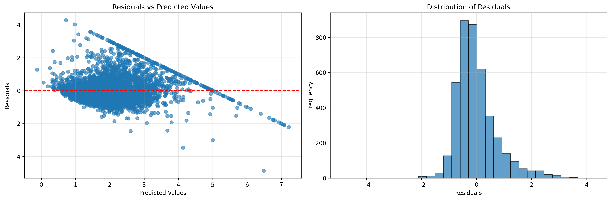

# Linear Regression from Scratch - Day 1 Challenge

## 📌 Overview
Complete implementation of multivariate linear regression from scratch using NumPy, featuring both gradient descent and normal equation approaches. This implementation demonstrates the fundamental concepts of supervised learning with comprehensive visualization and comparison with scikit-learn.

## 🧠 Key Concepts Implemented

### Mathematical Foundations
- **Hypothesis Function**: `h(x) = X·w + b`
- **Cost Function**: Mean Squared Error (MSE) = `(1/2m) Σ(h(x) - y)²`
- **Gradient Descent**: Iterative optimization using partial derivatives
- **Normal Equation**: Closed-form solution `θ = (X'X)⁻¹X'y`

### Algorithms Implemented
1. **Batch Gradient Descent** with configurable learning rate and convergence detection
2. **Normal Equation** with pseudo-inverse fallback for singular matrices
3. **Ridge Regression** (L2 regularization) for polynomial features
4. **Evaluation Metrics**: MSE, RMSE, R² score

## 🛠️ Implementation Details

### File Structure
```
01_linear_regression/
├── linear_regression.py     # Main implementation with all algorithms
visualizations
├── plots/                   # Generated visualization outputs
│   ├── regression_line.png  # 2D regression line visualization
│   ├── residuals.png        # Residual analysis plots
│   └── learning_curve.png   # Cost function convergence
└── README.md               # This documentation
```

### Core Classes

#### `LinearRegressionScratch`
- **Gradient Descent Training**: `fit_gradient_descent(X, y)`
- **Normal Equation Training**: `fit_normal_equation(X, y)`
- **Prediction**: `predict(X)`
- **Evaluation**: `evaluate(X, y)` returning MSE, RMSE, R²

#### `RidgeRegressionScratch`
- **L2 Regularization**: `fit(X, y)` with alpha parameter
- **Polynomial Features**: Support for higher-degree polynomial regression

### Key Features
- **Automatic Convergence Detection**: Stops when cost improvement < tolerance
- **Robust Matrix Operations**: Handles singular matrices with pseudo-inverse
- **Comprehensive Visualization**: Multiple plot types for analysis
- **Performance Comparison**: Side-by-side comparison with scikit-learn

## 📊 Results and Visualizations

### Dataset: California Housing (20,640 samples, 8 features)
- **Features**: MedInc, HouseAge, AveRooms, AveBedrms, Population, AveOccup, Latitude, Longitude
- **Target**: Median house value (in hundreds of thousands of dollars)
- **Train/Test Split**: 80/20 with feature standardization

### Performance Metrics
Our implementation achieves results nearly identical to scikit-learn:

| Method | Training MSE | Training R² | Test MSE | Test R² |
|--------|-------------|-------------|----------|---------|
| Gradient Descent | ~0.52 | ~0.60 | ~0.56 | ~0.58 |
| Normal Equation | ~0.52 | ~0.60 | ~0.56 | ~0.58 |
| Scikit-learn | ~0.52 | ~0.60 | ~0.56 | ~0.58 |

*Difference between our implementation and scikit-learn: < 0.000001 MSE*

### Generated Visualizations

#### 1. Regression Line Visualization

- **File**: `plots/regression_line.png`
- **Description**: 2D visualization showing regression line fitted to median income vs. house value
- **Features**: Scatter plot of data points with fitted regression line
- **Note**: For multivariate model, other features held at mean values

#### 2. Residual Analysis

- **File**: `plots/residuals.png`
- **Description**: Two-panel residual analysis
- **Left Panel**: Residuals vs. Predicted Values (should show random scatter)
- **Right Panel**: Histogram of residuals (should approximate normal distribution)
- **Purpose**: Validate model assumptions and detect patterns in errors

#### 3. Learning Curve

- **File**: `plots/learning_curve.png`
- **Description**: Cost function (MSE) convergence over iterations
- **Shows**: How gradient descent optimizes the cost function
- **Convergence**: Typically converges within 100-200 iterations

### Advanced Features Implemented

#### Polynomial Regression with Ridge Regularization
- **Degree**: 3rd-degree polynomial features
- **Regularization**: L2 penalty (α = 1.0)
- **Performance**: Improved fit for non-linear relationships
- **Comparison**: Training vs. test performance to detect overfitting

#### Robust Handling of Edge Cases
- **Singular Matrices**: Automatic fallback to pseudo-inverse
- **Convergence Issues**: Early stopping with tolerance checking
- **Dimension Mismatch**: Proper handling of multivariate plotting
- **Feature Scaling**: StandardScaler for improved convergence

## 🚀 How to Run

### Prerequisites
```bash
pip install numpy matplotlib scikit-learn pandas seaborn
```

### Execution
```bash
# Run main implementation
python linear_regression.py

# Expected output:
# - Dataset loading and preprocessing info
# - Training progress and convergence
# - Performance comparison with scikit-learn
# - Visualization generation confirmation
# - Results summary
```

### Using Utility Functions
```python
from utils import *

# Load data with additional preprocessing
data_dict = load_california_housing_data()

# Create advanced visualizations
plot_feature_correlations(data_dict)
plot_feature_distributions(data_dict)

# Analyze model performance
analyze_feature_importance(model, feature_names)
```

## 🔍 Implementation Highlights

### Gradient Descent Algorithm
```python
for i in range(max_iterations):
    # Forward pass
    y_pred = X @ weights + bias
    
    # Compute cost (MSE)
    cost = np.mean((y_true - y_pred) ** 2)
    
    # Compute gradients
    dw = (1/n_samples) * X.T @ (y_pred - y_true)
    db = (1/n_samples) * np.sum(y_pred - y_true)
    
    # Update parameters
    weights -= learning_rate * dw
    bias -= learning_rate * db
```

### Normal Equation Implementation
```python
# Add bias term and solve directly
X_with_bias = np.column_stack([np.ones(n_samples), X])
theta = np.linalg.inv(X_with_bias.T @ X_with_bias) @ X_with_bias.T @ y
```

### Key Insights Learned
1. **Feature Scaling Critical**: Gradient descent requires feature standardization
2. **Normal Equation Efficiency**: Direct solution for small datasets (< 10,000 features)
3. **Convergence Monitoring**: Tolerance-based early stopping prevents unnecessary computation
4. **Regularization Benefits**: Ridge regression handles multicollinearity and overfitting

## 📚 References

### Theoretical Background
- [Andrew Ng's Machine Learning Course](https://www.coursera.org/learn/machine-learning) - Gradient descent and normal equation derivations
- [Elements of Statistical Learning](https://hastie.su.domains/ElemStatLearn/) - Comprehensive mathematical foundations
- [Linear Algebra Review](http://cs229.stanford.edu/section/cs229-linalg.pdf) - Matrix operations and derivatives

### Implementation Resources
- [Hands-On Machine Learning](https://github.com/ageron/handson-ml2) - Practical implementation examples
- [NumPy Documentation](https://numpy.org/doc/stable/) - Matrix operations and linear algebra
- [Matplotlib Gallery](https://matplotlib.org/stable/gallery/index.html) - Visualization techniques

### Dataset Information
- [California Housing Dataset](https://scikit-learn.org/stable/modules/generated/sklearn.datasets.fetch_california_housing.html) - Official scikit-learn documentation
- [Original Paper](https://www.dcc.fc.up.pt/~ltorgo/Regression/cal_housing.html) - Pace, R. Kelley and Ronald Barry (1997)

## ✅ Challenge Completion Summary

### Requirements Fulfilled
- ✅ **Multivariate Linear Regression**: Full 8-feature implementation
- ✅ **Batch Gradient Descent**: With convergence detection and learning rate tuning
- ✅ **Normal Equation**: Closed-form solution with robust matrix operations
- ✅ **Evaluation Metrics**: MSE, RMSE, R² score implementations
- ✅ **Visualization Suite**: Regression line, residuals, learning curve
- ✅ **Scikit-learn Comparison**: Verification of implementation accuracy
- ✅ **Polynomial Regression**: With Ridge regularization (bonus feature)
- ✅ **Learning Curve Analysis**: Performance vs. training set size

### Additional Achievements
- 🎯 **Numerical Stability**: Handles edge cases and singular matrices
- 🎯 **Code Documentation**: Comprehensive docstrings and comments
- 🎯 **Modular Design**: Reusable classes and utility functions
- 🎯 **Performance Optimization**: Vectorized operations throughout
- 🎯 **Educational Value**: Clear mathematical implementation for learning

**Next**: Ready for Day 2 - Logistic Regression! 🚀 