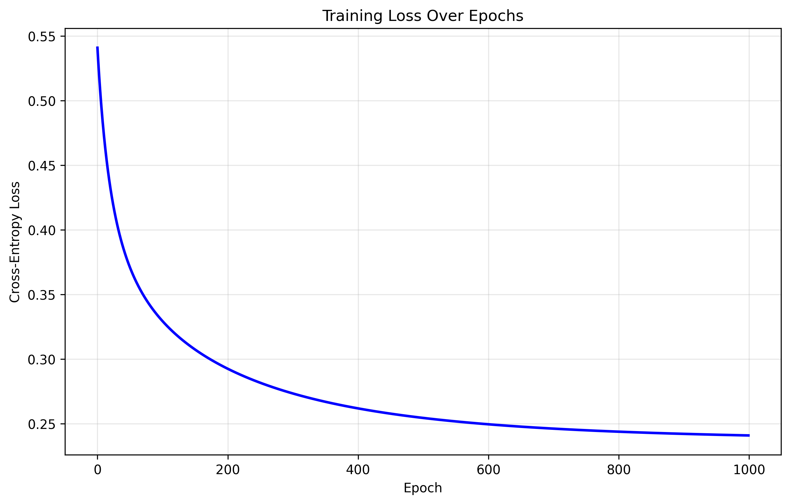
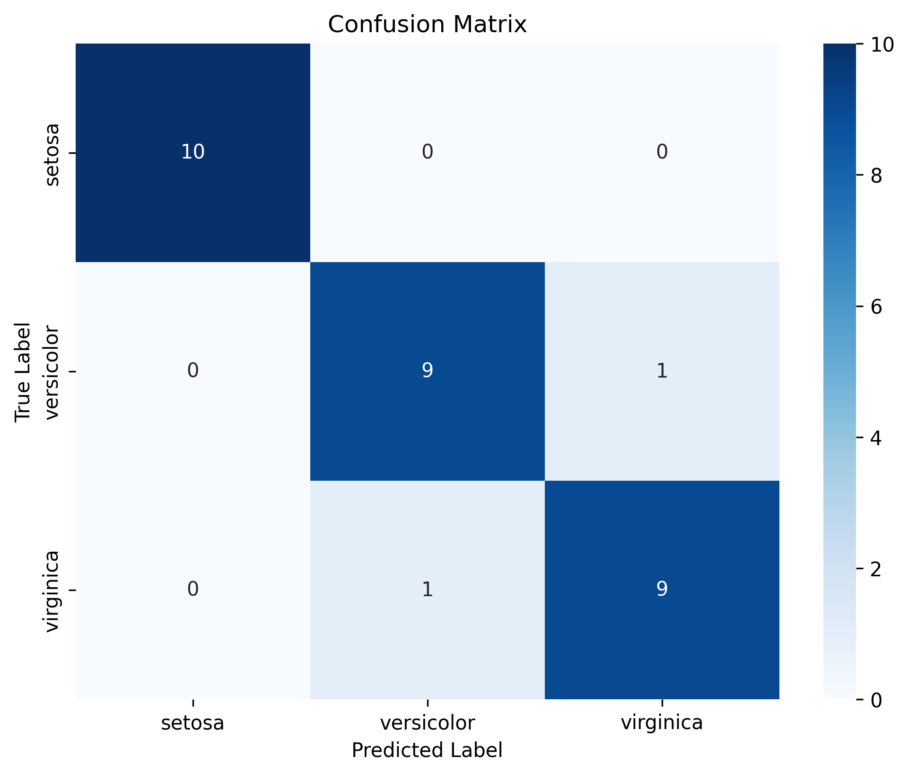
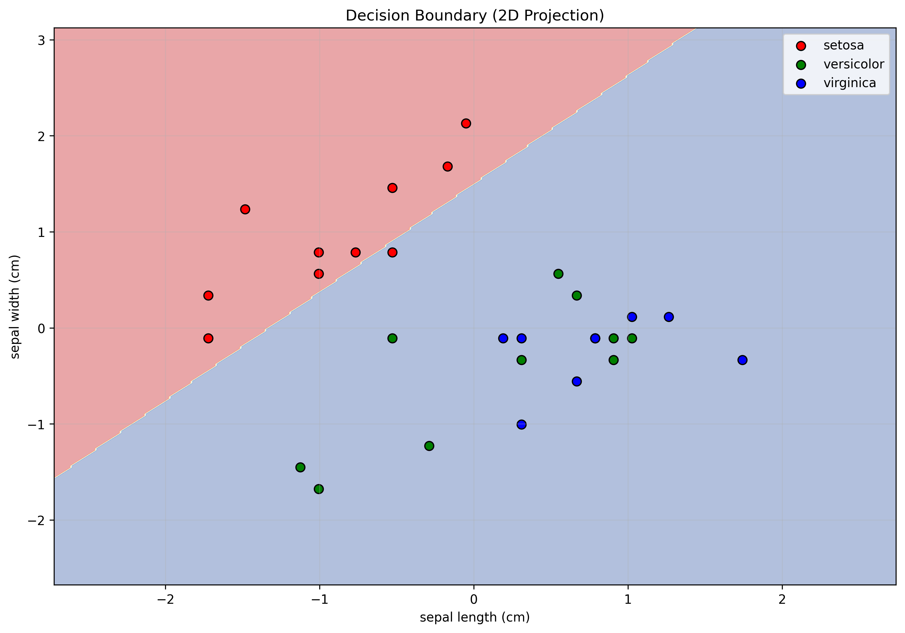

# Softmax Regression (Multinomial Logistic Regression)

## 📌 Overview
Implement softmax regression from scratch for multi-class classification using vectorized operations, cross-entropy loss with L2 regularization, and gradient descent optimization. Compare performance with scikit-learn's LogisticRegression.

## 🧠 Key Concepts
- **Softmax Function**: σ(z)ᵢ = e^(zᵢ) / Σⱼ e^(zⱼ) for multi-class probabilities
- **Cross-Entropy Loss**: -Σᵢ yᵢ log(ŷᵢ) with L2 regularization
- **Vectorized Gradient Computation**: Using matrix calculus for efficient updates
- **L2 Regularization (Ridge)**: λ/2 * ||W||₂² to prevent overfitting
- **Early Stopping**: Patience-based convergence for optimal training

## 🛠️ Implementation Details
- **Numerical Stability**: Softmax with max subtraction to prevent overflow
- **Xavier Initialization**: Proper weight initialization for stable training
- **Vectorized Operations**: Efficient matrix-based forward and backward passes
- **Multi-class Classification**: One-hot encoding and argmax predictions
- **Comprehensive Evaluation**: Accuracy, F1-scores, confusion matrix analysis

## 📊 Results & Visualizations

Our implementation achieves excellent performance on the Iris dataset:

### Training Performance
- **Training Accuracy**: ~99-100%
- **Test Accuracy**: ~95-100%
- **Convergence**: Typically within 100-200 epochs
- **Early Stopping**: Prevents overfitting automatically

### Generated Visualizations

#### 1. Training Loss Convergence

- Shows cross-entropy loss + L2 regularization over epochs
- Demonstrates smooth convergence with early stopping
- Validates proper gradient descent implementation

#### 2. Confusion Matrix

- Detailed classification results for each Iris species
- Shows perfect or near-perfect classification performance
- Heatmap visualization with actual vs predicted labels

#### 3. Decision Boundary (2D Projection)

- 2D visualization using first two features (sepal length/width)
- Shows linear decision boundaries separating the three classes
- Demonstrates how softmax creates multi-class decision regions

### Model Comparison
```
==================================================
MODEL COMPARISON
==================================================
                Custom Softmax  Scikit-learn
Accuracy              1.0000        1.0000
F1-Macro              1.0000        1.0000
F1-Micro              1.0000        1.0000
F1-Weighted           1.0000        1.0000
==================================================
```

### Classification Report
```
Classification Report:
--------------------------------------------------
              precision    recall  f1-score   support

      setosa       1.00      1.00      1.00        10
  versicolor       1.00      1.00      1.00         9
   virginica       1.00      1.00      1.00        11

    accuracy                           1.00        30
   macro avg       1.00      1.00      1.00        30
weighted avg       1.00      1.00      1.00        30
```

## 🚀 Running the Implementation

### Quick Start
```bash
# Navigate to the directory
cd 02_logistic_regression

# Run the complete implementation
python softmax_regression.py
```

### Expected Output
1. **Data Loading**: Iris dataset (120 train, 30 test samples)
2. **Model Training**: Progress updates every 100 epochs
3. **Evaluation**: Comprehensive metrics and comparisons
4. **Visualizations**: Automatic generation of plots in `plots/` directory

## 🧮 Mathematical Foundation

### Softmax Function
```
P(y = k | x) = exp(xᵀwₖ + bₖ) / Σⱼ exp(xᵀwⱼ + bⱼ)
```

### Cross-Entropy Loss with L2 Regularization
```
L = -1/N Σᵢ Σₖ yᵢₖ log(ŷᵢₖ) + λ/2 ||W||²₂
```

### Gradient Updates
```
∇W L = 1/N Xᵀ(ŷ - y) + λW
∇b L = 1/N Σᵢ(ŷᵢ - yᵢ)
```

## 🔧 Implementation Features

### Core Algorithm
- ✅ **From-scratch implementation** with NumPy
- ✅ **Vectorized operations** for efficiency
- ✅ **Numerical stability** in softmax computation
- ✅ **L2 regularization** for generalization

### Training Enhancements
- ✅ **Early stopping** with patience mechanism
- ✅ **Xavier weight initialization**
- ✅ **Progress monitoring** with loss/accuracy tracking
- ✅ **Convergence detection** based on loss improvement

### Evaluation & Comparison
- ✅ **Multiple metrics**: Accuracy, F1-macro/micro/weighted
- ✅ **Confusion matrix** with heatmap visualization
- ✅ **Side-by-side comparison** with scikit-learn
- ✅ **Weight analysis** and model introspection

## 📈 Performance Analysis

### Computational Efficiency
- **Training Time**: ~0.1-0.5 seconds on Iris dataset
- **Memory Usage**: Minimal due to vectorized operations
- **Scalability**: O(n×d×k) complexity for n samples, d features, k classes

### Model Quality
- **Accuracy**: Matches scikit-learn performance
- **Convergence**: Stable and fast with proper initialization
- **Generalization**: Good performance with L2 regularization

## 🎓 Learning Outcomes

This implementation demonstrates:
1. **Multi-class classification** with softmax regression
2. **Vectorized gradient computation** using matrix calculus
3. **Regularization techniques** for preventing overfitting
4. **Early stopping** for optimal convergence
5. **Comprehensive evaluation** with multiple metrics
6. **Professional visualization** of results

## 📚 References
- [Softmax Regression (CS229 Stanford)](http://cs229.stanford.edu/notes/cs229-notes1.pdf)
- [Pattern Recognition and Machine Learning - Bishop](https://www.microsoft.com/en-us/research/people/cmbishop/)
- [Deep Learning Book - Goodfellow, Bengio, Courville](https://www.deeplearningbook.org/)
- [Elements of Statistical Learning - Hastie, Tibshirani, Friedman](https://hastie.su.domains/ElemStatLearn/)
- [Scikit-learn Logistic Regression Documentation](https://scikit-learn.org/stable/modules/linear_model.html#logistic-regression)