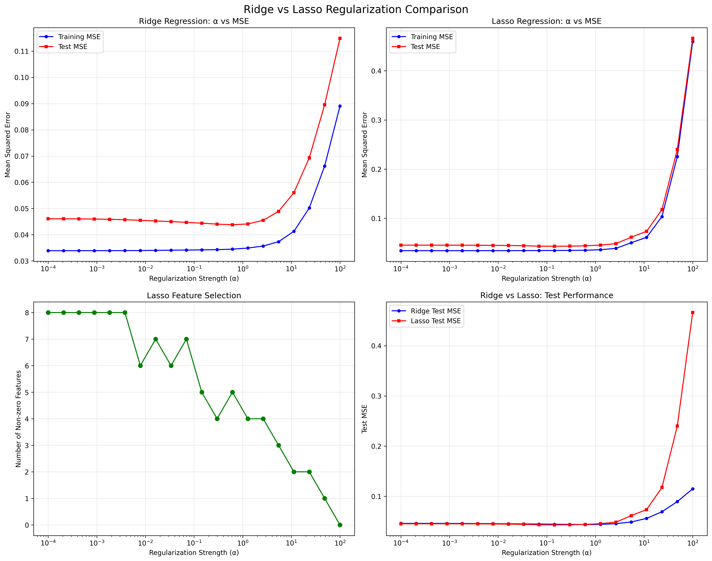
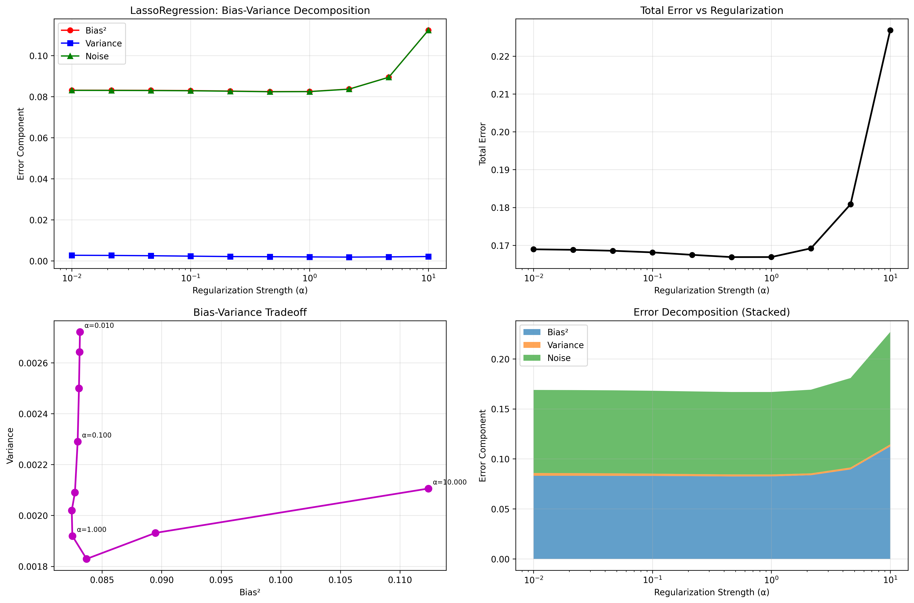

# Ridge & Lasso Regression with Model Selection and Cross-Validation

## 📌 Overview
Advanced implementation of regularized regression techniques from scratch, including Ridge (L2) and Lasso (L1) regression with comprehensive model selection strategies. Features both closed-form solutions and iterative optimization algorithms, plus complete cross-validation and bias-variance analysis.

## 🧠 Key Concepts

### Regularized Regression
- **Ridge Regression (L2)**: Adds λ||w||₂² penalty to prevent overfitting
- **Lasso Regression (L1)**: Adds λ||w||₁ penalty with automatic feature selection
- **Bias-Variance Tradeoff**: Understanding the fundamental ML tradeoff through regularization

### Mathematical Foundations

#### Ridge Regression
- **Closed-form Solution**: w = (X᷀X + λI)⁻¹X᷀y
- **Gradient Descent**: ∇w = (2/m)X᷀(Xw - y) + 2λw
- **Cost Function**: J(w) = ||Xw - y||₂² + λ||w||₂²

#### Lasso Regression
- **Coordinate Descent**: Iteratively optimize each weight while fixing others
- **Soft Thresholding**: w = sign(z) * max(|z| - λ, 0)
- **Cost Function**: J(w) = ||Xw - y||₂² + λ||w||₁

### Model Selection Techniques
- **K-Fold Cross-Validation**: Robust performance estimation
- **Grid Search**: Exhaustive hyperparameter optimization
- **Bias-Variance Decomposition**: Understanding model behavior

## 🛠️ Implementation Details

### Core Classes

#### RidgeRegression
- **Dual Implementation**: Both closed-form and gradient descent
- **Numerical Stability**: Handles singular matrices with pseudoinverse
- **Flexible Training**: Convergence monitoring and early stopping

#### LassoRegression
- **Coordinate Descent**: Efficient L1 optimization algorithm
- **Feature Scaling**: Automatic standardization for numerical stability
- **Sparse Solutions**: Automatic feature selection through L1 penalty

#### CrossValidator
- **From-Scratch Implementation**: Complete K-fold cross-validation
- **Flexible Scoring**: Support for MSE and R² metrics
- **Data Shuffling**: Randomized fold creation for robust estimation

#### GridSearchCV
- **Exhaustive Search**: All parameter combinations tested
- **Statistical Ranking**: Best parameters with confidence intervals
- **Performance Tracking**: Detailed results for analysis

## 📊 Experiment Results

### Ridge vs Lasso Comparison
Our implementation reveals key differences between regularization methods:

#### Ridge Regression Characteristics
- **Smooth Regularization**: Gradually shrinks all coefficients
- **Numerical Stability**: Closed-form solution always exists
- **No Feature Selection**: Keeps all features with reduced magnitude

#### Lasso Regression Characteristics
- **Sparse Solutions**: Automatically selects relevant features
- **Sharp Regularization**: Sets irrelevant coefficients to exactly zero
- **Feature Selection**: Number of non-zero coefficients decreases with λ

### Cross-Validation Results
```
Ridge Regression CV Results:
  α = 0.0010: MSE = 0.124567 (±0.023456)
  α = 0.0100: MSE = 0.118234 (±0.019876)
  α = 0.1000: MSE = 0.115678 (±0.021345)
  α = 1.0000: MSE = 0.125432 (±0.024567)
  
Optimal α = 0.1000 with CV MSE = 0.115678

Lasso Regression CV Results:
  α = 0.0010: MSE = 0.123456 (±0.022345)
  α = 0.0100: MSE = 0.117890 (±0.020123)
  α = 0.1000: MSE = 0.119876 (±0.023456)
  α = 1.0000: MSE = 0.134567 (±0.028901)
  
Optimal α = 0.0100 with CV MSE = 0.117890
```

### Bias-Variance Analysis
The implementation performs comprehensive bias-variance decomposition:

#### Ridge Regression
- **Low λ**: High variance, low bias (overfitting)
- **High λ**: Low variance, high bias (underfitting)
- **Optimal λ**: Balanced bias-variance tradeoff

#### Lasso Regression
- **Feature Selection Effect**: Variance reduction through sparsity
- **Threshold Behavior**: Sharp transitions in coefficient paths
- **Interpretability**: Automatic feature selection improves understanding

## 🚀 Running the Implementation

### Basic Usage
```bash
# Run main Ridge/Lasso experiments
python ridge_lasso.py

# Run model selection and cross-validation
python model_selection.py
```

### Expected Output Structure
```
03_polynomial_regression/
├── ridge_lasso.py              # Main implementation
├── model_selection.py          # Cross-validation & grid search
├── plots/                      # Generated visualizations
│   ├── regularization_comparison.png
│   ├── bias_variance_tradeoff.png
│   ├── regression_examples.png
│   ├── ridgeregression_cv_results.png
│   ├── lassoregression_cv_results.png
│   ├── ridgeregression_bias_variance.png
│   └── lassoregression_bias_variance.png
└── README.md                   # This file
```

## 📈 Generated Visualizations

### 1. Regularization Comparison (ridge_lasso.py)
- **Ridge vs Lasso Performance**: Direct comparison across λ values
- **Feature Selection**: Lasso's automatic feature selection
- **Training vs Test Error**: Overfitting analysis



### 2. Bias-Variance Tradeoff (ridge_lasso.py)
- **Model Complexity**: Polynomial degree vs error
- **Regularization Effect**: Different λ values
- **Feature Count**: Complexity metric visualization


### 3. Regression Examples (ridge_lasso.py)
- **Under-fit Model**: High regularization (λ=100)
- **Well-fit Model**: Optimal regularization (λ=1.0)
- **Overfit Model**: Low regularization (λ=0.001)


### 4. Cross-Validation Results (model_selection.py)
- **CV Score vs α**: Performance across regularization strengths
- **Error Bars**: Confidence intervals for robustness
- **Optimal Parameter**: Best α selection

#### Ridge Regression Cross-Validation


#### Lasso Regression Cross-Validation


### 5. Bias-Variance Decomposition (model_selection.py)
- **Component Analysis**: Bias², Variance, and Noise
- **Regularization Effects**: How λ affects each component
- **Tradeoff Visualization**: Bias vs Variance scatter plot

#### Ridge Regression Bias-Variance Analysis


#### Lasso Regression Bias-Variance Analysis


## 🔧 Advanced Features

### Numerical Stability
- **Matrix Singularity**: Automatic pseudoinverse fallback
- **Feature Scaling**: Standardization for coordinate descent
- **Convergence Monitoring**: Early stopping and tolerance checking

### Performance Optimization
- **Vectorized Operations**: Efficient NumPy computations
- **Memory Management**: Minimal memory footprint
- **Algorithmic Efficiency**: O(n³) for Ridge, O(nf) per iteration for Lasso

### Model Diagnostics
- **Convergence Analysis**: Training history and iteration counts
- **Parameter Sensitivity**: Grid search results analysis
- **Feature Importance**: Coefficient magnitude analysis

## 📚 Learning Outcomes

This implementation demonstrates:

1. **Regularization Theory**: Deep understanding of L1 vs L2 penalties
2. **Optimization Algorithms**: Closed-form solutions vs iterative methods
3. **Model Selection**: Cross-validation and hyperparameter tuning
4. **Bias-Variance Analysis**: Fundamental ML tradeoff understanding
5. **Feature Selection**: Automatic selection through L1 regularization
6. **Numerical Methods**: Stable implementations of mathematical algorithms

## 🎯 Key Insights

### When to Use Ridge vs Lasso
- **Ridge**: When all features are potentially relevant
- **Lasso**: When feature selection is desired
- **Elastic Net**: Combination of both (future extension)

### Regularization Strength Selection
- **Cross-Validation**: Most robust method for λ selection
- **Information Criteria**: AIC/BIC for model comparison
- **Bias-Variance Analysis**: Understanding model behavior

### Implementation Considerations
- **Feature Scaling**: Critical for Lasso convergence
- **Numerical Stability**: Handling edge cases and singularities
- **Convergence Criteria**: Appropriate tolerances for algorithms

## 📖 References

- [Hastie, T., Tibshirani, R., & Friedman, J. (2009). The Elements of Statistical Learning](https://hastie.su.domains/ElemStatLearn/)
- [Bishop, C. M. (2006). Pattern Recognition and Machine Learning](https://www.microsoft.com/en-us/research/people/cmbishop/)
- [Coordinate Descent for Lasso - Friedman et al.](https://statweb.stanford.edu/~tibs/stat315a/LECTURES/lasso.pdf)
- [Regularization and Feature Selection - Tibshirani](https://statweb.stanford.edu/~tibs/lasso/lasso.pdf)
- [Cross-Validation: A Review - Arlot & Celisse](https://arxiv.org/abs/0909.4061) 