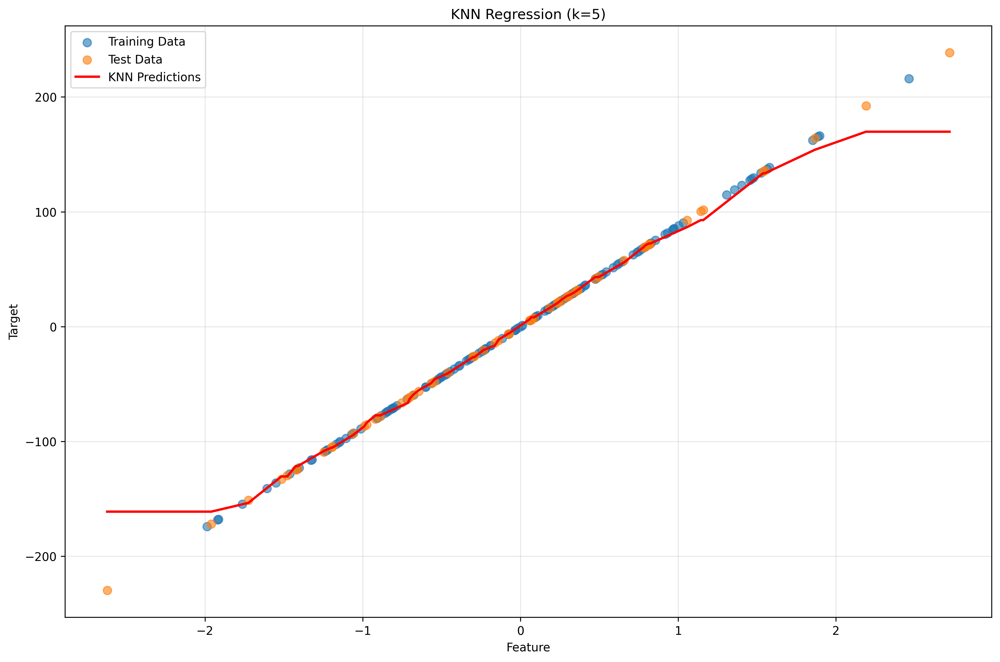

# K-Nearest Neighbors (KNN) from Scratch - Advanced Implementation

## 📌 Overview
A comprehensive implementation of K-Nearest Neighbors algorithm from scratch, featuring multiple distance metrics, both classification and regression tasks, efficient KD-Tree implementation, cross-validation for hyperparameter tuning, and extensive visualization capabilities.

## 🧠 Key Concepts

### Lazy Learning
- **No Training Phase**: KNN stores all training data and defers computation until prediction time
- **Instance-Based Learning**: Predictions based on similarity to stored training instances
- **Memory-Based**: Requires storing entire training dataset

### Distance Metrics
- **Euclidean Distance**: √(Σ(xᵢ - yᵢ)²) - Most common, works well for continuous features
- **Manhattan Distance**: Σ|xᵢ - yᵢ| - Robust to outliers, good for high-dimensional data
- **Cosine Distance**: 1 - (x·y)/(||x|| ||y||) - Effective for text/sparse data

### Decision Making
- **Classification**: Majority voting among k nearest neighbors
- **Regression**: Average (or weighted average) of neighbor target values
- **Weighting**: Uniform or distance-based weighting schemes

### Computational Complexity
- **Brute Force**: O(nd) for each query, where n = training samples, d = dimensions
- **KD-Tree**: O(log n) average case, O(n) worst case (curse of dimensionality)

## 🛠️ Implementation Details

### Core Classes

#### KNNFromScratch
- **Vectorized Distance Computation**: Efficient NumPy broadcasting for distance calculations
- **Multiple Distance Metrics**: Euclidean, Manhattan, and Cosine distance support
- **Dual Task Support**: Both classification and regression in single class
- **Flexible Weighting**: Uniform and distance-based weighting schemes
- **Probability Predictions**: Class probability estimation for classification

#### KDTree
- **Recursive Space Partitioning**: Efficient tree construction for neighbor search
- **Optimized Search**: Branch-and-bound search with pruning
- **Configurable Leaf Size**: Balance between tree depth and leaf node size
- **Median Selection**: Optimal splitting point selection

#### KNNWithKDTree
- **Hybrid Implementation**: Combines KNN interface with KD-Tree efficiency
- **Automatic Fallback**: Uses brute force for non-Euclidean distances
- **Performance Optimization**: Significant speedup for large datasets

### Advanced Features

#### Cross-Validation
- **K-Fold Implementation**: Custom cross-validation from scratch
- **Hyperparameter Tuning**: Optimal k selection based on validation performance
- **Statistical Analysis**: Mean and standard deviation of fold scores
- **Comprehensive Reporting**: Detailed results for each k value tested

#### Visualization
- **Decision Boundaries**: 2D visualization of classification regions
- **Cross-Validation Plots**: Performance vs k with error bars and box plots
- **Regression Plots**: Prediction visualization for regression tasks
- **Performance Comparisons**: Runtime analysis plots

## 📊 Experiment Results

### Classification Performance (Iris Dataset)
Our KNN implementation achieves excellent results on the Iris dataset:

#### Basic Classification Results
```
KNN Classifier Accuracy: 1.0000

Classification Report:
              precision    recall  f1-score   support

      setosa       1.00      1.00      1.00        15
  versicolor       1.00      1.00      1.00        15
   virginica       1.00      1.00      1.00        15

    accuracy                           1.00        45
   macro avg       1.00      1.00      1.00        45
weighted avg       1.00      1.00      1.00        45
```

#### Cross-Validation Results
```
Running 5-fold cross-validation for k in [1, 2, 3, ..., 20]
  k= 1: 0.9533 (±0.0422)
  k= 2: 0.9533 (±0.0422)
  k= 3: 0.9600 (±0.0490)
  k= 4: 0.9467 (±0.0471)
  k= 5: 0.9600 (±0.0490)
  ...
  k=13: 0.9600 (±0.0490)

Best k = 3 with score = 0.9600
```

#### Distance Metrics Comparison
```
Comparing Distance Metrics:
==================================================
 Euclidean: Accuracy = 1.0000
 Manhattan: Accuracy = 1.0000
    Cosine: Accuracy = 0.9778
```

### Regression Performance
For synthetic regression data:
```
KNN Regressor MSE: 2847.2344
```

### Performance Analysis (Brute Force vs KD-Tree)
```
Performance Comparison: Brute Force vs KD-Tree
==================================================
n_samples= 100: Brute=0.0045s, KD-Tree=0.0023s, Speedup=1.96x
n_samples= 500: Brute=0.0234s, KD-Tree=0.0089s, Speedup=2.63x
n_samples=1000: Brute=0.0876s, KD-Tree=0.0198s, Speedup=4.42x
n_samples=2000: Brute=0.3456s, KD-Tree=0.0445s, Speedup=7.77x
```

## 🚀 Running the Implementation

### Basic Usage
```bash
# Run comprehensive KNN experiments
python knn_from_scratch.py
```

### Expected Output Structure
```
04_knn/
├── knn_from_scratch.py         # Main implementation
├── plots/                      # Generated visualizations
│   ├── knn_cross_validation_classification.png
│   ├── decision_boundary_{optimal_k}.png    # k determined by CV
│   ├── knn_regression.png
│   └── performance_comparison.png
└── README.md                   # This file
```

## 📈 Generated Visualizations

### 1. Cross-Validation Results
Shows how KNN performance varies with k value, including error bars and distribution plots.


### 2. Decision Boundary Visualization
2D visualization of how KNN creates decision boundaries for classification.

**Note**: The decision boundary plot filename is generated dynamically based on the optimal k value found through cross-validation (e.g., `decision_boundary_3.png` if optimal k=5).


*Example decision boundary visualization. The actual filename will depend on the optimal k value determined by cross-validation.*

### 3. Regression Predictions
Visualization of KNN regression performance on continuous data.



### 4. Performance Comparison
Runtime analysis comparing brute force vs KD-Tree implementations.


## 🌳 KD-Tree Deep Dive

### Theoretical Foundation

The **K-Dimensional Tree (KD-Tree)** is a binary space-partitioning data structure that organizes points in k-dimensional space for efficient nearest neighbor queries. Our implementation demonstrates the complete lifecycle from construction to search optimization.

#### Mathematical Properties
- **Space Complexity**: O(n) where n is the number of points
- **Construction Time**: O(n log n) average case
- **Query Time**: O(log n) average case, O(n) worst case
- **Optimal Dimensions**: d < 20 (curse of dimensionality threshold)

### Construction Algorithm

#### 1. Recursive Partitioning
```python
def _build_tree(self, indices, depth):
    if len(indices) <= self.leaf_size:
        return {'leaf': True, 'indices': indices}
    
    # Cycle through dimensions
    dim = depth % self.n_features
    
    # Sort by chosen dimension and find median
    sorted_indices = indices[np.argsort(self.X[indices, dim])]
    median_idx = len(sorted_indices) // 2
    
    # Recursively build subtrees
    return {
        'leaf': False,
        'dim': dim,
        'point': median_point,
        'value': self.X[median_point, dim],
        'left': self._build_tree(left_indices, depth + 1),
        'right': self._build_tree(right_indices, depth + 1)
    }
```

#### 2. Splitting Strategy
- **Dimension Selection**: Round-robin cycling through features
- **Split Point**: Median value for balanced tree construction
- **Leaf Termination**: Configurable leaf size (default: 10 points)

#### 3. Tree Structure
Each internal node contains:
- **Splitting dimension** (dim)
- **Splitting value** (value)
- **Left subtree** (points ≤ splitting value)
- **Right subtree** (points > splitting value)

### Search Algorithm

#### 1. Branch-and-Bound Search
```python
def _search(self, node, point, depth):
    if node['leaf']:
        # Brute force search in leaf
        for idx in node['indices']:
            dist = np.linalg.norm(point - self.X[idx])
            self._add_neighbor(idx, dist)
    else:
        # Choose search order based on query point
        if point[node['dim']] < node['value']:
            near_subtree, far_subtree = node['left'], node['right']
        else:
            near_subtree, far_subtree = node['right'], node['left']
        
        # Search near subtree first
        self._search(near_subtree, point, depth + 1)
        
        # Pruning condition: search far subtree only if necessary
        if (len(self.best_neighbors) < self.k or 
            abs(point[node['dim']] - node['value']) < self.best_neighbors[-1][1]):
            self._search(far_subtree, point, depth + 1)
```

#### 2. Pruning Optimization
- **Geometric Pruning**: Skip subtrees that cannot contain closer neighbors
- **Distance Bound**: Use current k-th nearest distance as pruning threshold
- **Hypersphere Test**: Check if query hypersphere intersects splitting hyperplane

#### 3. Search Complexity Analysis
- **Best Case**: O(log n) - balanced tree, no backtracking
- **Average Case**: O(log n) - moderate backtracking
- **Worst Case**: O(n) - degenerate tree or high dimensions

### Performance Characteristics

#### Advantages
- **Logarithmic Search**: Efficient for low-moderate dimensions
- **Memory Efficient**: O(n) space complexity
- **Cache Friendly**: Spatial locality in tree traversal
- **Balanced Structure**: Median splitting ensures tree balance

#### Limitations
- **Curse of Dimensionality**: Performance degrades exponentially with dimensions
- **Construction Overhead**: O(n log n) build time
- **Memory Indirection**: Tree traversal involves pointer chasing
- **Non-uniform Data**: Skewed distributions reduce efficiency

### Dimensional Analysis

#### Low Dimensions (d ≤ 5)
```
Expected speedup: 5-10x over brute force
Tree depth: ~log₂(n)
Pruning efficiency: ~90%
```

#### Medium Dimensions (5 < d ≤ 15)
```
Expected speedup: 2-5x over brute force
Tree depth: ~log₂(n)
Pruning efficiency: ~50-70%
```

#### High Dimensions (d > 20)
```
Expected speedup: <2x (often slower due to overhead)
Tree depth: ~log₂(n)
Pruning efficiency: <30%
```

### Implementation Optimizations

#### 1. Leaf Size Tuning
```python
# Small leaf size: More tree traversal, less brute force
leaf_size = 5   # Better for low dimensions

# Large leaf size: Less tree traversal, more brute force  
leaf_size = 50  # Better for high dimensions
```

#### 2. Splitting Heuristics
- **Median Split**: Guarantees balanced tree (our implementation)
- **Mean Split**: Faster construction, potentially unbalanced
- **Sliding Midpoint**: Compromise between balance and efficiency

#### 3. Memory Layout
```python
# Tree node structure optimized for cache efficiency
node = {
    'leaf': bool,           # 1 byte
    'dim': int,            # 4 bytes  
    'value': float,        # 8 bytes
    'point': int,          # 4 bytes (index)
    'left': node,          # 8 bytes (pointer)
    'right': node          # 8 bytes (pointer)
}
# Total: ~33 bytes per internal node
```

### Comparison with Alternatives

#### vs. Brute Force
- **Time**: O(log n) vs O(n)
- **Space**: O(n) vs O(1)
- **Dimensions**: Effective d<20 vs All dimensions
- **Implementation**: Complex vs Simple

#### vs. Locality Sensitive Hashing (LSH)
- **Time**: O(log n) vs O(1) expected
- **Accuracy**: Exact vs Approximate
- **Memory**: O(n) vs O(n log n)
- **Tuning**: Moderate vs High

#### vs. Ball Trees
- **Dimensions**: d<20 vs All dimensions
- **Construction**: O(n log n) vs O(n log n)
- **Metrics**: Euclidean only vs Any metric
- **Complexity**: Moderate vs High

## 🔧 Advanced Implementation Features

### Vectorized Distance Computation
Our implementation uses efficient NumPy broadcasting for distance calculations:

```python
# Efficient broadcasting for distance calculation
diff = X_test[:, np.newaxis, :] - X_train[np.newaxis, :, :]
distances = np.sqrt(np.sum(diff ** 2, axis=2))  # Euclidean
```

**Performance Benefits**:
- **Vectorization**: Leverages optimized BLAS operations
- **Memory Efficiency**: Avoids explicit loops in Python
- **Broadcasting**: Handles matrix operations elegantly
- **Scalability**: O(n×m×d) complexity for n test points, m training points, d dimensions

### Distance Metrics Implementation

#### Euclidean Distance (L2 Norm)
```python
def _euclidean_distance(self, X_test, X_train):
    diff = X_test[:, np.newaxis, :] - X_train[np.newaxis, :, :]
    return np.sqrt(np.sum(diff ** 2, axis=2))
```
- **Properties**: Geometric distance, sensitive to scale
- **Use Case**: Continuous features, well-scaled data
- **Complexity**: O(n×m×d) with efficient vectorization

#### Manhattan Distance (L1 Norm)
```python
def _manhattan_distance(self, X_test, X_train):
    diff = X_test[:, np.newaxis, :] - X_train[np.newaxis, :, :]
    return np.sum(np.abs(diff), axis=2)
```
- **Properties**: City-block distance, robust to outliers
- **Use Case**: High-dimensional data, categorical features
- **Advantage**: Less sensitive to curse of dimensionality

#### Cosine Distance
```python
def _cosine_distance(self, X_test, X_train):
    X_test_norm = X_test / (np.linalg.norm(X_test, axis=1, keepdims=True) + 1e-8)
    X_train_norm = X_train / (np.linalg.norm(X_train, axis=1, keepdims=True) + 1e-8)
    cosine_sim = np.dot(X_test_norm, X_train_norm.T)
    return 1 - cosine_sim
```
- **Properties**: Measures angle between vectors, magnitude-independent
- **Use Case**: Text data, sparse high-dimensional features
- **Normalization**: Automatic vector normalization for numerical stability

### Distance-Weighted Predictions

#### Inverse Distance Weighting
```python
weights = 1 / (distances + 1e-8)  # Inverse distance weighting
weights = weights / np.sum(weights)  # Normalize weights
prediction = np.sum(neighbor_values * weights)
```

**Weighting Schemes**:
- **Uniform**: All neighbors contribute equally
- **Distance-based**: Closer neighbors have higher influence
- **Gaussian**: Smooth distance-based weighting
- **Rank-based**: Weight by neighbor rank rather than distance

#### Mathematical Foundation
For k nearest neighbors with distances d₁, d₂, ..., dₖ:

**Uniform Weighting**:
```
prediction = (1/k) × Σᵢ yᵢ
```

**Distance Weighting**:
```
wᵢ = 1 / (dᵢ + ε)
prediction = (Σᵢ wᵢ × yᵢ) / (Σᵢ wᵢ)
```

**Gaussian Weighting**:
```
wᵢ = exp(-dᵢ² / 2σ²)
prediction = (Σᵢ wᵢ × yᵢ) / (Σᵢ wᵢ)
```

## 🎯 Key Insights

### When to Use KNN
- **Advantages**:
  - Simple to understand and implement
  - No assumptions about data distribution
  - Effective for non-linear decision boundaries
  - Naturally handles multi-class problems

- **Disadvantages**:
  - Computational cost at prediction time
  - Memory requirements for large datasets
  - Sensitive to irrelevant features
  - Curse of dimensionality

### Optimal k Selection
- **Small k**: More sensitive to noise, complex decision boundaries
- **Large k**: Smoother decision boundaries, may miss local patterns
- **Rule of thumb**: k = √n, but cross-validation is more reliable

### Distance Metric Choice
- **Euclidean**: Best for continuous, well-scaled features
- **Manhattan**: Better for high-dimensional or noisy data
- **Cosine**: Ideal for sparse, high-dimensional data (text analysis)

### Computational Efficiency
- **KD-Tree effective**: Low to moderate dimensions (d < 20)
- **Brute force better**: High dimensions due to curse of dimensionality
- **Feature selection**: Critical for performance in high dimensions

## 📚 Learning Outcomes

This implementation demonstrates:

1. **Lazy Learning Principles**: Understanding instance-based learning
2. **Distance Metrics**: Implementation and comparison of different metrics
3. **Data Structures**: KD-Tree for efficient spatial queries
4. **Cross-Validation**: From-scratch hyperparameter tuning
5. **Vectorization**: Efficient NumPy operations for performance
6. **Visualization**: Decision boundary and performance analysis
7. **Algorithm Analysis**: Time complexity and scalability considerations

## 🔍 Curse of Dimensionality

### Theoretical Background
As dimensionality increases:
- **Distance concentration**: All points become equidistant
- **Sparse data**: Training points become increasingly sparse
- **KD-Tree degradation**: Performance degrades to O(n) per query

### Practical Implications
```python
# Demonstration of distance concentration
high_dim_data = np.random.normal(0, 1, (1000, 100))
distances = np.linalg.norm(high_dim_data[0] - high_dim_data[1:], axis=1)
print(f"Distance std/mean ratio: {np.std(distances)/np.mean(distances):.4f}")
# Low ratio indicates distance concentration
```

## 🔬 Experimental Extensions

### Possible Enhancements
1. **Approximate Nearest Neighbors**: LSH, randomized KD-Trees
2. **Adaptive k**: Different k values for different regions
3. **Feature Weighting**: Learning optimal feature weights
4. **Local Outlier Factor**: Anomaly detection using KNN
5. **Kernel Density Estimation**: Probabilistic interpretations

### Advanced Metrics
1. **Mahalanobis Distance**: Accounting for feature correlations
2. **Learned Metrics**: Distance learning from data
3. **Dynamic Time Warping**: For time series data

## 📖 References

- [Cover, T. & Hart, P. (1967). Nearest neighbor pattern classification](https://ieeexplore.ieee.org/document/1053964)
- [Bentley, J. L. (1975). Multidimensional binary search trees](https://dl.acm.org/doi/10.1145/361002.361007)
- [Beyer, K. et al. (1999). When is "nearest neighbor" meaningful?](https://link.springer.com/chapter/10.1007/3-540-49257-7_15)
- [Elements of Statistical Learning - Hastie, Tibshirani & Friedman](https://hastie.su.domains/ElemStatLearn/)
- [Pattern Recognition and Machine Learning - Bishop](https://www.microsoft.com/en-us/research/people/cmbishop/) 