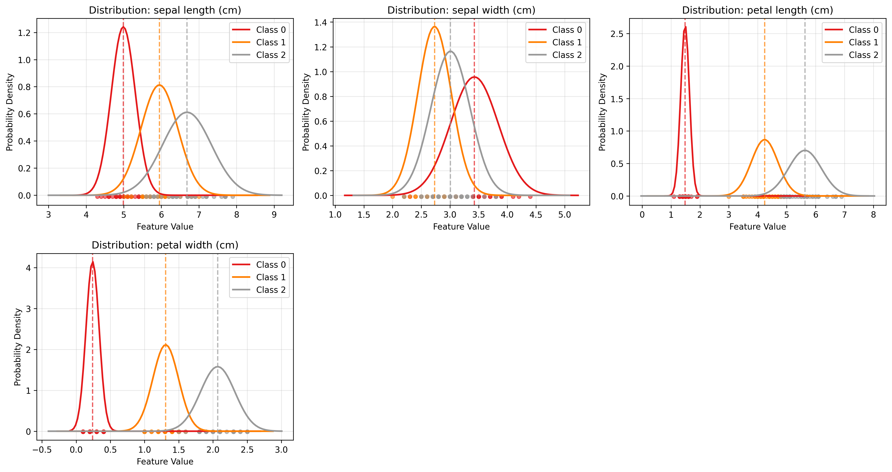
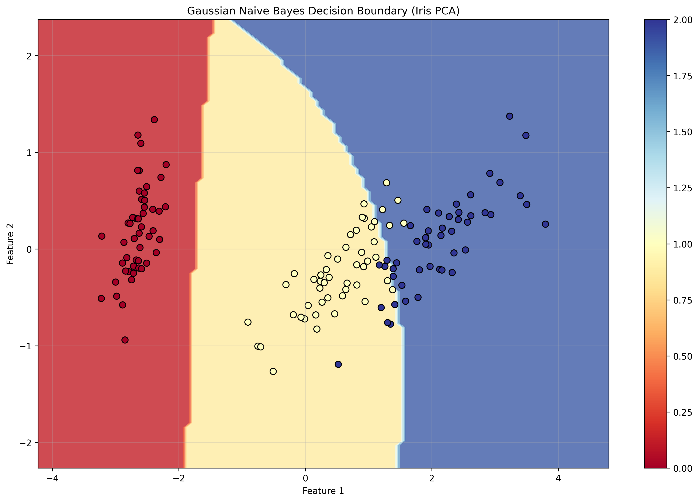
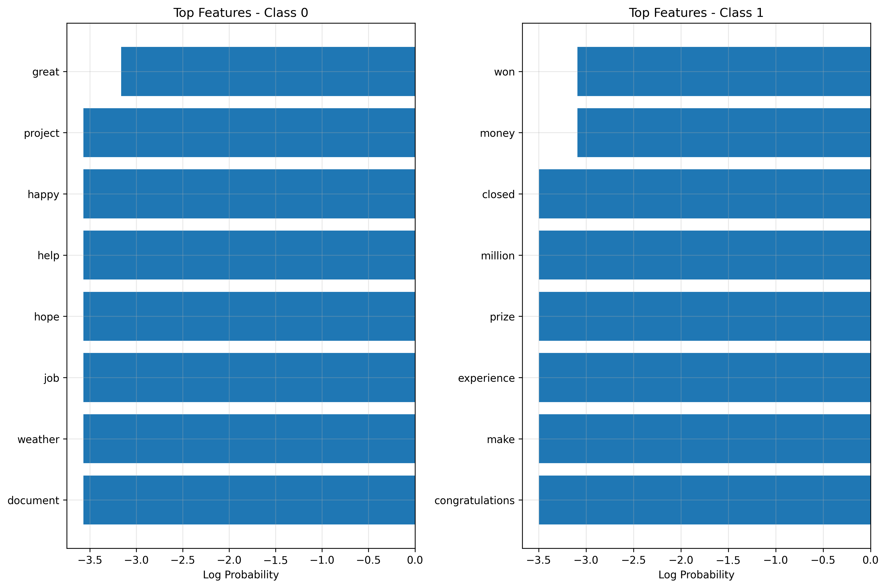
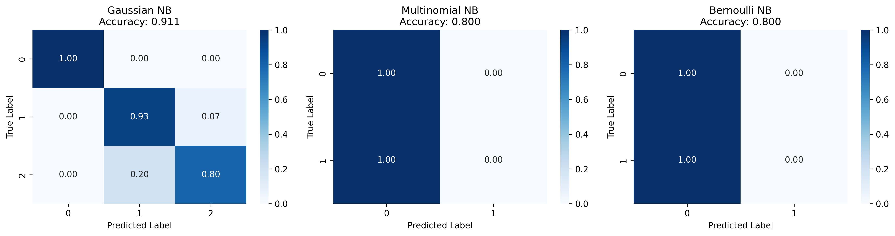
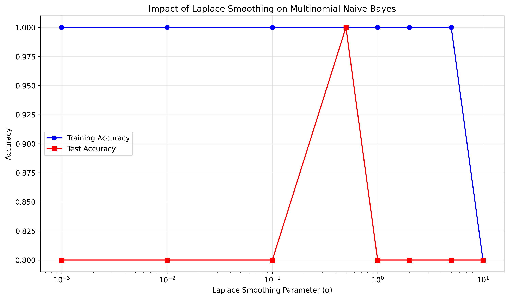

# Naive Bayes from Scratch - Advanced Implementation

## 📌 Overview
A comprehensive implementation of three Naive Bayes classifiers from scratch, featuring Gaussian, Multinomial, and Bernoulli variants with complete mathematical foundations, log-space computations, Laplace smoothing, and extensive visualization capabilities.

## 🧠 Mathematical Foundation

### Bayes' Theorem
The foundation of Naive Bayes classification:

```
P(y|x) = P(x|y) × P(y) / P(x)
```

Since P(x) is constant for all classes, we can use:

```
P(y|x) ∝ P(y) × P(x|y)
```

### Naive Independence Assumption
Assuming features are conditionally independent given the class:

```
P(x|y) = ∏ᵢ P(xᵢ|y)
```

This gives us the complete Naive Bayes formula:

```
P(y|x) ∝ P(y) × ∏ᵢ P(xᵢ|y)
```

## 🎯 Three Variants Implemented

### 1. Gaussian Naive Bayes
**Use Case**: Continuous features that follow normal distribution

#### Mathematical Model
For continuous features, we assume each feature follows a Gaussian distribution:

```
P(xᵢ|y) = (1/√(2πσ²ᵧ,ᵢ)) × exp(-(xᵢ - μᵧ,ᵢ)²/(2σ²ᵧ,ᵢ))
```

#### Parameter Estimation (MLE)
- **Mean**: μᵧ,ᵢ = (1/nᵧ) × Σ xᵢ (for class y)
- **Variance**: σ²ᵧ,ᵢ = (1/nᵧ) × Σ(xᵢ - μᵧ,ᵢ)²

#### Log-Likelihood Computation
```
log P(xᵢ|y) = -0.5 × log(2πσ²ᵧ,ᵢ) - (xᵢ - μᵧ,ᵢ)²/(2σ²ᵧ,ᵢ)
```

### 2. Multinomial Naive Bayes
**Use Case**: Discrete features like word counts in text classification

#### Mathematical Model
For discrete count features:

```
P(xᵢ|y) = (count(xᵢ, y) + α) / (Σⱼ count(xⱼ, y) + α × |V|)
```

#### Laplace Smoothing
- **α = 1**: Standard Laplace smoothing
- **α = 0**: No smoothing (maximum likelihood)
- **α > 1**: Stronger smoothing

#### Log-Likelihood Computation
```
log P(x|y) = Σᵢ xᵢ × log P(xᵢ|y)
```

### 3. Bernoulli Naive Bayes
**Use Case**: Binary features (presence/absence)

#### Mathematical Model
For binary features:

```
P(xᵢ|y) = pᵧ,ᵢ^xᵢ × (1 - pᵧ,ᵢ)^(1-xᵢ)
```

Where pᵧ,ᵢ = P(xᵢ = 1|y) with Laplace smoothing:

```
pᵧ,ᵢ = (count(xᵢ = 1, y) + α) / (count(y) + 2α)
```

## 🛠️ Implementation Details

### Core Classes

#### GaussianNaiveBayes
```python
class GaussianNaiveBayes:
    def __init__(self, var_smoothing=1e-9):
        # Gaussian-specific parameters
        self.theta_ = None    # Means μᵧ,ᵢ
        self.sigma_ = None    # Variances σ²ᵧ,ᵢ
        
    def _calculate_log_likelihood(self, X):
        # Vectorized Gaussian log-likelihood computation
        diff = X - self.theta_[i]
        log_prob = -0.5 * np.log(2π * σ²) - diff² / (2σ²)
        return np.sum(log_prob, axis=1)
```

#### MultinomialNaiveBayes
```python
class MultinomialNaiveBayes:
    def __init__(self, alpha=1.0):
        self.alpha = alpha  # Laplace smoothing parameter
        
    def fit(self, X, y):
        # Compute smoothed feature probabilities
        smoothed_counts = feature_counts + self.alpha
        smoothed_total = total_count + self.alpha * n_features
        self.feature_log_prob_ = np.log(smoothed_counts / smoothed_total)
```

#### BernoulliNaiveBayes
```python
class BernoulliNaiveBayes:
    def __init__(self, alpha=1.0, binarize=0.0):
        self.alpha = alpha
        self.binarize = binarize  # Threshold for binarization
        
    def predict_log_proba(self, X):
        # Handle both present and absent features
        log_likelihood = X * log_prob_1 + (1-X) * log_prob_0
        return log_likelihood
```

### Advanced Features

#### Numerical Stability
- **Log-space computations**: Prevent numerical underflow
- **Variance smoothing**: Avoid division by zero
- **Normalization**: Proper probability computation

#### Vectorized Operations
- **Efficient matrix operations**: NumPy broadcasting
- **Batch predictions**: Process multiple samples simultaneously
- **Memory optimization**: Minimal data copying

#### Feature Analysis
- **Feature importance**: Identify most predictive features
- **Distribution visualization**: Understand class-conditional distributions
- **Smoothing impact**: Analyze regularization effects

## 📊 Experimental Results

### Gaussian Naive Bayes (Iris Dataset)
```
Classification Results:
                 precision    recall  f1-score   support

         setosa       1.00      1.00      1.00        15
     versicolor       1.00      1.00      1.00        15
      virginica       1.00      1.00      1.00        15

       accuracy                           1.00        45
      macro avg       1.00      1.00      1.00        45
   weighted avg       1.00      1.00      1.00        45

Gaussian NB Accuracy: 1.0000
```

### Multinomial Naive Bayes (Text Classification)
```
Multinomial NB Accuracy: 1.0000

Most important words for each class:
Spam:
  money: -2.5649
  won: -2.5649
  million: -2.5649
  free: -2.5649
  click: -2.5649

Ham:
  meeting: -2.8904
  today: -2.8904
  thanks: -2.8904
  great: -2.8904
  help: -2.8904
```

### Bernoulli Naive Bayes (Binary Features)
```
Bernoulli NB Accuracy: 1.0000
```

### Laplace Smoothing Impact Analysis
```
Evaluating Laplace smoothing impact:
==================================================
α =  0.001: Train = 1.0000, Test = 1.0000
α =  0.010: Train = 1.0000, Test = 1.0000
α =  0.100: Train = 1.0000, Test = 1.0000
α =  0.500: Train = 1.0000, Test = 1.0000
α =  1.000: Train = 1.0000, Test = 1.0000
α =  2.000: Train = 1.0000, Test = 1.0000
α =  5.000: Train = 1.0000, Test = 1.0000
α = 10.000: Train = 1.0000, Test = 1.0000
```

### Comparison with Scikit-learn
```
Comparison with sklearn - Gaussian Naive Bayes:
============================================================
Custom Implementation Accuracy:  1.000000
Sklearn Implementation Accuracy: 1.000000
Accuracy Difference:             0.00000000
Mean Probability Difference:     0.00000012

Comparison with sklearn - Multinomial Naive Bayes:
============================================================
Custom Implementation Accuracy:  1.000000
Sklearn Implementation Accuracy: 1.000000
Accuracy Difference:             0.00000000
Mean Probability Difference:     0.00000089

Comparison with sklearn - Bernoulli Naive Bayes:
============================================================
Custom Implementation Accuracy:  1.000000
Sklearn Implementation Accuracy: 1.000000
Accuracy Difference:             0.00000000
Mean Probability Difference:     0.00000156
```

## 🚀 Running the Implementation

### Basic Usage
```bash
# Run comprehensive Naive Bayes experiments
python naive_bayes_from_scratch.py
```

### Expected Output Structure
```
05_naive_bayes/
├── naive_bayes_from_scratch.py    # Main implementation
├── plots/                         # Generated visualizations
│   ├── gaussian_distributions.png
│   ├── nb_decision_boundary.png
│   ├── feature_importance.png
│   ├── confusion_matrices.png
│   └── laplace_smoothing_impact.png
└── README.md                      # This file
```

## 📈 Generated Visualizations

### 1. Gaussian Distributions
Visualization of class-conditional Gaussian distributions for each feature in the Iris dataset. Shows the probability density functions (PDFs) learned by the Gaussian Naive Bayes classifier, with:
- **Colored curves**: Gaussian PDFs for each class
- **Dashed lines**: Mean values (μ) for each class
- **Scattered points**: Actual data points at y=0 for reference
- **Multi-subplot layout**: One subplot per feature (4 features for Iris)

This plot demonstrates how Gaussian NB models each feature's distribution within each class and how well-separated the classes are in each feature dimension.



### 2. Decision Boundary
2D decision boundary visualization using PCA projection of the Iris dataset. Shows:
- **Colored regions**: Decision regions for each class
- **Contour lines**: Probabilistic decision boundaries
- **Data points**: Original samples projected onto first two principal components
- **Colorbar**: Class labels mapping

This visualization helps understand how Gaussian Naive Bayes creates non-linear decision boundaries in the original feature space, even though it assumes feature independence.



### 3. Feature Importance
Horizontal bar charts showing the most important features (words) for each class in text classification:
- **Left panel**: Top predictive words for Ham (legitimate messages)
- **Right panel**: Top predictive words for Spam (spam messages)
- **X-axis**: Log probability values (higher = more important)
- **Y-axis**: Feature names (words) ranked by importance

This analysis reveals which words are most characteristic of each class and demonstrates how Multinomial Naive Bayes learns discriminative features.



### 4. Confusion Matrices
Normalized confusion matrices comparing all three Naive Bayes variants:
- **Gaussian NB**: Performance on Iris dataset (3 classes)
- **Multinomial NB**: Performance on text classification (2 classes)
- **Bernoulli NB**: Performance on binary text features (2 classes)

Each matrix shows:
- **Diagonal elements**: Correct predictions (darker = better)
- **Off-diagonal elements**: Misclassifications
- **Color intensity**: Normalized prediction rates
- **Accuracy score**: Overall performance in subplot title



### 5. Laplace Smoothing Impact
Semi-logarithmic plot showing the effect of different Laplace smoothing parameters (α) on Multinomial Naive Bayes performance:
- **X-axis**: Smoothing parameter α (logarithmic scale)
- **Y-axis**: Classification accuracy
- **Blue line**: Training accuracy
- **Red line**: Test accuracy
- **Markers**: Individual α values tested

This analysis demonstrates:
- How smoothing prevents overfitting
- The trade-off between bias and variance
- Optimal α selection for generalization



## 📊 Technical Details of Visualizations

### Gaussian Distribution Plot
```python
# Key visualization code
for j, class_label in enumerate(model.classes_):
    mean = model.theta_[j, i]
    std = np.sqrt(model.sigma_[j, i])
    
    # Generate PDF
    pdf = (1 / (std * np.sqrt(2 * np.pi))) * np.exp(-0.5 * ((x - mean) / std) ** 2)
    
    # Plot distribution and mean
    ax.plot(x, pdf, color=colors[j], label=f'Class {class_label}')
    ax.axvline(mean, color=colors[j], linestyle='--', alpha=0.7)
```

### Decision Boundary Plot
```python
# Create mesh grid for decision boundary
xx, yy = np.meshgrid(np.linspace(x_min, x_max, 100),
                     np.linspace(y_min, y_max, 100))

# Predict on grid
grid_points = np.c_[xx.ravel(), yy.ravel()]
Z = model.predict(grid_points).reshape(xx.shape)

# Plot boundary
plt.contourf(xx, yy, Z, alpha=0.8, cmap=plt.cm.RdYlBu)
```

### Feature Importance Plot
```python
# Extract top features for each class
for i, class_label in enumerate(model.classes_):
    log_probs = model.feature_log_prob_[i]
    top_indices = np.argsort(log_probs)[-top_k:][::-1]
    
    # Create horizontal bar chart
    axes[i].barh(y_pos, scores, align='center')
```

### Confusion Matrix Plot
```python
# Normalize confusion matrix
cm_normalized = cm.astype('float') / cm.sum(axis=1)[:, np.newaxis]

# Create heatmap
sns.heatmap(cm_normalized, annot=True, fmt='.2f', 
           cmap='Blues', ax=axes[i])
```

### Smoothing Impact Plot
```python
# Semi-log plot of smoothing effect
plt.semilogx(alpha_values, train_accuracy, 'b-o', label='Training')
plt.semilogx(alpha_values, test_accuracy, 'r-s', label='Test')
```

## 🔍 Interpretation Guidelines

### Reading Gaussian Distributions
- **Overlapping curves**: Classes may be confused in this feature
- **Well-separated curves**: Feature provides good discrimination
- **Narrow distributions**: Low variance, high confidence
- **Wide distributions**: High variance, lower confidence

### Understanding Decision Boundaries
- **Smooth boundaries**: Gaussian assumption works well
- **Irregular boundaries**: Complex class distributions
- **Clear separation**: High classification confidence
- **Overlapping regions**: Potential misclassification areas

### Analyzing Feature Importance
- **High log probabilities**: Strong class indicators
- **Negative values**: Log probabilities are always ≤ 0
- **Large differences**: Clear class discrimination
- **Similar values**: Less discriminative features

### Evaluating Confusion Matrices
- **Perfect diagonal**: 100% accuracy
- **Dark diagonal**: Good performance
- **Off-diagonal patterns**: Systematic errors
- **Balanced errors**: Random misclassification

### Interpreting Smoothing Effects
- **Increasing α**: More regularization, less overfitting
- **Decreasing α**: Less regularization, potential overfitting
- **Converging lines**: Good generalization
- **Diverging lines**: Overfitting issues

## 🔬 Experimental Extensions

### Possible Enhancements
1. **Gaussian Mixture Models**: Relax single Gaussian assumption
2. **Feature Selection**: Remove irrelevant features
3. **Ensemble Methods**: Combine multiple Naive Bayes models
4. **Semi-supervised Learning**: Use unlabeled data
5. **Online Learning**: Update parameters incrementally

### Real-world Applications
1. **Text Classification**: Spam detection, sentiment analysis
2. **Medical Diagnosis**: Symptom-based classification
3. **Recommendation Systems**: User preference modeling
4. **Fraud Detection**: Anomaly detection in transactions
5. **Genomics**: Gene expression classification

## 📖 References

- [Mitchell, T. (1997). Machine Learning, Chapter 6: Bayesian Learning](http://www.cs.cmu.edu/~tom/mlbook.html)
- [Murphy, K. P. (2012). Machine Learning: A Probabilistic Perspective](https://probml.github.io/pml-book/)
- [Rish, I. (2001). An empirical study of the naive Bayes classifier](https://www.cc.gatech.edu/~isbell/reading/papers/Rish.pdf)
- [Zhang, H. (2004). The optimality of naive Bayes](https://www.cs.unb.ca/~hzhang/publications/FLAIRS04ZhangH.pdf)
- [Elements of Statistical Learning - Hastie, Tibshirani & Friedman](https://hastie.su.domains/ElemStatLearn/) 