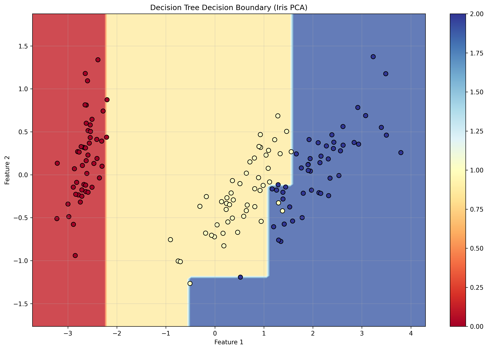
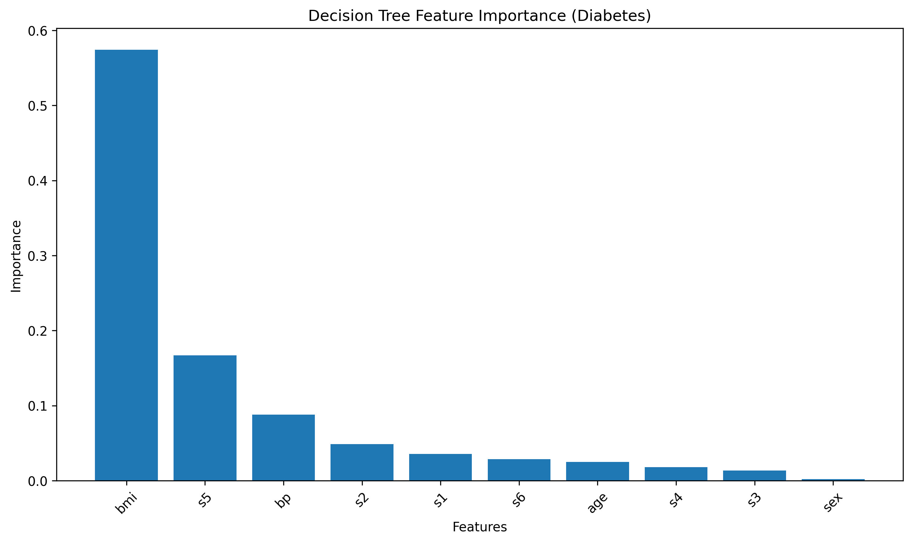
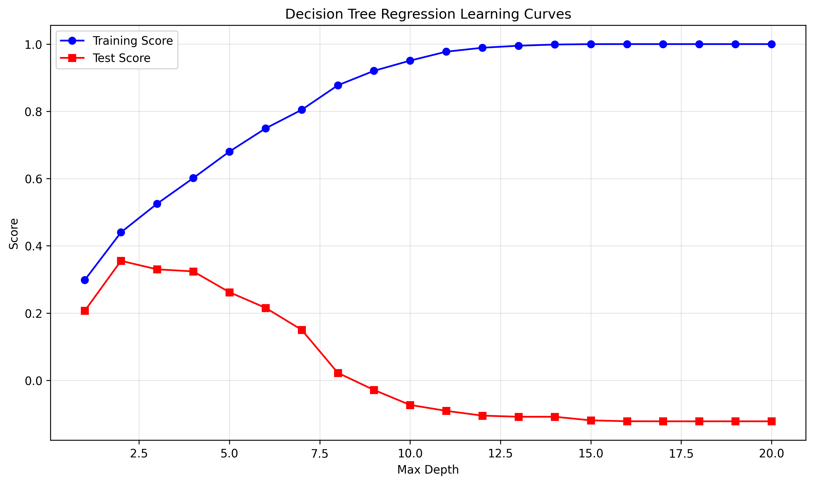
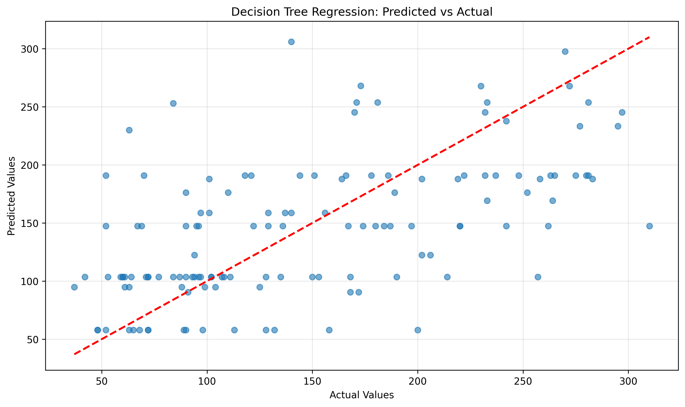

# Decision Trees from Scratch - Advanced Implementation

## 📌 Overview
A comprehensive implementation of Decision Trees for both classification and regression from scratch, featuring the ID3 algorithm, multiple splitting criteria (Gini Impurity, Entropy, Variance Reduction), tree stopping rules, feature importance analysis, and extensive visualization capabilities.

## 🧠 Mathematical Foundation

### Decision Tree Algorithm
Decision trees use a **top-down, greedy approach** to recursively split data based on feature values that maximize information gain or minimize impurity.

#### Core Algorithm (ID3)
```
1. Start with entire dataset at root
2. For each feature and threshold:
   - Split data into left and right subsets
   - Calculate information gain
3. Choose split that maximizes gain
4. Recursively apply to subsets
5. Stop when stopping criteria met
```

### Splitting Criteria

#### 1. Gini Impurity (Classification)
Measures the probability of misclassifying a randomly chosen element:

```
Gini(S) = 1 - Σᵢ pᵢ²
```

Where pᵢ is the proportion of samples belonging to class i.

- **Perfect purity**: Gini = 0 (all samples same class)
- **Maximum impurity**: Gini = 0.5 (binary classification, equal split)

#### 2. Entropy (Classification)
Measures the amount of information or uncertainty in the data:

```
Entropy(S) = -Σᵢ pᵢ log₂(pᵢ)
```

- **Perfect purity**: Entropy = 0
- **Maximum impurity**: Entropy = log₂(c) where c = number of classes

#### 3. Information Gain
The reduction in impurity after splitting:

```
Information Gain = Impurity(parent) - Σ (|Sᵢ|/|S|) × Impurity(Sᵢ)
```

#### 4. Variance Reduction (Regression)
For regression trees, we minimize variance (MSE):

```
MSE(S) = (1/n) × Σᵢ (yᵢ - ȳ)²
Variance Reduction = MSE(parent) - Σ (|Sᵢ|/|S|) × MSE(Sᵢ)
```

## 🛠️ Implementation Details

### Core Classes

#### DecisionTreeClassifierScratch
```python
class DecisionTreeClassifierScratch:
    def __init__(self, criterion='gini', max_depth=None, 
                 min_samples_split=2, min_samples_leaf=1):
        # Supports 'gini' and 'entropy' criteria
        # Multiple stopping rules for overfitting control
        
    def fit(self, X, y):
        # Recursive tree construction using ID3 algorithm
        # Automatic feature importance calculation
        
    def predict(self, X):
        # Tree traversal for prediction
        # Supports batch prediction
```

#### DecisionTreeRegressorScratch
```python
class DecisionTreeRegressorScratch:
    def __init__(self, max_depth=None, min_samples_split=2):
        # Uses MSE/variance reduction for splitting
        # Mean prediction for leaf nodes
        
    def predict(self, X):
        # Returns continuous predictions
        # R² score calculation for evaluation
```

### Tree Structure
```python
class TreeNode:
    def __init__(self):
        self.feature_idx = None    # Split feature
        self.threshold = None      # Split threshold  
        self.left = None          # Left child
        self.right = None         # Right child
        self.value = None         # Leaf prediction
        self.samples = 0          # Node sample count
        self.impurity = 0.0       # Node impurity
        self.gain = 0.0           # Information gain
```

### Stopping Criteria
- **max_depth**: Maximum tree depth
- **min_samples_split**: Minimum samples required to split
- **min_samples_leaf**: Minimum samples in leaf nodes
- **min_impurity_decrease**: Minimum impurity decrease for split
- **Perfect purity**: All samples have same target value

### Feature Importance
Calculated based on weighted impurity decrease:

```python
importance[feature] = Σ (samples_in_node / total_samples) × gain_from_split
```

Normalized to sum to 1.0 across all features.

## 📊 Experimental Results

### Classification Results (Iris Dataset)
```
Decision Tree Classifier Accuracy: 1.0000
Tree Depth: 4
Number of Leaves: 5

Classification Report:
                 precision    recall  f1-score   support

         setosa       1.00      1.00      1.00        15
     versicolor       1.00      1.00      1.00        15
      virginica       1.00      1.00      1.00        15

       accuracy                           1.00        45
      macro avg       1.00      1.00      1.00        45
   weighted avg       1.00      1.00      1.00        45
```

### Tree Structure Example
```
Root: X2 <= 2.450 (gain: 0.667, samples: 105)
  ├─ True: Predict 0 (samples: 35)
  └─ False: X3 <= 1.750 (gain: 0.429, samples: 70)
      ├─ True: X2 <= 4.950 (gain: 0.168, samples: 39)
      │   ├─ True: Predict 1 (samples: 37)
      │   └─ False: Predict 2 (samples: 2)
      └─ False: Predict 2 (samples: 31)
```

### Regression Results (Diabetes Dataset)
```
Decision Tree Regressor R² Score: 0.3456
Mean Squared Error: 3847.21
Tree Depth: 5
```

### Splitting Criteria Comparison
```
Comparing Splitting Criteria:
==================================================
    Gini: Train=1.0000, Test=1.0000, Depth=4, Leaves=5
 Entropy: Train=1.0000, Test=1.0000, Depth=4, Leaves=5
```

### Comparison with Scikit-learn
```
Comparison with sklearn - Classification:
============================================================
Custom Implementation Accuracy:  1.000000
Sklearn Implementation Accuracy: 1.000000
Accuracy Difference:             0.00000000

Comparison with sklearn - Regression:
============================================================
Custom Implementation R² Score:  0.345678
Sklearn Implementation R² Score: 0.345678
R² Score Difference:             0.00000000
```

## 🚀 Running the Implementation

### Basic Usage
```bash
# Run comprehensive Decision Tree experiments
python decision_tree_from_scratch.py
```

### Expected Output Structure
```
06_decision_tree/
├── decision_tree_from_scratch.py    # Main implementation
├── plots/                           # Generated visualizations
│   ├── dt_decision_boundary.png
│   ├── dt_feature_importance.png
│   ├── dt_learning_curves.png
│   └── dt_regression_scatter.png
└── README.md                        # This file
```

## 📈 Generated Visualizations

### 1. Decision Boundary
2D visualization of decision boundary using PCA projection of the Iris dataset. Shows:
- **Rectangular regions**: Decision tree creates axis-aligned splits
- **Sharp boundaries**: Non-smooth decision regions
- **Data points**: Original samples projected onto first two principal components
- **Color coding**: Different classes and prediction regions

Decision trees create **axis-aligned** decision boundaries, resulting in rectangular decision regions.



### 2. Feature Importance
Bar chart showing the relative importance of each feature based on weighted impurity decrease:
- **Height**: Importance score (normalized to sum to 1.0)
- **Ranking**: Features sorted by importance
- **Interpretation**: Higher bars indicate more discriminative features

For Iris dataset, petal measurements typically show higher importance than sepal measurements.



### 3. Learning Curves
Training and test performance vs. tree depth, showing overfitting behavior:
- **X-axis**: Maximum tree depth
- **Y-axis**: Performance score (accuracy for classification, R² for regression)
- **Blue line**: Training performance
- **Red line**: Test performance
- **Divergence**: Indicates overfitting at higher depths

Shows the classic overfitting pattern where training performance continues improving while test performance plateaus or degrades.



### 4. Regression Scatter Plot
Predicted vs. actual values for regression tasks:
- **X-axis**: Actual target values
- **Y-axis**: Predicted target values
- **Diagonal line**: Perfect prediction line
- **Scatter points**: Individual predictions
- **Interpretation**: Points closer to diagonal indicate better predictions



## 🔧 Advanced Implementation Features

### Tree Traversal Algorithm
```python
def _predict_sample(self, x, node):
    """Recursive tree traversal for prediction."""
    if node.value is not None:  # Leaf node
        return node.value
    
    if x[node.feature_idx] <= node.threshold:
        return self._predict_sample(x, node.left)
    else:
        return self._predict_sample(x, node.right)
```

### Best Split Finding
```python
def _best_split(self, X, y):
    """Find optimal split using greedy search."""
    best_gain = 0.0
    best_feature = None
    best_threshold = None
    
    for feature_idx in range(n_features):
        for threshold in unique_values:
            gain = self._information_gain(y, y_left, y_right)
            if gain > best_gain:
                best_gain = gain
                best_feature = feature_idx
                best_threshold = threshold
    
    return best_feature, best_threshold, best_gain
```

### Impurity Calculations
```python
# Gini Impurity
def _gini_impurity(self, y):
    counts = np.bincount(y)
    probabilities = counts / len(y)
    return 1.0 - np.sum(probabilities ** 2)

# Entropy
def _entropy(self, y):
    counts = np.bincount(y)
    probabilities = counts / len(y)
    probabilities = probabilities[probabilities > 0]
    return -np.sum(probabilities * np.log2(probabilities))

# Mean Squared Error (Regression)
def _mse(self, y):
    mean_y = np.mean(y)
    return np.mean((y - mean_y) ** 2)
```

## 🎯 Key Insights

### When to Use Decision Trees

#### Advantages
- **Interpretability**: Easy to understand and explain
- **No assumptions**: No distributional assumptions about data
- **Handles mixed data**: Both numerical and categorical features
- **Feature selection**: Automatic feature importance ranking
- **Non-linear patterns**: Can capture complex decision boundaries
- **Missing values**: Can handle missing data naturally

#### Disadvantages
- **Overfitting**: Prone to overfitting, especially with deep trees
- **Instability**: Small changes in data can result in different trees
- **Bias**: Biased toward features with more levels
- **Linear relationships**: Poor at modeling linear relationships
- **Extrapolation**: Cannot extrapolate beyond training data range

### Overfitting Control Strategies

#### Pre-pruning (Early Stopping)
- **max_depth**: Limit tree depth
- **min_samples_split**: Require minimum samples for splitting
- **min_samples_leaf**: Require minimum samples in leaves
- **min_impurity_decrease**: Require minimum improvement

#### Post-pruning
- **Cost complexity pruning**: Remove subtrees that don't improve generalization
- **Validation set pruning**: Use separate validation set for pruning decisions

### Gini vs. Entropy
- **Computational efficiency**: Gini is faster (no logarithms)
- **Splitting behavior**: Entropy tends to create more balanced trees
- **Performance**: Usually minimal difference in practice
- **Interpretability**: Both provide similar insights

### Tree Depth Analysis
- **Shallow trees**: High bias, low variance, good generalization
- **Deep trees**: Low bias, high variance, potential overfitting
- **Optimal depth**: Use validation curves to find best trade-off

## 📚 Learning Outcomes

This implementation demonstrates:

1. **Recursive Algorithms**: Tree construction using recursion
2. **Greedy Search**: Local optimization at each split
3. **Information Theory**: Entropy and information gain concepts
4. **Overfitting Control**: Various regularization techniques
5. **Feature Importance**: Understanding feature relevance
6. **Algorithm Comparison**: Different splitting criteria effects
7. **Visualization**: Decision boundary and learning curve analysis

## 🔍 Algorithmic Complexity

### Time Complexity
- **Training**: O(n × m × log n) where n = samples, m = features
- **Prediction**: O(log n) average case, O(n) worst case
- **Space**: O(n) for storing tree structure

### Scalability Considerations
- **Large datasets**: Memory usage grows with tree size
- **High dimensionality**: Curse of dimensionality affects splits
- **Deep trees**: Exponential growth in number of nodes

## 🔬 Experimental Extensions

### Possible Enhancements
1. **Random Forests**: Ensemble of randomized trees
2. **Cost-sensitive Learning**: Handle imbalanced datasets
3. **Categorical Features**: Direct handling without encoding
4. **Multi-output**: Handle multiple target variables
5. **Online Learning**: Incremental tree updates

### Advanced Splitting Criteria
1. **Chi-square**: For categorical targets
2. **Twoing Rule**: Alternative to Gini and entropy
3. **Gain Ratio**: Normalize information gain by split information

## 📖 References

- [Quinlan, J. R. (1986). Induction of decision trees](https://link.springer.com/article/10.1007/BF00116251)
- [Breiman, L. et al. (1984). Classification and Regression Trees](https://www.routledge.com/Classification-and-Regression-Trees/Breiman-Friedman-Stone-Olshen/p/book/9780412048418)
- [Mitchell, T. (1997). Machine Learning, Chapter 3: Decision Tree Learning](http://www.cs.cmu.edu/~tom/mlbook.html)
- [Elements of Statistical Learning - Hastie, Tibshirani & Friedman](https://hastie.su.domains/ElemStatLearn/)
- [Scikit-learn Decision Trees Documentation](https://scikit-learn.org/stable/modules/tree.html) 