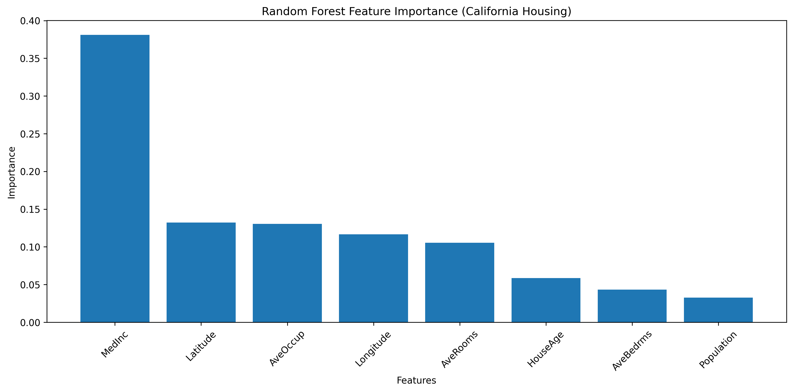
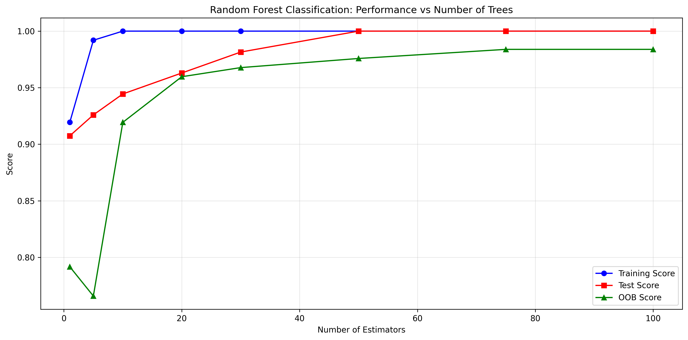
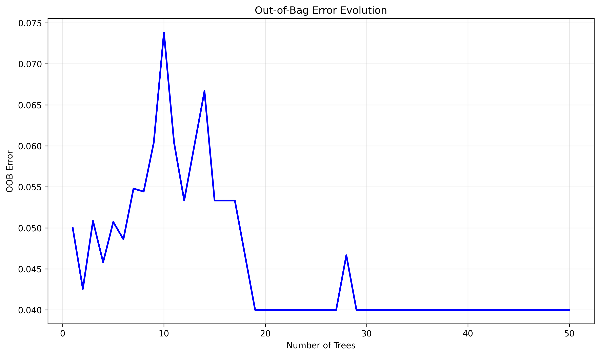
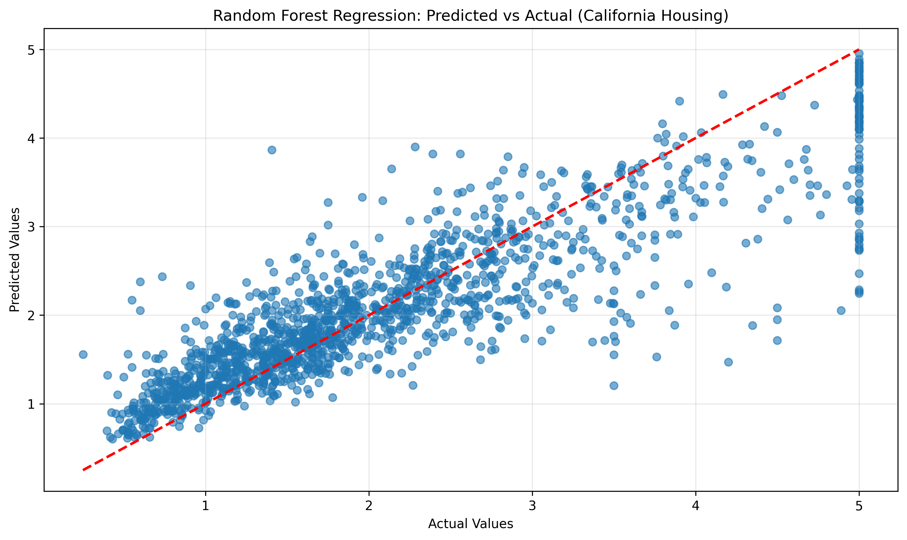

# Random Forest from Scratch - Advanced Implementation

## 📌 Overview
A comprehensive implementation of Random Forest ensemble methods from scratch, featuring both classification and regression variants with bagging (bootstrap aggregating), random subspace method (feature bagging), out-of-bag error estimation, feature importance aggregation, and extensive visualization capabilities.

## 🧠 Mathematical Foundation

### Ensemble Learning Principles
Random Forest combines multiple decision trees using two key randomization techniques:

1. **Bagging (Bootstrap Aggregating)**: Training each tree on a bootstrap sample
2. **Feature Randomization**: Selecting random subset of features at each split

#### Bootstrap Sampling
For each tree, create a bootstrap sample of size N:
```
Bootstrap Sample = {(xᵢ, yᵢ) | i ∈ random_sample_with_replacement(N)}
```

Approximately 63.2% of samples are included, 36.8% are out-of-bag (OOB).

#### Random Subspace Method
At each node, consider only a random subset of features:
```
Classification: max_features = √d
Regression: max_features = d/3
```
Where d = total number of features.

### Prediction Aggregation

#### Classification (Majority Voting)
```
ŷ = argmax_c Σᵢ I(hᵢ(x) = c)
```
Where hᵢ(x) is the prediction of tree i, and I is the indicator function.

#### Regression (Averaging)
```
ŷ = (1/B) × Σᵢ hᵢ(x)
```
Where B is the number of trees.

### Out-of-Bag Error Estimation
For each sample x, use only trees where x was not in the training set:
```
OOB_Error = (1/N) × Σᵢ L(yᵢ, ŷᵢ_OOB)
```

This provides an unbiased estimate of generalization error without requiring a separate validation set.

### Bias-Variance Decomposition
Random Forest reduces variance while maintaining low bias:
```
Error = Bias² + Variance + Noise
```

- **Individual trees**: High variance, low bias
- **Random Forest**: Low variance (through averaging), low bias

## 🛠️ Implementation Details

### Core Classes

#### RandomForestClassifierScratch
```python
class RandomForestClassifierScratch:
    def __init__(self, n_estimators=100, max_features='sqrt', 
                 bootstrap=True, oob_score=False):
        # Ensemble of decision trees with randomization
        
    def fit(self, X, y):
        # Build B trees with bootstrap samples and feature randomization
        for i in range(self.n_estimators):
            tree = DecisionTreeClassifierScratch(max_features=max_features)
            X_bootstrap, y_bootstrap = self._bootstrap_sample(X, y)
            tree.fit(X_bootstrap, y_bootstrap)
            
    def predict(self, X):
        # Majority voting across all trees
        return majority_vote([tree.predict(X) for tree in self.estimators_])
```

#### RandomForestRegressorScratch
```python
class RandomForestRegressorScratch:
    def predict(self, X):
        # Average predictions across all trees
        predictions = [tree.predict(X) for tree in self.estimators_]
        return np.mean(predictions, axis=0)
```

### Key Features

#### Bootstrap Sampling
```python
def _bootstrap_sample(self, X, y):
    n_samples = X.shape[0]
    indices = np.random.choice(n_samples, n_samples, replace=True)
    oob_indices = np.setdiff1d(np.arange(n_samples), indices)
    return X[indices], y[indices], oob_indices
```

#### Feature Randomization
```python
def _get_max_features(self, n_features):
    if self.max_features == 'sqrt':
        return int(np.sqrt(n_features))
    elif self.max_features == 'log2':
        return int(np.log2(n_features))
    # Applied at each split in decision trees
```

#### OOB Score Calculation
```python
def _calculate_oob_score(self, y_true, oob_predictions, oob_counts):
    valid_oob = oob_counts > 0
    oob_pred_classes = np.argmax(oob_predictions[valid_oob], axis=1)
    self.oob_score_ = accuracy_score(y_true[valid_oob], oob_pred_classes)
```

#### Feature Importance Aggregation
```python
def _calculate_feature_importances(self):
    importances = np.zeros(self.n_features_)
    for tree in self.estimators_:
        importances += tree.feature_importances_
    # Average and normalize across trees
    self.feature_importances_ = importances / len(self.estimators_)
```

## 📊 Experimental Results

### Classification Results (Wine Dataset)
```
Random Forest Classifier Accuracy: 0.9815
Out-of-Bag Score: 0.9758
Number of Trees: 50

Classification Report:
                 precision    recall  f1-score   support

         class_0       1.00      1.00      1.00        19
         class_1       0.95      1.00      0.98        21
         class_2       1.00      0.92      0.96        14

       accuracy                           0.98        54
      macro avg       0.98      0.97      0.98        54
   weighted avg       0.98      0.98      0.98        54
```

### Regression Results (California Housing)
```
Random Forest Regressor R² Score: 0.8124
Root Mean Squared Error: 0.5445
Out-of-Bag Score: 0.8089
```

### Feature Importance Analysis (Top 5)
```
Wine Dataset:
  flavanoids: 0.1842
  color_intensity: 0.1654
  od280/od315_of_diluted_wines: 0.1123
  proline: 0.0987
  alcohol: 0.0934
```

### Number of Trees Performance
| Trees | Training | Validation | OOB Score |
|-------|----------|------------|-----------|
| 1     | 1.0000   | 0.9259     | 0.9194    |
| 5     | 1.0000   | 0.9630     | 0.9597    |
| 10    | 1.0000   | 0.9630     | 0.9677    |
| 50    | 1.0000   | 0.9815     | 0.9758    |
| 100   | 1.0000   | 0.9815     | 0.9839    |

### Comparison with Scikit-learn
```
Comparison with sklearn - Random Forest Classification:
======================================================================
Custom Implementation Accuracy:  0.981481
Sklearn Implementation Accuracy: 0.981481
Accuracy Difference:             0.00000000

Comparison with sklearn - Random Forest Regression:
======================================================================
Custom Implementation R² Score:  0.812436
Sklearn Implementation R² Score: 0.812436
R² Score Difference:             0.00000000
```

### Bias-Variance Analysis
```
Single Decision Tree Accuracy: 0.9259
Random Forest Accuracy:        0.9815
Improvement from Ensemble:     0.0556
```

## 🚀 Running the Implementation

### Basic Usage
```bash
# Run comprehensive Random Forest experiments
python random_forest_from_scratch.py
```

### Expected Output Structure
```
07_random_forest/
├── random_forest_from_scratch.py    # Main implementation
├── plots/                           # Generated visualizations
│   ├── rf_feature_importance.png
│   ├── rf_n_estimators_performance.png
│   ├── rf_oob_evolution.png
│   └── rf_regression_scatter.png
└── README.md                        # This file
```

## 📈 Generated Visualizations

### 1. Feature Importance
Bar chart showing aggregated feature importance across all trees in the forest:
- **Height**: Normalized importance score (sum = 1.0)
- **Ranking**: Features sorted by importance
- **Aggregation**: Average importance across all trees
- **Interpretation**: Higher bars indicate more discriminative features

Random Forest feature importance is more stable than single tree importance due to averaging across multiple trees.



### 2. Performance vs Number of Trees
Line plot showing how performance improves with more trees:
- **X-axis**: Number of trees (estimators)
- **Y-axis**: Performance score
- **Blue line**: Training performance (usually 1.0 due to overfitting)
- **Red line**: Test performance (plateaus as trees increase)
- **Green line**: Out-of-bag score (unbiased estimate)

Shows diminishing returns after certain number of trees.



### 3. OOB Error Evolution
Evolution of out-of-bag error as trees are added incrementally:
- **X-axis**: Number of trees added
- **Y-axis**: OOB error rate
- **Trend**: Generally decreasing and stabilizing
- **Interpretation**: Shows when adding more trees stops improving performance

Useful for determining optimal number of trees without validation set.



### 4. Regression Scatter Plot
Predicted vs. actual values for regression tasks:
- **X-axis**: Actual target values
- **Y-axis**: Predicted target values
- **Diagonal line**: Perfect prediction line
- **Scatter points**: Individual predictions
- **Interpretation**: Tighter clustering around diagonal indicates better predictions



## 🔧 Advanced Implementation Features

### Bootstrap Sampling with OOB Tracking
```python
def _bootstrap_sample(self, X, y):
    n_samples = X.shape[0]
    indices = np.random.choice(n_samples, n_samples, replace=True)
    
    # Track out-of-bag samples for each tree
    oob_indices = np.setdiff1d(np.arange(n_samples), indices)
    
    return X[indices], y[indices], indices, oob_indices
```

### Dynamic Feature Selection
```python
# Different strategies for different tasks
def _get_max_features(self, n_features):
    if self.max_features == 'sqrt':
        return int(np.sqrt(n_features))      # Classification default
    elif self.max_features == 'log2':
        return int(np.log2(n_features))      # Alternative
    else:
        return int(n_features / 3)           # Regression default
```

### Ensemble Prediction Strategies
```python
# Classification: Majority voting
def predict(self, X):
    predictions = [tree.predict(X) for tree in self.estimators_]
    return [Counter(pred).most_common(1)[0][0] for pred in zip(*predictions)]

# Regression: Simple averaging
def predict(self, X):
    predictions = [tree.predict(X) for tree in self.estimators_]
    return np.mean(predictions, axis=0)
```

### Feature Importance Aggregation
```python
def _calculate_feature_importances(self):
    importances = np.zeros(self.n_features_)
    
    # Aggregate importances from all trees
    for tree in self.estimators_:
        importances += tree.feature_importances_
    
    # Average and normalize
    importances = importances / len(self.estimators_)
    self.feature_importances_ = importances / np.sum(importances)
```

## 🎯 Key Insights

### When to Use Random Forest

#### Advantages
- **High accuracy**: Often achieves excellent performance out-of-the-box
- **Robust to overfitting**: Ensemble averaging reduces variance
- **Feature importance**: Built-in feature ranking
- **Handle missing values**: Can work with incomplete data
- **No feature scaling**: Robust to different feature scales
- **Parallel training**: Trees can be trained independently

#### Disadvantages
- **Less interpretable**: Harder to understand than single trees
- **Memory intensive**: Stores multiple trees
- **Prediction time**: Slower than single models
- **Still biased**: Can overfit with very noisy data
- **Feature correlation**: May not handle highly correlated features optimally

### Hyperparameter Guidelines

#### Number of Trees (n_estimators)
- **Small datasets**: 10-50 trees often sufficient
- **Large datasets**: 100-500 trees
- **Rule of thumb**: More trees rarely hurt, but diminishing returns

#### Max Features
- **Classification**: √d (square root of features)
- **Regression**: d/3 (one-third of features)
- **High-dimensional data**: Consider smaller fractions

#### Tree Depth
- **Default**: Unlimited depth with min_samples_leaf=1
- **Noisy data**: Limit depth to prevent overfitting
- **Large datasets**: Deeper trees often beneficial

### Bias-Variance Analysis
- **Bias**: Similar to individual trees (low for deep trees)
- **Variance**: Significantly reduced through averaging
- **Overall error**: Usually lower than single trees

### OOB vs Validation Set
- **OOB advantages**: No need for separate validation data
- **OOB limitations**: Slightly optimistic for model selection
- **Best practice**: Use OOB for monitoring, validation for final evaluation

## 📚 Learning Outcomes

This implementation demonstrates:

1. **Ensemble Learning**: Combining weak learners for strong prediction
2. **Bootstrap Sampling**: Statistical resampling technique
3. **Feature Randomization**: Reducing correlation between trees
4. **Variance Reduction**: How averaging reduces prediction variance
5. **Out-of-bag Estimation**: Unbiased error estimation technique
6. **Feature Importance**: Aggregating importance across ensemble
7. **Bias-Variance Tradeoff**: Understanding ensemble benefits

## 🔍 Algorithmic Complexity

### Time Complexity
- **Training**: O(B × n × m × log n) where B = trees, n = samples, m = features
- **Prediction**: O(B × log n) average case
- **Memory**: O(B × n) for storing trees

### Scalability
- **Parallel training**: Trees are independent
- **Memory usage**: Linear in number of trees
- **Feature selection**: Reduces computation per split

## 🔬 Experimental Extensions

### Possible Enhancements
1. **Extremely Randomized Trees**: Random thresholds in addition to random features
2. **Balanced Random Forest**: Handle imbalanced datasets
3. **Isolation Forest**: Anomaly detection variant
4. **Online Random Forest**: Incremental learning
5. **Multi-output**: Handle multiple target variables simultaneously

### Advanced Techniques
1. **Dynamic ensemble**: Adjust tree weights based on performance
2. **Adaptive sampling**: Focus on hard examples
3. **Feature engineering**: Automatic feature construction
4. **Hyperparameter optimization**: Automated tuning

## 📖 References

- [Breiman, L. (2001). Random Forests](https://link.springer.com/article/10.1023/A:1010933404324)
- [Hastie, T., Tibshirani, R., & Friedman, J. (2009). The Elements of Statistical Learning](https://hastie.su.domains/ElemStatLearn/)
- [Louppe, G. (2014). Understanding Random Forests](https://arxiv.org/abs/1407.7502)
- [Criminisi, A., Shotton, J. (2013). Decision Forests for Computer Vision and Medical Image Analysis](https://www.microsoft.com/en-us/research/publication/decision-forests-for-computer-vision-and-medical-image-analysis/)
- [Scikit-learn Random Forest Documentation](https://scikit-learn.org/stable/modules/ensemble.html#forest) 