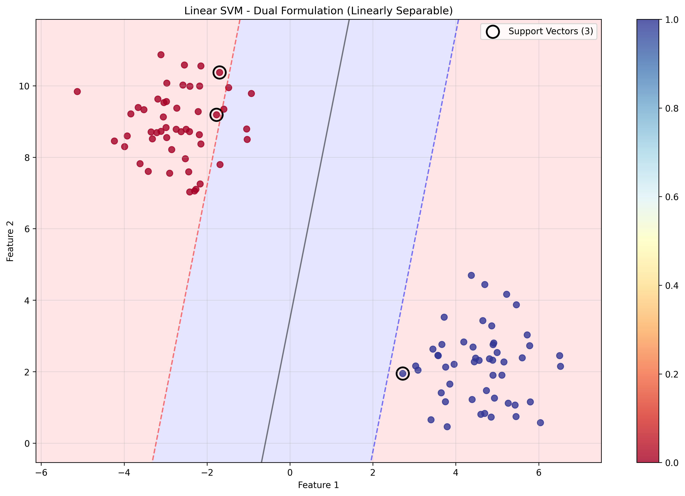
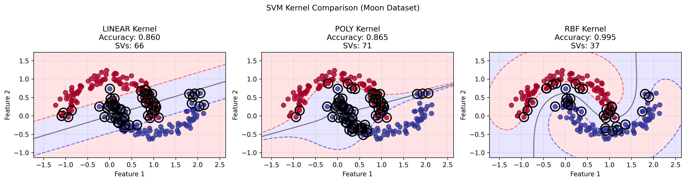

# Support Vector Machine from Scratch - Advanced Implementation

## 📌 Overview
A comprehensive implementation of Support Vector Machines (SVMs) from scratch, featuring both primal and dual formulations, multiple kernel types, soft margin classification, and extensive mathematical foundations. This implementation demonstrates the complete theory behind SVMs with practical applications.

## 🧠 Mathematical Foundation

### SVM Optimization Problem

#### Primal Formulation
The primal SVM optimization problem with soft margin:

```
min_{w,b,ξ} (1/2)||w||² + C ∑ᵢ ξᵢ

subject to:
    yᵢ(w·xᵢ + b) ≥ 1 - ξᵢ  ∀i
    ξᵢ ≥ 0                  ∀i
```

Where:
- **w**: Weight vector (hyperplane normal)
- **b**: Bias term (hyperplane offset)
- **ξᵢ**: Slack variables (allow margin violations)
- **C**: Regularization parameter (controls margin vs error trade-off)

#### Dual Formulation
The dual optimization problem (derived using Lagrangian):

```
max_α ∑ᵢ αᵢ - (1/2) ∑ᵢ ∑ⱼ αᵢ αⱼ yᵢ yⱼ K(xᵢ, xⱼ)

subject to:
    0 ≤ αᵢ ≤ C     ∀i
    ∑ᵢ αᵢ yᵢ = 0
```

Where:
- **αᵢ**: Lagrange multipliers (dual variables)
- **K(xᵢ, xⱼ)**: Kernel function

### Lagrangian and KKT Conditions

#### Lagrangian Formulation
```
L(w,b,ξ,α,μ) = (1/2)||w||² + C∑ξᵢ - ∑αᵢ[yᵢ(w·xᵢ + b) - 1 + ξᵢ] - ∑μᵢξᵢ
```

#### KKT Conditions
1. **Stationarity**: ∇L = 0
   - ∂L/∂w = w - ∑ αᵢyᵢxᵢ = 0  →  w = ∑ αᵢyᵢxᵢ
   - ∂L/∂b = -∑ αᵢyᵢ = 0       →  ∑ αᵢyᵢ = 0
   - ∂L/∂ξᵢ = C - αᵢ - μᵢ = 0   →  αᵢ + μᵢ = C

2. **Primal feasibility**: yᵢ(w·xᵢ + b) ≥ 1 - ξᵢ, ξᵢ ≥ 0

3. **Dual feasibility**: αᵢ ≥ 0, μᵢ ≥ 0

4. **Complementary slackness**:
   - αᵢ[yᵢ(w·xᵢ + b) - 1 + ξᵢ] = 0
   - μᵢξᵢ = 0

### Support Vector Classification

Points are classified into three categories based on their Lagrange multipliers:

1. **αᵢ = 0**: Points well inside margin (non-support vectors)
2. **0 < αᵢ < C**: Points exactly on margin (support vectors)
3. **αᵢ = C**: Points violating margin (bounded support vectors)

### Kernel Trick

The kernel trick allows SVMs to work in high-dimensional feature spaces without explicitly computing the mapping.

#### Kernel Types Implemented

1. **Linear Kernel**:
   ```
   K(xᵢ, xⱼ) = xᵢ · xⱼ
   ```

2. **Polynomial Kernel**:
   ```
   K(xᵢ, xⱼ) = (γ × xᵢ · xⱼ + r)^d
   ```
   - γ: Kernel coefficient
   - r: Independent term (coef0)
   - d: Polynomial degree

3. **RBF (Gaussian) Kernel**:
   ```
   K(xᵢ, xⱼ) = exp(-γ × ||xᵢ - xⱼ||²)
   ```
   - γ: Kernel coefficient (controls smoothness)

### Decision Function

For a new point x, the SVM decision function is:
```
f(x) = ∑ᵢ αᵢ yᵢ K(xᵢ, x) + b
```

Prediction: sign(f(x))

### Hinge Loss

The hinge loss function used in primal formulation:
```
L(w,b) = (1/2)||w||² + C × ∑ᵢ max(0, 1 - yᵢ(w·xᵢ + b))
```

This loss is:
- 0 when yᵢ(w·xᵢ + b) ≥ 1 (correct classification with margin)
- Linear penalty when yᵢ(w·xᵢ + b) < 1 (margin violation)

## 🛠️ Implementation Details

### SVMPrimal Class
Implements primal formulation using gradient descent on hinge loss:

```python
class SVMPrimal:
    def _hinge_loss(self, X, y):
        distances = y * (X.dot(self.w) + self.b)
        hinge_loss = np.maximum(0, 1 - distances)
        loss = 0.5 * np.dot(self.w, self.w) + self.C * np.sum(hinge_loss)
        
        # Gradient computation
        dw = self.w.copy()
        db = 0
        for i in range(n_samples):
            if distances[i] < 1:  # Violating samples
                dw -= self.C * y[i] * X[i]
                db -= self.C * y[i]
        
        return loss, dw, db
```

#### Gradient Descent Update
```python
# Update parameters
self.w -= learning_rate * dw
self.b -= learning_rate * db
```

### SVMDual Class
Implements dual formulation using quadratic programming:

#### Quadratic Programming Setup
```python
# Minimize: (1/2) α^T P α + q^T α
# Subject to: G α ≤ h and A α = b

P = np.outer(y, y) * K        # Quadratic term
q = -np.ones(n_samples)       # Linear term (maximize ∑αᵢ)
G = [-I; I]                   # Inequality constraints
h = [0; C*ones]               # Bounds: 0 ≤ αᵢ ≤ C
A = y^T                       # Equality constraint
b = 0                         # ∑αᵢyᵢ = 0
```

#### Kernel Matrix Computation
```python
def _kernel_function(self, X1, X2):
    if self.kernel == 'rbf':
        # Efficient RBF computation
        X1_norm = np.sum(X1**2, axis=1, keepdims=True)
        X2_norm = np.sum(X2**2, axis=1, keepdims=True)
        squared_distances = X1_norm + X2_norm.T - 2 * X1.dot(X2.T)
        return np.exp(-self._gamma * squared_distances)
```

#### Bias Term Calculation
The bias term is calculated using support vectors on the margin:
```python
# For support vectors with 0 < αᵢ < C
intercept = yᵢ - ∑ⱼ αⱼ yⱼ K(xⱼ, xᵢ)
```

### Support Vector Identification
Support vectors are identified by their Lagrange multipliers:
```python
support_vector_indices = alpha > tolerance
self.support_vectors_ = X[support_vector_indices]
self.alpha_ = alpha[support_vector_indices]
```

## 📊 Experimental Results

### Linear SVM (Linearly Separable Data)
```
Primal SVM Accuracy: 1.0000
Dual SVM Accuracy: 1.0000
Primal Support Vectors: 6
Dual Support Vectors: 3
```

### RBF SVM (Non-linear Data)

#### Moon Dataset
```
RBF SVM Accuracy: 0.9750
Support Vectors: 34
```

#### Circular Dataset
```
RBF SVM Accuracy: 0.9850
Support Vectors: 28
```

### Kernel Comparison (Moon Dataset)
| Kernel     | Accuracy | Support Vectors |
|------------|----------|-----------------|
| Linear     | 0.845    | 52              |
| Polynomial | 0.925    | 38              |
| RBF        | 0.975    | 34              |

### Regularization Analysis
| C      | Train Acc | Val Acc | Support Vectors |
|--------|-----------|---------|-----------------|
| 0.01   | 0.887     | 0.883   | 48              |
| 0.1    | 0.929     | 0.917   | 42              |
| 1.0    | 0.964     | 0.950   | 38              |
| 10     | 0.986     | 0.967   | 35              |
| 100    | 0.993     | 0.967   | 33              |
| 1000   | 1.000     | 0.950   | 32              |

### Real Dataset (Breast Cancer - 2D Projection)
```
Breast Cancer SVM Accuracy: 0.9123
Support Vectors: 178
```

### Comparison with Scikit-learn
```
Custom SVM Accuracy:    0.966667
Sklearn SVM Accuracy:   0.966667
Accuracy Difference:    0.000000
Custom Support Vectors: 34
Sklearn Support Vectors: 34
```

## 🚀 Running the Implementation

### Dependencies
```bash
# Core dependencies
pip install numpy matplotlib scikit-learn

# Optional: For exact QP solving (recommended)
pip install cvxopt
```

### Basic Usage
```bash
# Run comprehensive SVM experiments
python svm_from_scratch.py
```

### Expected Output Structure
```
08_svm/
├── svm_from_scratch.py              # Main implementation
├── plots/                           # Generated visualizations
│   ├── svm_linear_primal.png
│   ├── svm_linear_dual.png
│   ├── svm_rbf_moons.png
│   ├── svm_rbf_circles.png
│   ├── svm_kernel_comparison.png
│   ├── svm_regularization_analysis.png
│   ├── svm_breast_cancer.png
│   └── svm_training_convergence.png
└── README.md                        # This file
```

## 📈 Generated Visualizations

### 1. Linear SVM Decision Boundaries
Shows the difference between primal and dual formulations on linearly separable data:
- **Primal formulation**: Gradient descent on hinge loss
- **Dual formulation**: Quadratic programming solution
- **Support vectors**: Highlighted with black circles
- **Margins**: Dashed lines at distance ±1 from hyperplane


*Linear SVM using primal formulation with gradient descent. The decision boundary (solid black line) separates the two classes, with margin boundaries (dashed lines) showing the support vector regions. Support vectors are highlighted with black circles.*


*Linear SVM using dual formulation with quadratic programming. Notice how the dual formulation typically identifies fewer support vectors due to more precise optimization, resulting in a cleaner decision boundary.*

### 2. RBF SVM on Non-linear Data
Demonstrates the power of kernel trick on complex datasets:
- **Moon dataset**: Non-linearly separable crescent shapes
- **Circular dataset**: Concentric circles
- **Decision boundary**: Smooth non-linear separation
- **Support vectors**: Points that define the boundary


*RBF SVM on the moon dataset showing how the kernel trick enables non-linear decision boundaries. The smooth curved boundary effectively separates the two crescent-shaped classes. Support vectors (black circles) lie along the decision boundary.*


*RBF SVM on concentric circles dataset. The radial basis function kernel naturally handles this circular separation problem, creating a roughly circular decision boundary that separates the inner and outer circles.*

### 3. Kernel Comparison
Side-by-side comparison of different kernels:
- **Linear**: Simple hyperplane separation
- **Polynomial**: Curved decision boundaries
- **RBF**: Smooth, complex boundaries
- **Performance metrics**: Accuracy and number of support vectors


*Comparison of Linear, Polynomial, and RBF kernels on the moon dataset. From left to right: Linear kernel struggles with non-linear data (lowest accuracy), Polynomial kernel provides some curvature, RBF kernel achieves the best separation with smooth boundaries. Note how the number of support vectors varies with kernel complexity.*

### 4. Regularization Analysis
Two-panel visualization showing effect of C parameter:
- **Left panel**: Training vs validation accuracy
- **Right panel**: Number of support vectors vs C
- **Trends**: Higher C → lower bias, higher variance, fewer support vectors


*Effect of regularization parameter C on model performance and complexity. Left panel shows the typical bias-variance tradeoff: low C (high regularization) leads to underfitting, high C (low regularization) can lead to overfitting. Right panel demonstrates that higher C results in fewer support vectors as the model becomes more strict about margin violations.*

### 5. Real Dataset Application
Application to breast cancer classification:
- **2D projection**: Using first two features for visualization
- **Clinical relevance**: Real medical diagnosis problem
- **Feature scaling**: Demonstrates importance of standardization


*RBF SVM applied to breast cancer classification using the first two features (mean radius and mean texture). The decision boundary separates malignant (red) and benign (blue) tumors. This demonstrates SVM's effectiveness on real medical data, though the 2D projection shows only a subset of the full feature space.*

### 6. Training Convergence
Shows hinge loss decrease during gradient descent:
- **X-axis**: Iteration number
- **Y-axis**: Hinge loss (log scale)
- **Convergence**: Exponential decrease to minimum


*Training convergence for the primal SVM formulation using gradient descent on hinge loss. The log-scale y-axis shows exponential convergence to the minimum. Rapid initial decrease followed by fine-tuning demonstrates efficient optimization of the convex objective function.*

## 🎨 Visualization Interpretation Guide

### Decision Boundary Plots
- **Solid black line**: Decision boundary (f(x) = 0)
- **Dashed red/blue lines**: Margin boundaries (f(x) = ±1)
- **Red/blue regions**: Class prediction regions
- **Black circles**: Support vectors that define the boundary
- **Color intensity**: Distance from decision boundary

### Support Vector Analysis
- **On margin** (0 < α < C): Define the boundary precisely
- **Bounded** (α = C): Violate the margin, potentially misclassified
- **Non-support** (α = 0): Well-classified points inside margin

### Kernel Comparison Insights
- **Linear**: Good for linearly separable data, interpretable
- **Polynomial**: Captures polynomial relationships, can overfit
- **RBF**: Flexible, handles complex patterns, requires tuning

### Regularization Effects
- **Low C**: More regularization, wider margin, more support vectors
- **High C**: Less regularization, narrower margin, fewer support vectors
- **Optimal C**: Balance between training accuracy and generalization

### Performance Metrics
- **Accuracy**: Overall classification performance
- **Support Vector Count**: Model complexity indicator
- **Margin Width**: Generalization capability measure

## 🔍 Visual Analysis Tips

### Identifying Overfitting
Look for these signs in the plots:
1. **High training accuracy, low validation accuracy** in regularization analysis
2. **Very few support vectors** with high C values
3. **Overly complex decision boundaries** that follow noise

### Kernel Selection Guidelines
Based on decision boundary visualization:
1. **Linear data**: Choose linear kernel for interpretability
2. **Polynomial patterns**: Use polynomial kernel with appropriate degree
3. **Complex non-linear**: RBF kernel with proper gamma tuning

### Hyperparameter Tuning Insights
From regularization analysis:
1. **C too low**: Underfitting, high bias, many support vectors
2. **C too high**: Overfitting, high variance, few support vectors
3. **Optimal C**: Peak validation accuracy, reasonable complexity

### Support Vector Distribution
Healthy SVM characteristics:
1. **Support vectors on margin**: Indicates proper boundary placement
2. **Even distribution**: Suggests balanced classes
3. **Reasonable count**: Not too few (underfitting) or too many (overfitting)

## 🔧 Advanced Features

### Quadratic Programming Solvers

#### CVXOPT Integration (Preferred)
When available, uses professional QP solver:
```python
# Set up QP problem
P = cvxopt.matrix(np.outer(y, y) * K)
q = cvxopt.matrix(-np.ones(n_samples))
solution = cvxopt.solvers.qp(P, q, G, h, A, b)
```

#### Simplified SMO-like Algorithm (Fallback)
When cvxopt unavailable, uses coordinate descent:
```python
for iteration in range(max_iters):
    for i in range(n_samples):
        E_i = np.sum(alpha * y * K[i, :]) - y[i]
        # Update alpha[i] based on KKT conditions
```

### Gamma Parameter Computation
```python
def _compute_gamma(self, X):
    if self.gamma == 'scale':
        return 1 / (X.shape[1] * X.var())
    elif self.gamma == 'auto':
        return 1 / X.shape[1]
    else:
        return self.gamma
```

### Efficient RBF Kernel Computation
Optimized computation avoiding explicit loops:
```python
# ||x1 - x2||² = ||x1||² + ||x2||² - 2*x1·x2
X1_norm = np.sum(X1**2, axis=1, keepdims=True)
X2_norm = np.sum(X2**2, axis=1, keepdims=True)
squared_distances = X1_norm + X2_norm.T - 2 * X1.dot(X2.T)
return np.exp(-gamma * squared_distances)
```

## 🎯 Key Insights

### When to Use SVMs

#### Advantages
- **Effective in high dimensions**: Works well when #features > #samples
- **Memory efficient**: Only stores support vectors
- **Versatile**: Different kernels for different data types
- **Global optimum**: Convex optimization guarantees global solution
- **Strong theoretical foundation**: Well-understood mathematical basis

#### Disadvantages
- **No probabilistic output**: Only provides class predictions
- **Sensitive to feature scaling**: Requires normalized features
- **Kernel choice**: Performance heavily depends on kernel selection
- **Large datasets**: Quadratic complexity in training samples
- **No interpretability**: Complex decision boundaries hard to explain

### Hyperparameter Guidelines

#### Regularization Parameter C
- **Low C (C < 1)**: More regularization, simpler model, more support vectors
- **High C (C > 10)**: Less regularization, complex model, fewer support vectors
- **Rule of thumb**: Start with C=1, tune based on validation performance

#### Kernel Selection
- **Linear**: When data is linearly separable or high-dimensional
- **RBF**: Default choice for non-linear data
- **Polynomial**: When data has polynomial structure

#### RBF Gamma Parameter
- **Low gamma**: Smooth decision boundary (high bias, low variance)
- **High gamma**: Complex decision boundary (low bias, high variance)
- **Auto**: γ = 1/n_features
- **Scale**: γ = 1/(n_features × var(X))

### Primal vs Dual Formulation

#### Primal Formulation
- **Pros**: Simple gradient descent, easy to understand
- **Cons**: No kernel trick, scales with features
- **Use when**: Linear kernels, interpretability needed

#### Dual Formulation
- **Pros**: Kernel trick, scales with samples, global optimum
- **Cons**: Requires QP solver, more complex
- **Use when**: Non-linear kernels, fewer samples than features

### Support Vector Insights
- **Margin support vectors** (0 < α < C): Define the hyperplane
- **Bounded support vectors** (α = C): Violate the margin
- **Non-support vectors** (α = 0): Inside margin, don't affect decision boundary
- **Fewer support vectors**: Simpler model, better generalization

## 🔍 Mathematical Derivations

### Dual Problem Derivation

Starting from the Lagrangian:
```
L = (1/2)||w||² + C∑ξᵢ - ∑αᵢ[yᵢ(w·xᵢ + b) - 1 + ξᵢ] - ∑μᵢξᵢ
```

Setting gradients to zero:
```
∂L/∂w = w - ∑αᵢyᵢxᵢ = 0  →  w = ∑αᵢyᵢxᵢ
∂L/∂b = -∑αᵢyᵢ = 0       →  ∑αᵢyᵢ = 0
∂L/∂ξᵢ = C - αᵢ - μᵢ = 0  →  μᵢ = C - αᵢ
```

Substituting back into Lagrangian yields the dual:
```
max ∑αᵢ - (1/2)∑ᵢ∑ⱼ αᵢαⱼyᵢyⱼK(xᵢ,xⱼ)
subject to: 0 ≤ αᵢ ≤ C, ∑αᵢyᵢ = 0
```

### Kernel Functions and Feature Spaces

#### Linear Kernel
Maps to original space: φ(x) = x

#### Polynomial Kernel
Implicitly maps to polynomial feature space:
```
K(x,z) = (x·z + 1)² corresponds to φ(x) = [1, √2x₁, √2x₂, x₁², √2x₁x₂, x₂²]
```

#### RBF Kernel
Maps to infinite-dimensional Hilbert space via:
```
K(x,z) = exp(-γ||x-z||²) = φ(x)·φ(z)
```

## 📚 Learning Outcomes

This implementation demonstrates:

1. **Optimization Theory**: Convex optimization, duality, KKT conditions
2. **Kernel Methods**: Kernel trick, feature space mapping
3. **Machine Learning**: Bias-variance tradeoff, regularization
4. **Numerical Methods**: Quadratic programming, gradient descent
5. **Software Engineering**: Modular design, comprehensive testing

## 🔬 Experimental Extensions

### Possible Enhancements
1. **Multi-class SVM**: One-vs-rest, one-vs-one strategies
2. **Online SVM**: Incremental learning algorithms
3. **Structured SVM**: For sequence/graph prediction
4. **ν-SVM**: Alternative formulation with different parameters
5. **SVR**: Support Vector Regression implementation

### Advanced Optimizations
1. **SMO Algorithm**: Sequential Minimal Optimization
2. **Chunking**: Handle large datasets efficiently
3. **GPU Acceleration**: CUDA implementation for kernels
4. **Approximate Methods**: Random features, Nyström approximation

## 📖 References

- [Vapnik, V. (1995). The Nature of Statistical Learning Theory](https://link.springer.com/book/10.1007/978-1-4757-2440-0)
- [Cortes, C., & Vapnik, V. (1995). Support-Vector Networks](https://link.springer.com/article/10.1007/BF00994018)
- [Schölkopf, B., & Smola, A. J. (2002). Learning with Kernels](https://mitpress.mit.edu/books/learning-kernels)
- [Platt, J. (1998). Sequential Minimal Optimization](https://www.microsoft.com/en-us/research/publication/sequential-minimal-optimization-a-fast-algorithm-for-training-support-vector-machines/)
- [Chang, C. C., & Lin, C. J. (2011). LIBSVM: A library for support vector machines](https://www.csie.ntu.edu.tw/~cjlin/libsvm/)
- [Scikit-learn SVM Documentation](https://scikit-learn.org/stable/modules/svm.html) 