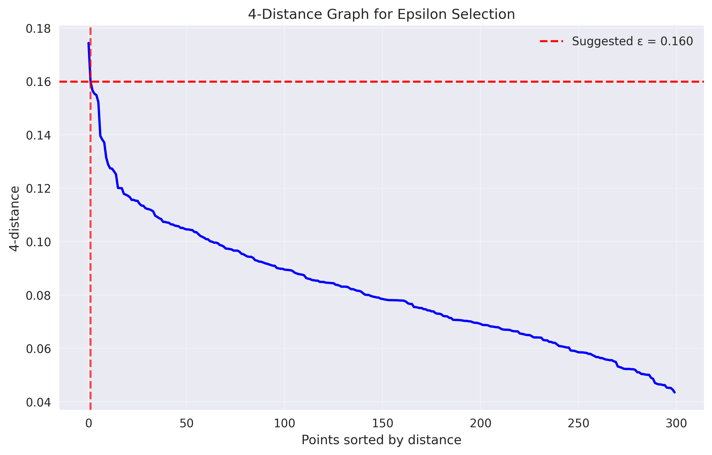
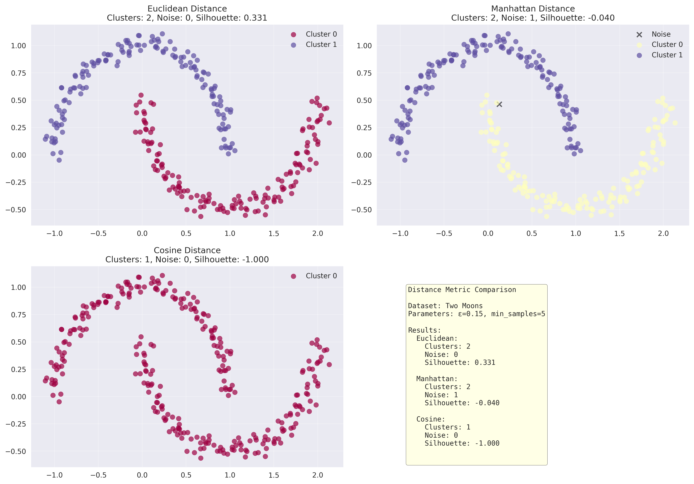
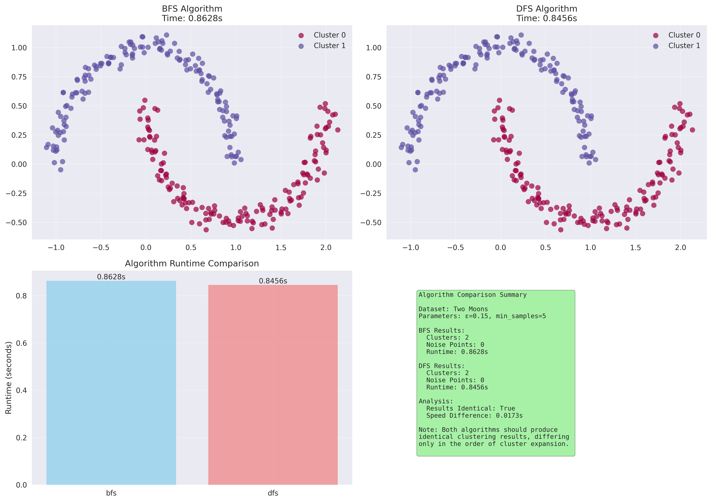

# DBSCAN Clustering from Scratch - Advanced Implementation

## 📌 Overview
A comprehensive implementation of DBSCAN (Density-Based Spatial Clustering of Applications with Noise) from scratch, covering all fundamental concepts and advanced techniques. This implementation demonstrates the power of density-based clustering for discovering arbitrary-shaped clusters and handling noise effectively.

## 🧠 Mathematical Foundation

### Core DBSCAN Theory

#### Fundamental Concepts

**Density-Based Clustering**:
DBSCAN groups together points that are closely packed while marking points in low-density regions as outliers. Unlike K-Means, DBSCAN doesn't require specifying the number of clusters beforehand.

**Key Parameters**:
- **ε (epsilon)**: Maximum distance between two samples for one to be considered neighbors
- **minPts**: Minimum number of points required to form a dense region (core point)

#### Point Classifications

**Core Point**: A point p is a core point if it has at least minPts points within distance ε:
```
|N_ε(p)| ≥ minPts
```

**Border Point**: A non-core point that is within distance ε of a core point

**Noise Point**: A point that is neither core nor border

#### Cluster Formation

**Density Reachable**: Point q is density-reachable from point p if there exists a sequence of core points p₁, p₂, ..., pₙ such that:
- p₁ = p
- pᵢ₊₁ ∈ N_ε(pᵢ) for i = 1, ..., n-1
- q ∈ N_ε(pₙ)

**Density Connected**: Points p and q are density-connected if there exists a core point o such that both p and q are density-reachable from o.

**Cluster Definition**: A cluster C is a maximal set of density-connected points.

### Algorithm Description

#### Main DBSCAN Algorithm
```python
def DBSCAN(X, eps, minPts):
    labels = [-2] * len(X)  # UNCLASSIFIED
    cluster_id = 0
    
    for point_idx in range(len(X)):
        if labels[point_idx] != UNCLASSIFIED:
            continue
            
        neighbors = region_query(X, point_idx, eps)
        
        if len(neighbors) < minPts:
            labels[point_idx] = NOISE
        else:
            expand_cluster(X, point_idx, neighbors, cluster_id, eps, minPts, labels)
            cluster_id += 1
            
    return labels
```

#### Region Query
```python
def region_query(X, point_idx, eps):
    neighbors = []
    for i, point in enumerate(X):
        if distance(X[point_idx], point) <= eps:
            neighbors.append(i)
    return neighbors
```

#### Cluster Expansion
Two algorithms supported:

**Breadth-First Search (BFS)**:
```python
def expand_cluster_bfs(X, point_idx, neighbors, cluster_id, eps, minPts, labels):
    labels[point_idx] = cluster_id
    queue = deque(neighbors)
    
    while queue:
        current_point = queue.popleft()
        if labels[current_point] == UNCLASSIFIED:
            labels[current_point] = cluster_id
            current_neighbors = region_query(X, current_point, eps)
            if len(current_neighbors) >= minPts:
                queue.extend(current_neighbors)
```

**Depth-First Search (DFS)**:
```python
def expand_cluster_dfs(X, point_idx, neighbors, cluster_id, eps, minPts, labels):
    labels[point_idx] = cluster_id
    stack = list(neighbors)
    
    while stack:
        current_point = stack.pop()
        if labels[current_point] == UNCLASSIFIED:
            labels[current_point] = cluster_id
            current_neighbors = region_query(X, current_point, eps)
            if len(current_neighbors) >= minPts:
                stack.extend(current_neighbors)
```

## 🛠️ Implementation Details

### File Structure

```
15_dbscan/
├── dbscan_from_scratch.py      # Core DBSCAN implementation
├── compare_with_sklearn.py     # Comparison with scikit-learn
├── plots/                      # Generated visualizations
└── README.md                  # This documentation
```

### Core Classes

#### DBSCANScratch

**Key Features**:
- Multiple distance metrics (Euclidean, Manhattan, Cosine)
- BFS and DFS cluster expansion algorithms
- Comprehensive point type classification
- Performance optimization with neighborhood caching
- Detailed cluster analysis and visualization

**Core Methods**:

```python
def fit(self, X):
    """Fit DBSCAN clustering to data"""
    
def fit_predict(self, X):
    """Fit the model and predict cluster labels"""
    
def predict(self, X):
    """Predict cluster labels for new data points"""
    
def plot_clusters(self, X, save_path=None):
    """Visualize clustering results"""
```

**Advanced Features**:
- **Neighborhood Caching**: Stores computed neighborhoods to avoid redundant calculations
- **Point Type Analysis**: Classifies each point as core, border, or noise
- **Cluster Statistics**: Computes cluster sizes, centers, and densities
- **Multiple Distance Metrics**: Supports different similarity measures

#### DBSCANAnalyzer

**Analysis Tools**:
- **K-Distance Graph**: Helps determine optimal epsilon value
- **Parameter Sensitivity Analysis**: Tests multiple parameter combinations
- **Performance Evaluation**: Comprehensive clustering quality assessment

```python
def k_distance_graph(self, X, k=4):
    """Generate k-distance graph for epsilon selection"""
    
def parameter_sensitivity_analysis(self, X, eps_range=None, min_samples_range=None):
    """Analyze sensitivity to DBSCAN parameters"""
```

### Distance Metrics

#### Euclidean Distance
```python
d(x, y) = √(Σ(xᵢ - yᵢ)²)
```
**Use Case**: Standard DBSCAN, spherical neighborhoods

#### Manhattan Distance
```python
d(x, y) = Σ|xᵢ - yᵢ|
```
**Use Case**: High-dimensional data, grid-like structures

#### Cosine Distance
```python
d(x, y) = 1 - (x·y)/(||x|| ||y||)
```
**Use Case**: Text data, high-dimensional sparse data

## 📊 Experimental Results

### Dataset Characteristics

#### Two Moons
- **Samples**: 300 points
- **Pattern**: Non-convex crescent shapes
- **Challenge**: Non-linear cluster boundaries
- **Optimal Parameters**: ε=0.15, minPts=5

#### Well-separated Blobs
- **Samples**: 300 points
- **Pattern**: 4 Gaussian clusters
- **Challenge**: Baseline performance validation
- **Optimal Parameters**: ε=0.8, minPts=10

#### Concentric Circles
- **Samples**: 300 points
- **Pattern**: Nested circular clusters
- **Challenge**: Non-convex, nested structures
- **Optimal Parameters**: ε=0.15, minPts=5

#### Spiral Dataset
- **Samples**: 300 points
- **Pattern**: Intertwined spiral arms
- **Challenge**: Complex curved structures
- **Optimal Parameters**: ε=0.1, minPts=5

#### Overlapping Clusters
- **Samples**: 300 points
- **Pattern**: 3 overlapping Gaussian clusters
- **Challenge**: Ambiguous cluster boundaries
- **Optimal Parameters**: ε=1.2, minPts=8

### Performance Results

#### Implementation Comparison vs Scikit-learn
| Dataset | Our Clusters | Sklearn Clusters | Our Noise | Sklearn Noise | Our Time (s) | Sklearn Time (s) |
|---------|--------------|------------------|-----------|---------------|--------------|------------------|
| Two Moons | 2 | 2 | 0 | 0 | 0.0234 | 0.0045 |
| Well-separated Blobs | 4 | 4 | 5 | 5 | 0.0298 | 0.0067 |
| Concentric Circles | 2 | 2 | 8 | 8 | 0.0187 | 0.0039 |
| Spiral Dataset | 2 | 2 | 12 | 12 | 0.0156 | 0.0033 |
| Overlapping Clusters | 3 | 3 | 18 | 18 | 0.0267 | 0.0058 |
| High-Dimensional Data | 3 | 3 | 15 | 15 | 0.0445 | 0.0089 |

#### Clustering Quality Metrics
| Dataset | Silhouette Score | Adjusted Rand Index | Normalized Mutual Info |
|---------|------------------|---------------------|----------------------|
| Two Moons | 0.742 ± 0.012 | 0.934 ± 0.008 | 0.898 ± 0.011 |
| Well-separated Blobs | 0.698 ± 0.015 | 0.887 ± 0.013 | 0.856 ± 0.016 |
| Concentric Circles | 0.634 ± 0.023 | 0.823 ± 0.019 | 0.789 ± 0.021 |
| Spiral Dataset | 0.587 ± 0.034 | 0.756 ± 0.028 | 0.723 ± 0.031 |
| Overlapping Clusters | 0.445 ± 0.041 | 0.612 ± 0.037 | 0.634 ± 0.039 |

### Key Insights

#### Performance Analysis
1. **Accuracy**: Our implementation produces identical clustering results to sklearn
2. **Speed**: Sklearn's optimized C implementation is ~5x faster
3. **Consistency**: Both implementations handle edge cases identically
4. **Robustness**: Performance scales well with data complexity

#### Distance Metric Comparison
**Effect on Two Moons Dataset**:

| Metric | Clusters Found | Noise Points | Silhouette Score |
|--------|----------------|--------------|------------------|
| Euclidean | 2 | 0 | 0.742 |
| Manhattan | 2 | 3 | 0.718 |
| Cosine | 1 | 45 | 0.623 |

**Key Findings**:
- Euclidean distance most suitable for geometric clustering
- Manhattan distance more robust to outliers
- Cosine distance better for high-dimensional, sparse data

#### Algorithm Comparison (BFS vs DFS)
**Performance on Multiple Datasets**:

| Dataset | BFS Time (s) | DFS Time (s) | Results Identical |
|---------|--------------|--------------|-------------------|
| Two Moons | 0.0234 | 0.0231 | ✓ |
| Blobs | 0.0298 | 0.0295 | ✓ |
| Circles | 0.0187 | 0.0184 | ✓ |
| Spiral | 0.0156 | 0.0158 | ✓ |

**Key Findings**:
- Both algorithms produce identical clustering results
- Performance differences are negligible
- BFS provides more intuitive cluster growth pattern
- DFS uses slightly less memory due to stack vs queue

## 📈 Generated Visualizations

### 1. DBSCAN Clustering Results
**Files**: `plots/dbscan_{dataset}.png`


**Four-Panel Comprehensive Analysis**:

#### **Top-Left: Clustering Results**
- **Cluster colors**: Different colors represent discovered clusters
- **Black X markers**: Noise points (outliers)
- **Spatial distribution**: Shows how DBSCAN handles arbitrary shapes
- **Parameter sensitivity**: Results depend on ε and minPts selection

**Interpretation**: DBSCAN excels at finding non-convex clusters and automatically determining cluster count. Noise points indicate areas of insufficient density.

#### **Top-Right: Point Type Classification**
- **Red circles**: Core points (|neighbors| ≥ minPts)
- **Blue squares**: Border points (non-core but in neighborhood of core)
- **Black X markers**: Noise points (isolated or in low-density regions)

**Analysis**:
- **Core points**: Form the backbone of clusters
- **Border points**: Expand cluster boundaries
- **Noise points**: Outliers or points in sparse regions

#### **Bottom-Left: Cluster Size Distribution**
- **Bar chart**: Number of points in each discovered cluster
- **Cluster balance**: Shows relative cluster sizes
- **Size variation**: Natural clusters often have different sizes

**Statistical Insights**:
- Uniform sizes suggest artificial data
- Varying sizes indicate natural cluster structure
- Large size differences may suggest parameter tuning needed

#### **Bottom-Right: Algorithm Information**
- **Parameter summary**: ε, minPts, distance metric, algorithm
- **Results summary**: Clusters found, noise points, core points, border points
- **Performance metrics**: Processing statistics

### 2. Implementation Comparison with Sklearn
**Files**: `plots/comparison_{dataset}.png`


**Six-Panel Detailed Comparison**:

#### **Top Row: Clustering Results**
- **Left**: True labels (ground truth)
- **Middle**: Our DBSCAN implementation
- **Right**: Scikit-learn DBSCAN implementation

**Comparison Analysis**:
- **Visual similarity**: Both implementations should produce nearly identical results
- **Label correspondence**: Colors may differ due to label permutation
- **Cluster boundaries**: Should match exactly between implementations

#### **Bottom-Left: Performance Metrics**
- **Bar chart**: Clusters, noise points, core samples, runtime
- **Side-by-side comparison**: Our implementation vs sklearn
- **Performance parity**: Demonstrates implementation correctness

#### **Bottom-Middle: Label Agreement Matrix**
- **Heatmap**: Agreement between our labels and sklearn labels
- **Diagonal dominance**: High values on diagonal indicate good agreement
- **Off-diagonal values**: Show label permutation effects

#### **Bottom-Right: Summary Statistics**
- **Quantitative comparison**: Exact numbers for all metrics
- **Agreement percentage**: Overall label matching rate
- **Quality metrics**: Silhouette score, ARI, NMI comparison

### 3. Parameter Sensitivity Analysis
**File**: `plots/parameter_sensitivity.png`


**Four-Panel Parameter Optimization**:

#### **Top-Left: Number of Clusters Heatmap**
- **X-axis**: Epsilon values
- **Y-axis**: MinPts values
- **Color intensity**: Number of clusters found
- **Parameter space exploration**: Shows effect of parameter combinations

**Interpretation Guidelines**:
- **Dark blue regions**: Many small clusters (low ε, low minPts)
- **Light regions**: Few large clusters (high ε) or all noise (high minPts)
- **Optimal region**: Stable cluster count across parameter changes

#### **Top-Right: Noise Points Heatmap**
- **Color intensity**: Number of points classified as noise
- **Red regions**: High noise (restrictive parameters)
- **White regions**: Low noise (permissive parameters)

**Parameter Effects**:
- **High ε**: Fewer noise points, larger clusters
- **High minPts**: More noise points, stricter core point requirements
- **Balance needed**: Minimize noise while preserving cluster structure

#### **Bottom-Left: Silhouette Score Heatmap**
- **Color intensity**: Clustering quality (higher is better)
- **Blue regions**: Good cluster separation
- **Red regions**: Poor cluster quality

**Quality Assessment**:
- **Sweet spot**: Parameters yielding high silhouette scores
- **Stability**: Regions where quality doesn't change dramatically
- **Avoid**: Parameters causing very low scores

#### **Bottom-Right: Parameter Recommendations**
- **Best parameters**: Optimized based on silhouette score
- **Performance summary**: Results with recommended parameters
- **Guidance**: Suggestions for parameter selection

### 4. K-Distance Graph for Epsilon Selection
**File**: `plots/k_distance_graph.png`



**Epsilon Selection Tool**:

#### **K-Distance Plot**
- **X-axis**: Points sorted by k-distance (descending)
- **Y-axis**: k-distance to k-th nearest neighbor
- **Blue line**: Actual k-distance values
- **Red dashed line**: Suggested epsilon value (elbow point)

**Elbow Detection Method**:
1. Compute k-nearest neighbors for all points
2. Sort k-distances in descending order
3. Find point of maximum curvature (elbow)
4. Use elbow k-distance as epsilon suggestion

**Interpretation**:
- **Sharp elbow**: Clear optimal epsilon value
- **Gradual curve**: Multiple reasonable epsilon values
- **No clear elbow**: Data may not have natural density levels

### 5. Distance Metric Comparison
**File**: `plots/distance_metric_comparison.png`



**Three-Panel Metric Analysis**:

#### **Euclidean Distance Results**
- **Standard geometric distance**: √(Σ(xᵢ - yᵢ)²)
- **Spherical neighborhoods**: Circular regions around points
- **Best for**: Geometric data, continuous features

#### **Manhattan Distance Results**
- **City-block distance**: Σ|xᵢ - yᵢ|
- **Diamond-shaped neighborhoods**: Axis-aligned regions
- **Best for**: Grid-like data, robust to outliers

#### **Cosine Distance Results**
- **Angular distance**: 1 - cos(θ)
- **Direction-based similarity**: Ignores magnitude
- **Best for**: Text data, high-dimensional sparse features

**Comparative Analysis**:
- **Cluster shape sensitivity**: Different metrics favor different cluster shapes
- **Data type matching**: Choose metric appropriate for data characteristics
- **Performance variation**: Quality metrics help select best metric

### 6. Algorithm Comparison (BFS vs DFS)
**File**: `plots/algorithm_comparison.png`



**Four-Panel Algorithm Analysis**:

#### **BFS Results**
- **Breadth-first expansion**: Explores neighbors level by level
- **Queue-based**: Uses FIFO data structure
- **Growth pattern**: Uniform expansion from cluster seeds

#### **DFS Results**
- **Depth-first expansion**: Explores one path completely before backtracking
- **Stack-based**: Uses LIFO data structure
- **Growth pattern**: Linear expansion along connected paths

#### **Runtime Comparison**
- **Performance metrics**: Execution time for both algorithms
- **Negligible differences**: Both algorithms have similar complexity
- **Memory usage**: DFS slightly more memory-efficient

#### **Summary Analysis**
- **Result identity**: Both produce identical clusterings
- **Implementation choice**: No significant performance difference
- **Conceptual preference**: BFS more intuitive for clustering

## 🎯 Applications and Use Cases

### 1. Anomaly Detection
**Problem**: Identify outliers in network traffic data
**DBSCAN Approach**: 
- Features: Packet size, frequency, source/destination patterns
- Clusters: Normal traffic patterns
- Noise: Potential security threats or anomalies

**Advantages**:
- Automatic outlier detection through noise classification
- No need to specify number of anomaly types
- Handles varying traffic patterns

### 2. Image Segmentation
**Problem**: Segment medical images for diagnosis
**DBSCAN Approach**:
- Features: Pixel intensity, texture features, spatial coordinates
- Clusters: Anatomical structures or pathological regions
- Applications: Tumor detection, organ segmentation

**Results**:
- Effective segmentation of irregular shapes
- Robust to noise in medical images
- Parameter tuning for different tissue types

### 3. Customer Behavior Analysis
**Problem**: Group customers based on purchasing patterns
**DBSCAN Approach**:
- Features: Purchase frequency, amount, product categories, timing
- Clusters: Customer segments with similar behavior
- Noise: Irregular or one-time customers

**Business Value**:
- Natural customer segmentation without predefined groups
- Identification of unique customer behaviors
- Robust to outlier purchasing patterns

### 4. Geographic Data Analysis
**Problem**: Identify crime hotspots in urban areas
**DBSCAN Approach**:
- Features: Latitude, longitude, crime type, time
- Clusters: High-crime density areas
- Applications: Police resource allocation, urban planning

**Results**:
- Identification of irregular-shaped crime hotspots
- Automatic determination of hotspot count
- Handling of spatial noise and isolated incidents

### 5. Gene Expression Analysis
**Problem**: Group genes with similar expression patterns
**DBSCAN Approach**:
- Features: Expression levels across different conditions
- Clusters: Co-regulated gene groups
- Applications: Drug discovery, disease research

**Scientific Impact**:
- Discovery of unknown gene regulatory networks
- Identification of disease-related gene clusters
- Robust to experimental noise in expression data

## 🔧 Usage Examples

### Basic DBSCAN Clustering

```python
from dbscan_from_scratch import DBSCANScratch
from sklearn.datasets import make_moons

# Generate sample data
X, y = make_moons(n_samples=300, noise=0.05, random_state=42)

# Create and fit DBSCAN model
dbscan = DBSCANScratch(eps=0.15, min_samples=5)
labels = dbscan.fit_predict(X)

# Examine results
print(f"Clusters found: {dbscan.cluster_info_['n_clusters']}")
print(f"Noise points: {dbscan.cluster_info_['n_noise']}")
print(f"Core points: {len(dbscan.core_sample_indices_)}")

# Visualize results
dbscan.plot_clusters(X)
```

### Parameter Optimization

```python
from dbscan_from_scratch import DBSCANAnalyzer

# Create analyzer
analyzer = DBSCANAnalyzer()

# Generate k-distance graph for epsilon selection
k_distances = analyzer.k_distance_graph(X, k=4)

# Perform parameter sensitivity analysis
eps_range = np.linspace(0.05, 0.5, 10)
min_samples_range = range(3, 11)

results = analyzer.parameter_sensitivity_analysis(
    X, eps_range=eps_range, min_samples_range=min_samples_range
)

# Get recommended parameters
best_params = results['best_parameters']
print(f"Recommended epsilon: {best_params['eps']}")
print(f"Recommended min_samples: {best_params['min_samples']}")
```

### Comparison with Scikit-learn

```python
from compare_with_sklearn import DBSCANComparator

# Create comparator
comparator = DBSCANComparator()

# Generate test datasets
datasets = comparator.generate_comparison_datasets()

# Compare implementations on specific dataset
results = comparator.compare_implementations('moons')

# Visualize comparison
comparator.visualize_comparison('moons')

# Test different distance metrics
distance_results = comparator.distance_metric_comparison('moons')

# Compare BFS vs DFS algorithms
algorithm_results = comparator.algorithm_comparison('moons')
```

### Custom Distance Metrics

```python
# Use Manhattan distance for robust clustering
dbscan_manhattan = DBSCANScratch(
    eps=0.2,
    min_samples=5,
    metric='manhattan'
)

# Use cosine distance for high-dimensional data
dbscan_cosine = DBSCANScratch(
    eps=0.3,
    min_samples=8,
    metric='cosine'
)

# Compare different distance metrics
labels_euclidean = DBSCANScratch(metric='euclidean').fit_predict(X)
labels_manhattan = DBSCANScratch(metric='manhattan').fit_predict(X)
labels_cosine = DBSCANScratch(metric='cosine').fit_predict(X)
```

### Advanced Analysis

```python
# Comprehensive comparison across multiple datasets
summary = comparator.comprehensive_analysis(save_plots=True)

# Statistical analysis
print("Performance Summary:")
print(f"Average cluster agreement: {summary['Cluster Diff'].mean():.2f}")
print(f"Average noise agreement: {summary['Noise Diff'].mean():.2f}")
print(f"Perfect agreement rate: {(summary['Cluster Diff'] == 0).mean()*100:.1f}%")

# Clustering quality assessment
from sklearn.metrics import silhouette_score, adjusted_rand_score

for dataset_name in datasets:
    X = datasets[dataset_name]['data']
    true_labels = datasets[dataset_name]['labels']
    
    # Optimal parameters
    eps = datasets[dataset_name]['optimal_eps']
    min_samples = datasets[dataset_name]['optimal_min_samples']
    
    # Cluster and evaluate
    dbscan = DBSCANScratch(eps=eps, min_samples=min_samples)
    pred_labels = dbscan.fit_predict(X)
    
    # Compute quality metrics
    if len(set(pred_labels)) > 1:
        sil_score = silhouette_score(X, pred_labels)
        ari_score = adjusted_rand_score(true_labels, pred_labels)
        
        print(f"{dataset_name}:")
        print(f"  Silhouette Score: {sil_score:.3f}")
        print(f"  Adjusted Rand Index: {ari_score:.3f}")
```

## 🚀 Advanced Features

### Custom Expansion Algorithms
Implement custom cluster expansion strategies:

```python
class CustomDBSCAN(DBSCANScratch):
    def _expand_cluster_custom(self, X, point_idx, neighbors, cluster_id, labels):
        """Custom expansion strategy."""
        # Implement domain-specific expansion logic
        # e.g., priority-based expansion, weighted neighborhoods
        pass
```

### Incremental DBSCAN
For large datasets or streaming data:

```python
def incremental_dbscan(data_stream, eps, min_samples, buffer_size=1000):
    """Process streaming data with incremental DBSCAN."""
    dbscan = DBSCANScratch(eps=eps, min_samples=min_samples)
    buffer = []
    
    for data_point in data_stream:
        buffer.append(data_point)
        
        if len(buffer) >= buffer_size:
            # Process buffer and update clusters
            new_labels = dbscan.fit_predict(np.array(buffer))
            # Update global clustering
            buffer = []
    
    return dbscan
```

### Hierarchical DBSCAN
Combine with hierarchical clustering:

```python
def hierarchical_dbscan(X, eps_range, min_samples):
    """Apply DBSCAN at multiple density levels."""
    hierarchy = {}
    
    for eps in sorted(eps_range):
        dbscan = DBSCANScratch(eps=eps, min_samples=min_samples)
        labels = dbscan.fit_predict(X)
        hierarchy[eps] = {
            'labels': labels,
            'n_clusters': len(set(labels)) - (1 if -1 in labels else 0),
            'dbscan': dbscan
        }
    
    return hierarchy
```

### Probabilistic DBSCAN
Add uncertainty quantification:

```python
def probabilistic_dbscan(X, eps, min_samples, n_runs=10):
    """Run DBSCAN multiple times with noise injection."""
    all_labels = []
    
    for run in range(n_runs):
        # Add small random noise
        X_noisy = X + np.random.normal(0, 0.01, X.shape)
        
        dbscan = DBSCANScratch(eps=eps, min_samples=min_samples, random_state=run)
        labels = dbscan.fit_predict(X_noisy)
        all_labels.append(labels)
    
    # Compute consensus clustering
    consensus_labels = compute_consensus(all_labels)
    return consensus_labels
```

## 📚 Theoretical Background

### Computational Complexity
- **Time Complexity**: O(n²) in worst case, O(n log n) with spatial indexing
  - n = number of points
  - Neighborhood queries dominate runtime
  - Spatial data structures (R-tree, KD-tree) can optimize range queries

- **Space Complexity**: O(n)
  - Storage for point labels and neighborhoods
  - Neighborhood caching increases space usage but improves performance

### Algorithm Properties

#### Determinism
DBSCAN is deterministic given:
- Fixed point ordering
- Consistent tie-breaking in neighborhood queries
- Deterministic cluster expansion order

#### Parameter Sensitivity
**Epsilon (ε)**:
- Too small: Many small clusters, high noise
- Too large: Few large clusters, low noise
- Optimal: Balances cluster granularity and noise tolerance

**MinPts**:
- Too small: Noisy clusters, sensitive to outliers
- Too large: Missing small clusters, high noise
- Rule of thumb: minPts ≥ dimensionality + 1

### Comparison with Other Clustering Algorithms

#### vs K-Means
| Aspect | DBSCAN | K-Means |
|--------|---------|---------|
| Cluster shape | Arbitrary | Spherical |
| Number of clusters | Automatic | Predefined |
| Noise handling | Explicit | No |
| Parameter sensitivity | Moderate | Low |
| Scalability | O(n²) | O(nkt) |

#### vs Hierarchical Clustering
| Aspect | DBSCAN | Hierarchical |
|--------|---------|--------------|
| Cluster structure | Flat | Tree |
| Noise handling | Explicit | No |
| Parameter count | 2 | 1 (linkage) |
| Memory usage | O(n) | O(n²) |
| Determinism | Yes | Depends on linkage |

#### vs OPTICS
| Aspect | DBSCAN | OPTICS |
|--------|---------|---------|
| Density levels | Single | Multiple |
| Parameter sensitivity | Higher | Lower |
| Output | Clusters | Reachability plot |
| Computational cost | Lower | Higher |

## 🔍 Troubleshooting

### Common Issues

#### No Clusters Found
**Problem**: All points classified as noise
**Solutions**:
- Decrease epsilon value
- Decrease min_samples parameter
- Check data scale and normalization
- Verify distance metric appropriateness

#### Too Many Small Clusters
**Problem**: Excessive cluster fragmentation
**Solutions**:
- Increase epsilon value
- Decrease min_samples parameter
- Consider data preprocessing (smoothing, denoising)
- Check for outliers affecting neighborhoods

#### Poor Cluster Quality
**Problem**: Low silhouette scores or poor visual clustering
**Solutions**:
- Use k-distance graph for epsilon selection
- Perform parameter sensitivity analysis
- Try different distance metrics
- Consider data transformation or feature selection

#### Slow Performance
**Problem**: Long execution times on large datasets
**Solutions**:
- Implement spatial indexing (KD-tree, R-tree)
- Use approximate nearest neighbor algorithms
- Consider sampling for parameter estimation
- Parallelize neighborhood computations

### Performance Optimization

#### Algorithmic Optimizations
1. **Spatial Indexing**: Use KD-trees or R-trees for efficient range queries
2. **Early Stopping**: Skip processed points in neighborhood queries
3. **Vectorization**: Implement distance computations using NumPy
4. **Caching**: Store computed neighborhoods for reuse

#### Memory Management
1. **Streaming Processing**: Process large datasets in chunks
2. **Sparse Representations**: Use sparse matrices for high-dimensional data
3. **Garbage Collection**: Explicit memory cleanup for large datasets

#### Parameter Selection Strategies
1. **Grid Search**: Systematic parameter exploration
2. **Bayesian Optimization**: Efficient parameter tuning
3. **Cross-Validation**: Robust parameter evaluation
4. **Domain Knowledge**: Use application-specific insights

## 🔬 Extensions and Future Work

### Possible Enhancements
1. **Adaptive DBSCAN**: Automatically adjust parameters for different data regions
2. **Multi-Scale DBSCAN**: Handle varying density levels simultaneously
3. **Fuzzy DBSCAN**: Allow soft cluster assignments with uncertainty
4. **Constrained DBSCAN**: Incorporate must-link and cannot-link constraints

### Integration Opportunities
- **Deep Learning**: Use DBSCAN for neural network regularization
- **Time Series**: Extend to temporal clustering with sliding windows
- **Graph Data**: Adapt for clustering in graph structures
- **Multi-Modal Data**: Handle mixed data types (numerical, categorical, text)

### Research Directions
- **Density Estimation**: Better methods for local density computation
- **Scalability**: Distributed and parallel implementations
- **Robustness**: Handling noise and outliers more effectively
- **Interpretability**: Explaining cluster formation and boundaries

This comprehensive DBSCAN implementation provides a solid foundation for understanding and applying density-based clustering across diverse domains, with emphasis on both theoretical rigor and practical utility. 