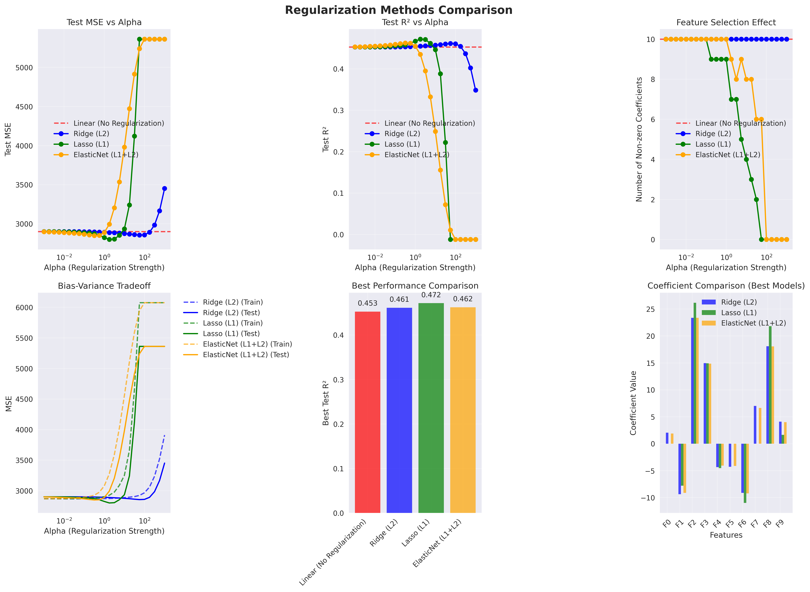
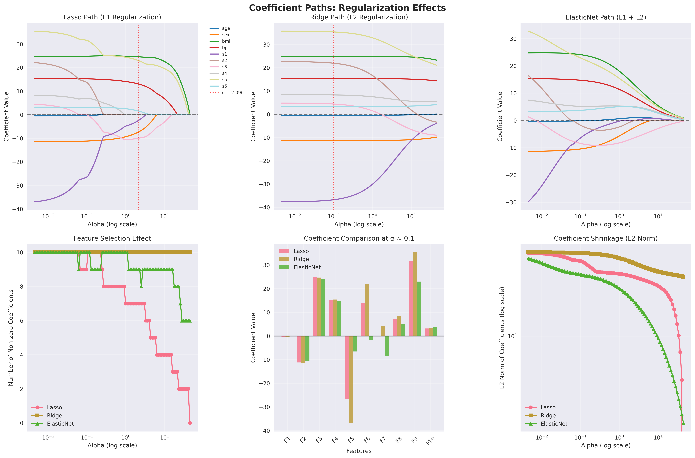
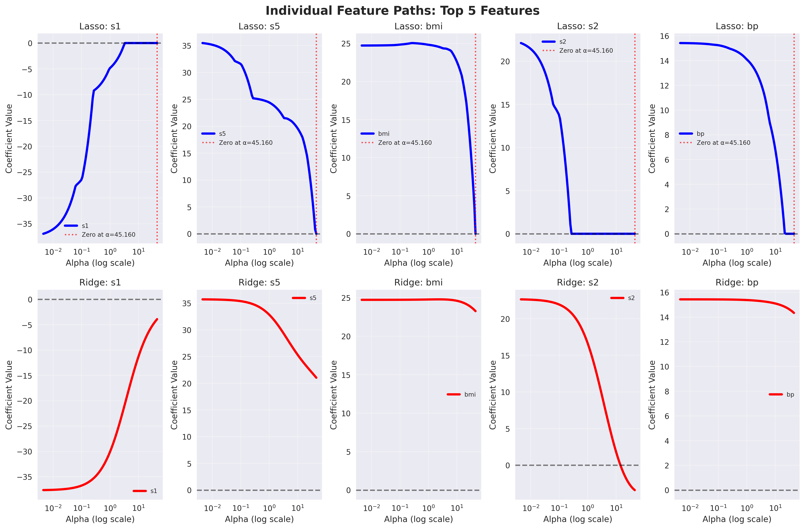
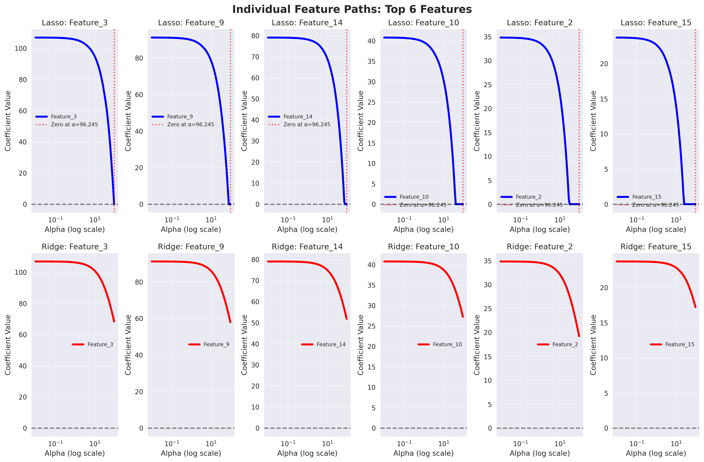
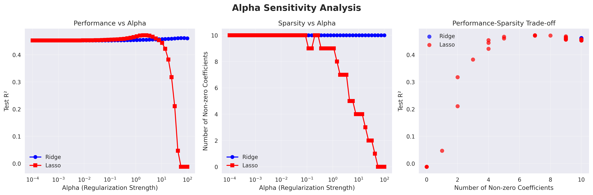
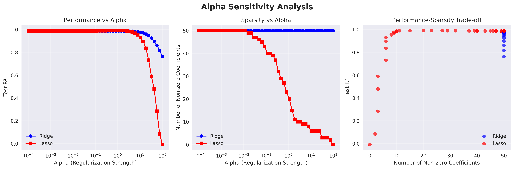
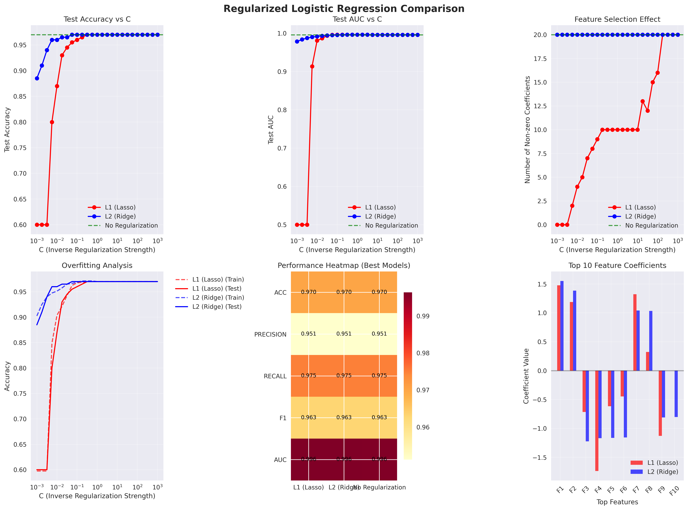

# Day 18: Regularization (L1, L2, ElasticNet)

A comprehensive implementation of regularization techniques in machine learning, demonstrating L1 (Lasso), L2 (Ridge), and ElasticNet regularization with detailed analysis and visualizations.

## 📋 Table of Contents

1. [Overview](#overview)
2. [Theoretical Background](#theoretical-background)
3. [Implementation Components](#implementation-components)
4. [Usage Examples](#usage-examples)
5. [Visualization Gallery](#visualization-gallery)
6. [Key Concepts](#key-concepts)
7. [Experimental Results](#experimental-results)
8. [Best Practices](#best-practices)
9. [Troubleshooting](#troubleshooting)
10. [References](#references)

## 🎯 Overview

This module provides a complete toolkit for understanding and applying regularization techniques in machine learning:

- **L1 Regularization (Lasso)**: Promotes sparsity and automatic feature selection
- **L2 Regularization (Ridge)**: Prevents overfitting through coefficient shrinkage
- **ElasticNet**: Combines L1 and L2 regularization for balanced feature selection
- **Coefficient Path Analysis**: Shows how coefficients change with regularization strength
- **Decision Boundary Visualization**: Demonstrates regularization effects on classification
- **Comprehensive Comparisons**: Side-by-side analysis of different methods

## 📚 Theoretical Background

### Mathematical Foundations

#### Linear Regression with Regularization

The general form of regularized linear regression:

```
Loss = MSE + λ × Penalty
```

Where:
- **MSE**: Mean Squared Error (data fitting term)
- **λ (alpha)**: Regularization strength parameter
- **Penalty**: Regularization term (L1, L2, or combination)

#### L1 Regularization (Lasso)

```
Loss_L1 = MSE + λ × Σ|βᵢ|
```

**Properties:**
- Promotes sparsity (sets coefficients to exactly zero)
- Automatic feature selection
- Solution may not be unique
- Less stable than Ridge

**Geometric Interpretation:**
- L1 penalty creates diamond-shaped constraint regions
- Sharp corners promote sparsity

#### L2 Regularization (Ridge)

```
Loss_L2 = MSE + λ × Σβᵢ²
```

**Properties:**
- Shrinks coefficients uniformly
- Never sets coefficients to exactly zero
- Unique solution always exists
- More stable than Lasso

**Geometric Interpretation:**
- L2 penalty creates circular constraint regions
- Smooth boundaries lead to uniform shrinkage

#### ElasticNet

```
Loss_ElasticNet = MSE + λ × (α × Σ|βᵢ| + (1-α) × Σβᵢ²)
```

Where:
- **α (l1_ratio)**: Mixing parameter between L1 and L2
- **α = 1**: Pure Lasso
- **α = 0**: Pure Ridge
- **0 < α < 1**: Combined penalty

**Properties:**
- Balances feature selection and coefficient stability
- Handles correlated features better than Lasso
- Tunable trade-off between sparsity and shrinkage

### Regularization in Logistic Regression

For classification problems:

```
Loss = LogLikelihood + λ × Penalty
```

**Parameter C in sklearn:**
- C = 1/λ (inverse of regularization strength)
- Higher C = Less regularization
- Lower C = More regularization

### Bias-Variance Tradeoff

Regularization directly affects the bias-variance tradeoff:

```
MSE = Bias² + Variance + Irreducible Error
```

- **No Regularization**: Low bias, high variance
- **High Regularization**: High bias, low variance
- **Optimal Regularization**: Minimizes total MSE

## 🛠 Implementation Components

### 1. L1, L2, ElasticNet Demo (`l1_l2_elasticnet_demo.py`)

```python
from l1_l2_elasticnet_demo import RegularizationDemo

# Initialize demo
demo = RegularizationDemo(random_state=42)

# Load dataset
dataset_info = demo.load_and_prepare_data('diabetes')

# Compare regularization methods
alpha_range = np.logspace(-3, 3, 25)
results = demo.compare_regularization_methods(alpha_range)

# Plot comprehensive comparison
demo.plot_regularization_comparison(save_path='regularization_comparison.png')

# ElasticNet analysis
elasticnet_results = demo.elasticnet_analysis()
demo.plot_elasticnet_analysis(elasticnet_results)
```

#### Key Features:
- **Multiple datasets**: Diabetes, synthetic options
- **Comprehensive metrics**: MSE, R², coefficient count
- **ElasticNet analysis**: Different L1 ratios
- **Statistical summaries**: Performance comparison tables

### 2. Coefficient Path Plotting (`coefficient_path_plot.py`)

```python
from coefficient_path_plot import CoefficientPathAnalyzer

# Initialize analyzer
analyzer = CoefficientPathAnalyzer(random_state=42)

# Load data
dataset_info = analyzer.load_data('diabetes')

# Plot coefficient paths
paths = analyzer.plot_coefficient_paths(save_path='coefficient_paths.png')

# Individual feature analysis
analyzer.plot_individual_feature_paths(top_n=5)

# Shrinkage pattern analysis
analysis = analyzer.analyze_shrinkage_patterns()
```

#### Key Visualizations:
- **Lasso paths**: Feature selection progression
- **Ridge paths**: Uniform coefficient shrinkage
- **ElasticNet paths**: Combined behavior
- **Individual features**: Detailed coefficient evolution
- **Shrinkage analysis**: Quantitative pattern comparison

### 3. Regularized Logistic Regression (`regularized_logistic_regression.py`)

```python
from regularized_logistic_regression import RegularizedLogisticAnalyzer

# Initialize analyzer
analyzer = RegularizedLogisticAnalyzer(random_state=42)

# Load classification data
dataset_info = analyzer.load_data('breast_cancer')

# Compare L1 vs L2 regularization
C_range = np.logspace(-3, 3, 25)
results = analyzer.compare_regularization_methods(C_range)

# Plot comparison
analyzer.plot_regularization_comparison()

# Decision boundary visualization
analyzer.plot_decision_boundaries_2d()

# Feature importance analysis
feature_analysis = analyzer.feature_importance_analysis()
```

#### Analysis Features:
- **Multiple metrics**: Accuracy, precision, recall, F1, AUC
- **Decision boundaries**: 2D visualization with PCA
- **Feature selection**: L1 vs L2 comparison
- **Performance analysis**: Overfitting detection

### 4. Ridge vs Lasso Comparison (`ridge_vs_lasso_plot.py`)

```python
from ridge_vs_lasso_plot import RidgeLassoComparator

# Initialize comparator
comparator = RidgeLassoComparator(random_state=42)

# Load data
dataset_info = comparator.load_data('diabetes')

# Find optimal parameters
optimal_alphas = comparator.find_optimal_alphas()

# Compare models
results = comparator.compare_models()

# Comprehensive visualization
comparator.plot_ridge_vs_lasso_comparison()

# Alpha sensitivity analysis
comparator.plot_alpha_sensitivity()
```

#### Comparison Features:
- **Side-by-side coefficients**: Direct comparison
- **Sparsity analysis**: Feature selection patterns
- **Performance metrics**: Multi-faceted evaluation
- **Alpha sensitivity**: Parameter tuning insights

## 📊 Usage Examples

### Example 1: Basic Regularization Comparison

```python
import numpy as np
from sklearn.datasets import load_diabetes
from l1_l2_elasticnet_demo import RegularizationDemo

# Load diabetes dataset
demo = RegularizationDemo(random_state=42)
dataset_info = demo.load_and_prepare_data('diabetes')

# Compare regularization methods
alpha_range = np.logspace(-3, 3, 20)
results = demo.compare_regularization_methods(alpha_range)

# Print best results
demo.print_summary()
```

### Example 2: Coefficient Path Analysis

```python
from coefficient_path_plot import CoefficientPathAnalyzer

# Initialize and load data
analyzer = CoefficientPathAnalyzer()
analyzer.load_data('diabetes')

# Compute and plot paths
lasso_alphas, lasso_coefs = analyzer.compute_lasso_path()
ridge_alphas, ridge_coefs = analyzer.compute_ridge_path()

# Comprehensive visualization
analyzer.plot_coefficient_paths()

# Analyze shrinkage patterns
shrinkage_analysis = analyzer.analyze_shrinkage_patterns()
```

### Example 3: Regularized Classification

```python
from regularized_logistic_regression import RegularizedLogisticAnalyzer

# Load classification dataset
analyzer = RegularizedLogisticAnalyzer()
dataset_info = analyzer.load_data('breast_cancer')

# Compare L1 and L2 regularization
results = analyzer.compare_regularization_methods()

# Feature importance analysis
feature_analysis = analyzer.feature_importance_analysis()

# Classification reports
analyzer.print_classification_report()
```

### Example 4: Ridge vs Lasso Direct Comparison

```python
from ridge_vs_lasso_plot import RidgeLassoComparator

# Initialize comparator
comparator = RidgeLassoComparator()

# Load and compare
comparator.load_data('diabetes')
results = comparator.compare_models()

# Detailed analysis
comparator.print_detailed_comparison()
```

## 📈 Visualization Gallery

### 1. Comprehensive Regularization Methods Comparison



**Detailed Analysis:**
This comprehensive six-panel visualization demonstrates the fundamental differences between L1 (Lasso), L2 (Ridge), and ElasticNet regularization methods:

- **Top Left - MSE vs Alpha**: Shows how Mean Squared Error changes with regularization strength. Notice how Lasso (blue) and ElasticNet (green) show more dramatic changes due to feature elimination, while Ridge (orange) shows smoother transitions.

- **Top Middle - R² vs Alpha**: Displays explained variance across different alpha values. The optimal alpha for each method occurs at the peak of each curve, balancing bias-variance tradeoff.

- **Top Right - Feature Selection**: Demonstrates the sparsity-inducing property of L1 regularization. Lasso aggressively eliminates features as alpha increases, Ridge maintains all features, and ElasticNet provides intermediate behavior.

- **Bottom Left - Performance Comparison**: Bar chart comparing best performance of each method. Shows that while Ridge might have slightly better performance, Lasso achieves comparable results with fewer features.

- **Bottom Middle - Bias-Variance Analysis**: Training vs test performance curves reveal overfitting patterns. Lower alpha values show larger gaps between training and test performance.

- **Bottom Right - Coefficient Values**: Direct comparison of coefficient magnitudes at optimal alpha values, highlighting how different methods handle feature importance.

### 2. Coefficient Path Analysis - Diabetes Dataset



**Comprehensive Path Analysis:**
This six-panel visualization tracks how coefficients evolve with regularization strength using the diabetes dataset:

- **Top Left - Lasso Path**: Each colored line represents a different feature's coefficient. Notice how features are eliminated one by one as alpha increases (coefficients hit zero), demonstrating Lasso's feature selection property. The sharp transitions to zero are characteristic of L1 regularization.

- **Top Right - Ridge Path**: All coefficients shrink smoothly toward zero but never reach exactly zero. The curves are smooth and continuous, showing Ridge's uniform shrinkage property without feature elimination.

- **Middle Left - ElasticNet Path**: Combines characteristics of both Lasso and Ridge. Some features are eliminated (like Lasso) while others shrink gradually (like Ridge), providing a balanced approach.

- **Middle Right - Feature Count**: Quantifies the sparsity induced by each method. Lasso shows dramatic reduction in active features, Ridge maintains all features, and ElasticNet shows intermediate behavior.

- **Bottom Left - Coefficient Snapshot**: Provides a detailed view of coefficient values at a specific alpha value, allowing direct comparison of feature importance across methods.

- **Bottom Right - L2 Norm**: Shows the overall magnitude of the coefficient vector, illustrating how total model complexity changes with regularization strength.

### 3. Individual Feature Paths - Diabetes Dataset



**Feature-Specific Analysis:**
This visualization focuses on the top 5 most important features, showing their individual coefficient trajectories:

- **Detailed Feature Tracking**: Each subplot shows how a specific feature's coefficient changes across the regularization path for all three methods.

- **Feature Stability**: Some features (like 'bmi' and 's5') show consistent importance across methods, while others are more sensitive to the regularization type.

- **Selection Timing**: For Lasso and ElasticNet, you can see exactly when each feature gets eliminated (coefficient reaches zero), providing insights into feature importance hierarchy.

- **Method Comparison**: Direct comparison shows how different regularization methods handle the same feature differently, with Ridge providing smooth transitions and Lasso showing sharp cutoffs.

### 4. Coefficient Path Analysis - Synthetic Dataset


**High-Dimensional Analysis:**
Using synthetic data with more features provides additional insights:

- **Sparsity Patterns**: With more features, the difference between methods becomes more pronounced. Lasso creates very sparse solutions, effectively performing automatic feature selection.

- **Noise vs Signal**: In synthetic data where we control which features are informative, we can see how well each method distinguishes between relevant and irrelevant features.

- **Regularization Strength**: The optimal alpha values may differ significantly between methods, demonstrating the importance of proper hyperparameter tuning.

### 5. Individual Feature Paths - Synthetic Dataset



**Controlled Feature Analysis:**
With synthetic data, we can analyze how regularization methods handle known feature relationships:

- **Ground Truth Comparison**: Since we know which features are truly important in synthetic data, we can evaluate how well each method recovers the true sparse structure.

- **Feature Interactions**: Shows how correlated features are handled differently by each regularization method.

### 6. Ridge vs Lasso Direct Comparison


**Side-by-Side Method Comparison:**
This four-panel visualization provides direct comparison between Ridge and Lasso:

- **Performance Metrics**: Multiple evaluation criteria (MSE, R², MAE) show how the methods perform across different aspects of prediction quality.

- **Coefficient Comparison**: Direct coefficient value comparison at optimal regularization strengths reveals how each method assigns importance to features.

- **Sparsity Analysis**: Clear visualization of how many features each method selects and their relative importance.

- **Alpha Sensitivity**: Shows how sensitive each method is to the choice of regularization parameter.

### 7. Ridge vs Lasso High-Dimensional Analysis


**High-Dimensional Data Insights:**
When dealing with datasets where the number of features exceeds samples (p > n):

- **Sparsity Benefits**: Lasso's advantage becomes more apparent in high-dimensional settings where feature selection is crucial.

- **Stability Considerations**: Ridge's stability advantage is particularly important when dealing with limited samples relative to features.

- **Performance Trade-offs**: The trade-off between model complexity and prediction accuracy becomes more critical in high-dimensional spaces.

### 8. Alpha Sensitivity Analysis



**Parameter Tuning Insights:**
This visualization helps understand how sensitive each method is to the regularization parameter:

- **Optimal Regions**: Identifies the range of alpha values that provide good performance for each method.

- **Robustness**: Shows which methods are more robust to suboptimal parameter choices.

- **Tuning Guidelines**: Provides practical guidance for hyperparameter selection in real applications.

### 9. Alpha Sensitivity High-Dimensional



**High-Dimensional Parameter Sensitivity:**
Extended analysis for high-dimensional data:

- **Critical Alpha Values**: In high-dimensional settings, the choice of alpha becomes even more critical.

- **Method Differences**: The gap between optimal and suboptimal alpha choices is often larger in high-dimensional spaces.

### 10. ElasticNet Analysis


**L1 Ratio Optimization:**
This four-panel analysis explores ElasticNet's dual hyperparameters:

- **L1 Ratio Effects**: Shows how the mixing parameter between L1 and L2 penalties affects performance and sparsity.

- **Optimal Combinations**: Identifies the best combination of alpha and l1_ratio for the given dataset.

- **Feature Selection Patterns**: Demonstrates how different l1_ratio values lead to different feature selection behaviors.

- **Performance Surface**: Provides a comprehensive view of the hyperparameter space to guide optimization.

### 11. Regularized Logistic Regression Comparison


**Classification Performance Analysis:**
Comprehensive evaluation of regularization methods in classification tasks:

- **Multiple Metrics**: Evaluation across accuracy, precision, recall, F1-score, and AUC provides a complete performance picture.

- **Regularization Effects**: Shows how different regularization strengths affect classification performance and model complexity.

- **Feature Selection Impact**: Demonstrates the trade-off between model interpretability (fewer features) and classification performance.

- **Optimal C Values**: Identifies the best regularization strength for each method in classification contexts.

### 12. Logistic Regression - Synthetic Data



**Controlled Classification Analysis:**
Using synthetic classification data allows for controlled evaluation:

- **Ground Truth Validation**: With known feature importance, we can evaluate how well each regularization method recovers the true model structure.

- **Class Separation**: Analysis of how regularization affects the ability to separate different classes.

- **Noise Handling**: Evaluation of robustness to irrelevant features and noise in the data.

### 13. Decision Boundaries Visualization


**Geometric Interpretation:**
Two-dimensional decision boundary visualization using PCA projection:

- **Boundary Complexity**: Shows how regularization simplifies decision boundaries, with stronger regularization leading to smoother, less complex boundaries.

- **Overfitting Prevention**: Demonstrates how regularization prevents overly complex decision boundaries that might overfit to training data.

- **Method Differences**: L1 and L2 regularization can lead to qualitatively different boundary shapes.

### 14. Decision Boundaries - Synthetic Data


**Controlled Boundary Analysis:**
Using synthetic data with known optimal boundaries:

- **Ground Truth Comparison**: Allows evaluation of how close each regularized method comes to the true optimal decision boundary.

- **Regularization Impact**: Clear demonstration of how different regularization strengths affect boundary complexity and classification accuracy.

- **Method Suitability**: Shows which regularization methods work best for different types of classification problems.

## 🔬 Key Insights from Visualizations

### Feature Selection Patterns
The visualizations clearly demonstrate that:
- **Lasso performs aggressive feature selection**, setting coefficients to exactly zero
- **Ridge maintains all features** but shrinks them proportionally
- **ElasticNet provides a balance**, combining feature selection with coefficient shrinkage

### Performance Trade-offs
- **Optimal regularization strength** varies significantly between methods and datasets
- **High-dimensional data** particularly benefits from L1 regularization's sparsity
- **Feature scaling** is crucial for all regularization methods

### Practical Guidelines
- **Start with ElasticNet** for unknown data characteristics
- **Use Lasso** when interpretability and feature selection are priorities
- **Choose Ridge** when all features are potentially relevant and stability is important
- **Always use cross-validation** for hyperparameter tuning

### Method Selection Criteria
The visualizations support these decision guidelines:
- **n_features > n_samples**: Prefer Lasso or ElasticNet
- **Correlated features**: Ridge or ElasticNet with low l1_ratio
- **Sparse ground truth**: Lasso or ElasticNet with high l1_ratio
- **Stable predictions**: Ridge or ElasticNet 