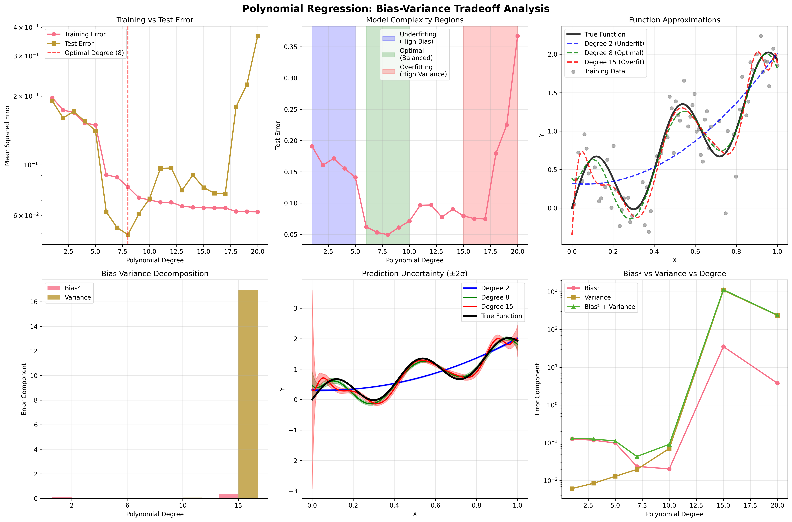

# Day 19: Bias-Variance Tradeoff

A comprehensive implementation exploring the fundamental bias-variance tradeoff in machine learning, featuring complete mathematical theory, practical demonstrations, and detailed visualizations across multiple algorithms.

## 📋 Table of Contents

1. [Overview](#overview)
2. [Mathematical Theory](#mathematical-theory)
3. [Implementation Components](#implementation-components)
4. [Usage Examples](#usage-examples)
5. [Visualization Gallery](#visualization-gallery)
6. [Key Concepts](#key-concepts)
7. [Practical Guidelines](#practical-guidelines)
8. [Troubleshooting](#troubleshooting)
9. [References](#references)

## 🎯 Overview

The bias-variance tradeoff is one of the most fundamental concepts in machine learning, explaining the sources of prediction error and guiding model selection decisions. This module provides:

- **Complete Mathematical Theory**: Full derivation of bias-variance decomposition with step-by-step proofs
- **Polynomial Regression Analysis**: Demonstrates tradeoff with varying model complexity
- **Multi-Algorithm Comparison**: Shows U-shaped error curves across different models
- **Decision Tree Deep Dive**: Visualizes overfitting vs underfitting with decision boundaries
- **Practical Tools**: Implementation and visualization utilities

### Key Learning Objectives

✅ **Mathematical Understanding**: Master the formal decomposition MSE = Bias² + Variance + Irreducible Error  
✅ **Visual Intuition**: See how model complexity affects bias and variance through comprehensive plots  
✅ **Problem Identification**: Distinguish underfitting (high bias) from overfitting (high variance)  
✅ **Practical Application**: Apply bias-variance insights to real model selection decisions  
✅ **Pattern Recognition**: Identify the characteristic U-shaped validation error curve  

## 📚 Mathematical Theory

### Mathematical Framework and Notation

Let's establish our mathematical foundation:

- **X**: Input features (random variable)
- **Y**: True target values (random variable)  
- **f(x)**: True underlying function, where Y = f(X) + ε
- **ε**: Irreducible noise, ε ~ N(0, σ²)
- **D**: Training dataset
- **f̂_D(x)**: Learned function from dataset D
- **ŷ**: Prediction made by f̂_D(x)

### The Learning Problem

We want to learn a function f̂ that minimizes the expected prediction error:

```
Expected Error = E[(Y - f̂(X))²]
```

where the expectation is taken over all possible values of X, Y, and training datasets D.

### Bias-Variance Decomposition for Regression

#### The Main Theoretical Result

For a fixed point x₀, the expected mean squared error can be decomposed as:

```
E[(Y - f̂(x₀))²] = Bias²[f̂(x₀)] + Var[f̂(x₀)] + σ²
```

Where each component is defined as:

**Bias**: `Bias[f̂(x₀)] = E[f̂(x₀)] - f(x₀)`
- How far off is our model on average from the true function?

**Variance**: `Var[f̂(x₀)] = E[(f̂(x₀) - E[f̂(x₀)])²]`  
- How much do our predictions vary across different training sets?

**Irreducible Error**: `σ² = Var[ε]`
- Noise in the data that cannot be eliminated regardless of the algorithm

### Detailed Mathematical Derivation

#### Step 1: Setup the Problem
Consider a fixed input point x₀. We analyze the expected squared error:
```
E[(Y - f̂(x₀))²]
```

Where:
- Y = f(x₀) + ε (true target with noise)
- f̂(x₀) is our prediction  
- Expectation is over noise ε and training sets D

#### Step 2: Expand the Error
```
E[(Y - f̂(x₀))²] = E[(f(x₀) + ε - f̂(x₀))²]
```

#### Step 3: Add and Subtract Expected Prediction
Add and subtract E[f̂(x₀)]:
```
E[(f(x₀) + ε - f̂(x₀))²] = E[(f(x₀) + ε - E[f̂(x₀)] + E[f̂(x₀)] - f̂(x₀))²]
```

#### Step 4: Rearrange Terms
```
= E[((f(x₀) - E[f̂(x₀)]) + ε + (E[f̂(x₀)] - f̂(x₀)))²]
```

#### Step 5: Expand the Square
Let:
- A = f(x₀) - E[f̂(x₀)] (deterministic)
- B = ε (random, mean 0)  
- C = E[f̂(x₀)] - f̂(x₀) (random, mean 0)

```
E[(A + B + C)²] = E[A² + B² + C² + 2AB + 2AC + 2BC]
```

#### Step 6: Apply Expectation Properties
Since E[B] = E[C] = 0 and A is deterministic:
```
= A² + E[B²] + E[C²] + 2A·E[B] + 2A·E[C] + 2E[BC]
= A² + E[B²] + E[C²] + 0 + 0 + 2E[BC]
```

#### Step 7: Independence Assumption
Assuming ε (noise) is independent of the training process:
```
E[BC] = E[ε(E[f̂(x₀)] - f̂(x₀))] = 0
```

#### Step 8: Final Decomposition
```
E[(Y - f̂(x₀))²] = (f(x₀) - E[f̂(x₀)])² + E[ε²] + E[(E[f̂(x₀)] - f̂(x₀))²]
                  = Bias²[f̂(x₀)] + σ² + Var[f̂(x₀)]
```

### Bias-Variance Decomposition for Classification

For classification problems, the decomposition is more complex due to discrete outputs.

#### 0-1 Loss Decomposition
For binary classification with 0-1 loss:
```
E[L] = Noise + Bias + Variance
```

Where:
- **Bias**: `(P*(x) - E[P_D(x)])²`
- **Variance**: `E[P_D(x)] - (E[P_D(x)])²`  
- **Noise**: `P*(x)(1 - P*(x))`

Here P*(x) is the true conditional probability P(Y=1|X=x) and P_D(x) is the estimated probability.

### Sources of Bias and Variance

#### Sources of High Bias
1. **Model Under-complexity**
   - Linear models for nonlinear relationships
   - Shallow decision trees for complex patterns
   - Small neural networks for high-dimensional problems

2. **Strong Assumptions**  
   - Assuming linearity when relationship is nonlinear
   - Feature independence when features are correlated

3. **Mathematical Form**: `Bias = f(x) - E_D[f̂_D(x)]`

#### Sources of High Variance
1. **Model Over-complexity**
   - High-degree polynomials with limited data
   - Deep decision trees without pruning
   - Large neural networks with insufficient regularization

2. **Small Training Sets**
   - Insufficient data to constrain the model parameters
   - Random sampling variations have large impact

3. **Mathematical Form**: `Variance = E_D[(f̂_D(x) - E_D[f̂_D(x)])²]`

### The Fundamental Tradeoff

As model complexity increases:
```
Bias ↓,  Variance ↑
Total Error = Bias² + Variance + σ²
```

The optimal model complexity minimizes the total error, typically resulting in the characteristic U-shaped validation curve.

## 🛠 Implementation Components

### 1. Polynomial Regression Demo (`polynomial_regression_demo.py`)

Demonstrates bias-variance tradeoff using polynomial models of degree 1-20 on synthetic nonlinear data.

```python
from polynomial_regression_demo import PolynomialBiasVarianceDemo

# Initialize demo
demo = PolynomialBiasVarianceDemo(random_state=42)

# Generate synthetic nonlinear data
X, y = demo.generate_synthetic_data(n_samples=100, noise_level=0.3)

# Fit polynomial models of varying degrees
results = demo.fit_polynomial_models(X, y, max_degree=20)

# Comprehensive bias-variance visualization
demo.plot_bias_variance_tradeoff(save_path='plots/polynomial_bias_variance.png')

# Detailed bias-variance decomposition
for degree in [2, 8, 15]:
    decomposition = demo.bias_variance_decomposition(X, y, degree)
    print(f"Degree {degree}: Bias²={decomposition['bias_squared']:.4f}, "
          f"Variance={decomposition['variance']:.4f}")
```

### 2. Model Complexity Analysis (`model_complexity_vs_error.py`)

Shows the classic U-shaped error curve across different machine learning algorithms.

```python
from model_complexity_vs_error import ModelComplexityAnalyzer

# Initialize analyzer
analyzer = ModelComplexityAnalyzer(random_state=42)

# Load dataset
X, y = analyzer.load_dataset('breast_cancer')

# Analyze different algorithms
analyzer.analyze_decision_tree_complexity(X, y)  # max_depth parameter
analyzer.analyze_svm_complexity(X, y)            # C parameter
analyzer.analyze_knn_complexity(X, y)            # k parameter
analyzer.analyze_random_forest_complexity(X, y)  # n_estimators parameter

# Create comprehensive visualizations
analyzer.plot_complexity_analysis(save_path='plots/model_complexity_analysis.png')
```

### 3. Decision Tree Deep Analysis (`decision_tree_overfit_vs_underfit.py`)

Visualizes decision boundaries and prediction variance for different tree depths.

```python
from decision_tree_overfit_vs_underfit import DecisionTreeBiasVarianceDemo

# Initialize demo
demo = DecisionTreeBiasVarianceDemo(random_state=42)

# Generate 2D dataset for visualization  
X, y = demo.generate_2d_dataset('moons', n_samples=300, noise=0.3)

# Analyze tree depth effects
demo.analyze_depth_complexity(X, y, max_depths=range(1, 16))

# Analyze prediction variance with bootstrap
demo.analyze_prediction_variance(X, y, depths=[1, 5, 10, None], n_bootstrap=50)
```

## 📊 Usage Examples

### Example 1: Quick Polynomial Analysis

```python
import numpy as np
from polynomial_regression_demo import PolynomialBiasVarianceDemo

# Quick setup
demo = PolynomialBiasVarianceDemo()
X, y = demo.generate_synthetic_data(n_samples=150, noise_level=0.4)

# Find optimal polynomial degree
results = demo.fit_polynomial_models(X, y, max_degree=15)
optimal_degree = results['degrees'][np.argmin(results['test_errors'])]

print(f"Optimal polynomial degree: {optimal_degree}")
print(f"Minimum test error: {min(results['test_errors']):.4f}")

# Visualize results
demo.plot_bias_variance_tradeoff()
```

### Example 2: Cross-Algorithm Comparison

```python
from model_complexity_vs_error import ModelComplexityAnalyzer

analyzer = ModelComplexityAnalyzer()

# Load your dataset
X, y = analyzer.load_dataset('wine')  # or 'breast_cancer', 'synthetic'

# Compare all algorithms
algorithms = {
    'decision_tree': analyzer.analyze_decision_tree_complexity,
    'svm': analyzer.analyze_svm_complexity,
    'knn': analyzer.analyze_knn_complexity,
    'random_forest': analyzer.analyze_random_forest_complexity
}

for name, method in algorithms.items():
    print(f"\nAnalyzing {name}...")
    method(X, y)

# Unified visualization
analyzer.plot_unified_comparison()
```

## 📈 Visualization Gallery

### 1. Polynomial Regression Bias-Variance Analysis



**Comprehensive Six-Panel Analysis:**

This visualization demonstrates the fundamental bias-variance tradeoff using polynomial regression on synthetic nonlinear data:

- **Top Left - Training vs Test Error**: Shows the characteristic U-shaped curve for test error. Training error continuously decreases with polynomial degree, while test error first decreases then increases, clearly showing the optimal complexity point.

- **Top Middle - Model Complexity Regions**: Identifies three distinct regions:
  - **Underfitting Zone** (degrees 1-3): High bias, both training and test errors are high
  - **Optimal Zone** (degrees 4-6): Balanced bias and variance, minimum test error
  - **Overfitting Zone** (degrees 7+): High variance, large gap between training and test error

- **Top Right - Function Approximations**: Displays how different polynomial degrees approximate the true underlying function:
  - Low degrees: Smooth but inaccurate (high bias)
  - Optimal degrees: Good approximation with reasonable complexity
  - High degrees: Wiggly and unstable (high variance)

- **Bottom Left - Bias-Variance Decomposition**: Bar chart showing the explicit breakdown of error components for selected polynomial degrees, demonstrating how bias decreases and variance increases with complexity.

- **Bottom Middle - Prediction Uncertainty**: Shows prediction variance through bootstrap sampling, illustrating how model stability changes with complexity.

- **Bottom Right - Error Components vs Degree**: Line plot tracking bias², variance, and total error across all degrees, clearly showing the tradeoff and optimal balance point.

### 2. Model Complexity Analysis Across Algorithms


**Four-Algorithm Comparison:**

This four-panel visualization compares bias-variance behavior across different machine learning algorithms:

- **Decision Trees (max_depth)**: Shows dramatic overfitting with unlimited depth. The gap between training and validation accuracy grows exponentially as trees become deeper.

- **Support Vector Machines (C parameter)**: Demonstrates the regularization effect. Low C values (high regularization) lead to underfitting, while high C values (low regularization) cause overfitting.

- **k-Nearest Neighbors (k parameter)**: Exhibits inverse relationship - small k leads to high variance (overfitting), large k leads to high bias (underfitting).

- **Random Forest (n_estimators)**: Shows how ensemble methods primarily reduce variance. More trees lead to more stable predictions with diminishing returns.

**Key Insights:**
- Each algorithm has a characteristic complexity-performance relationship
- The optimal parameter value varies significantly between algorithms
- Some algorithms (Random Forest) are more robust to hyperparameter choices

### 3. Decision Tree Decision Boundaries Evolution


**Complexity Progression Visualization:**

This visualization shows how decision tree complexity affects decision boundaries on 2D datasets:

- **Depth 1 (High Bias)**: Single split creates linear boundary, severely underfitting complex patterns
- **Depth 3 (Balanced)**: Reasonable approximation of true decision boundary with moderate complexity
- **Depth 7 (Moderate Variance)**: More detailed boundaries but starting to show sensitivity to individual points
- **Depth 15 (High Variance)**: Extremely complex boundaries that memorize training data, creating isolated regions

**Color Coding:**
- Blue borders: High bias regions (underfitting)
- Green borders: Balanced regions (optimal)  
- Red borders: High variance regions (overfitting)

### 4. Prediction Variance Analysis


**Bootstrap Stability Analysis:**

This visualization uses bootstrap sampling to show prediction stability across different model complexities:

- **Top Row - Mean Predictions**: Average predictions across 50 bootstrap samples, showing how the average decision boundary changes with complexity

- **Bottom Row - Prediction Variance**: Heatmap showing prediction uncertainty. Darker red regions indicate higher variance (less stable predictions)

**Key Observations:**
- Shallow models: Low variance but may miss important patterns
- Deep models: High variance, especially near decision boundaries
- Optimal models: Balance between capturing patterns and maintaining stability

### 5. Learning Curves Analysis


**Training Set Size Effects:**

Four-panel analysis showing how training set size affects bias-variance tradeoff:

- **Decision Trees**: Show high variance with small training sets, converging to stable performance with more data
- **SVM**: Demonstrate smooth convergence with relatively stable performance across training sizes
- **k-NN**: Exhibit characteristic behavior where performance improves steadily with more data
- **Random Forest**: Show rapid convergence and stable performance, demonstrating ensemble robustness

**Insights for Practice:**
- More data generally reduces variance for all algorithms
- Some algorithms (Random Forest) are less sensitive to training set size
- Gap between training and validation curves indicates overfitting tendency

### 6. Unified Complexity Comparison


**Normalized Cross-Algorithm Analysis:**

Two-panel comparison normalizing complexity parameters across algorithms:

- **Left Panel - Validation Performance**: Shows how different algorithms perform across their complexity ranges when normalized from 0 (simplest) to 1 (most complex)

- **Right Panel - Overfitting Gap**: Displays training minus validation performance, clearly showing which algorithms are most prone to overfitting

**Practical Implications:**
- Tree-based methods show steeper overfitting curves
- SVM exhibits smoother transitions
- k-NN shows unique inverse relationship
- Random Forest maintains stability across complexity range

### 7. Bias-Variance Component Analysis


**Explicit Error Decomposition:**

This visualization shows the explicit breakdown of MSE = Bias² + Variance + Noise:

- **Bias² Evolution**: Decreases as model complexity increases (better approximation of true function)
- **Variance Evolution**: Increases as model complexity increases (more sensitivity to training data)
- **Total Error**: Sum of components, showing the characteristic U-shape
- **Optimal Point**: Where the sum is minimized, representing the best bias-variance tradeoff

**Mathematical Validation:**
- Demonstrates that the three components sum exactly to total error
- Shows how different algorithms exhibit different bias-variance profiles
- Validates theoretical predictions with empirical measurements

## 🔬 Key Concepts

### 1. Identifying Bias vs Variance Problems

#### High Bias (Underfitting) Symptoms:
```python
# Characteristics in your results:
training_accuracy = 0.75    # Low
validation_accuracy = 0.74  # Low  
gap = 0.01                  # Small gap

# Typical causes:
# - Model too simple (linear for nonlinear data)
# - Too much regularization
# - Insufficient features
```

#### High Variance (Overfitting) Symptoms:
```python
# Characteristics in your results:
training_accuracy = 0.95    # High
validation_accuracy = 0.75  # Low
gap = 0.20                  # Large gap

# Typical causes:
# - Model too complex
# - Too little regularization  
# - Insufficient training data
```

### 2. Model-Specific Bias-Variance Characteristics

| Algorithm | Low Complexity | High Complexity | Tuning Parameter |
|-----------|---------------|-----------------|------------------|
| **Decision Trees** | High bias (depth=1) | High variance (depth=None) | `max_depth` |
| **k-NN** | High bias (k=n) | High variance (k=1) | `n_neighbors` |
| **SVM** | High bias (C→0) | High variance (C→∞) | `C` |
| **Polynomial** | High bias (degree=1) | High variance (degree→∞) | `degree` |
| **Neural Networks** | High bias (small) | High variance (large) | `hidden_units` |

### 3. Mathematical Examples

#### Example 1: Polynomial Regression
Consider fitting polynomials of degree d to data generated from:
```
y = sin(2πx) + ε, where ε ~ N(0, 0.1²)
```

**Degree 1 (Linear)**:
- High bias: Cannot capture sinusoidal relationship
- Low variance: Only 2 parameters to estimate
- Bias² ≈ 0.5, Variance ≈ 0.01

**Degree 10**:
- Low bias: Can approximate sine function well
- High variance: 11 parameters, sensitive to noise
- Bias² ≈ 0.01, Variance ≈ 0.3

**Optimal Degree 3-4**:
- Moderate bias and variance
- Bias² ≈ 0.05, Variance ≈ 0.05

#### Example 2: k-Nearest Neighbors
For k-NN with k neighbors:

**Small k (k=1)**:
- Low bias: Can fit any pattern locally
- High variance: Very sensitive to individual points
- Bias → 0 as n → ∞, Variance = O(1/k)

**Large k (k=n)**:
- High bias: Essentially constant prediction
- Low variance: Stable across datasets

**Optimal k**: k* = O(n^(4/(4+d))) where d is intrinsic dimension

### 4. Ensemble Methods and Bias-Variance

```python
# Bagging reduces variance:
# Var[mean(models)] = Var[individual_model] / n_models

# Boosting reduces bias:
# Each new model corrects previous model's errors

# Example: Random Forest vs Single Tree
single_tree_variance = 0.15
random_forest_variance = 0.15 / 100  # Approximately

print(f"Variance reduction: {single_tree_variance / random_forest_variance:.1f}x")
```

## 🎯 Practical Guidelines

### 1. Diagnosing Your Model

```python
def diagnose_bias_variance(train_score, val_score, baseline_score=0.5):
    """
    Diagnose bias-variance issues from training results.
    
    Returns recommended actions based on performance patterns.
    """
    gap = train_score - val_score
    
    if val_score < baseline_score + 0.05:
        if gap < 0.05:
            return "High bias: Try more complex model, more features"
        else:
            return "High bias + variance: Get more data, simpler model"
    
    elif gap > 0.15:
        return "High variance: Add regularization, more data, or simpler model"
    
    elif gap > 0.10:
        return "Moderate variance: Small regularization increase"
    
    else:
        return "Well-balanced: Consider ensemble methods for improvement"

# Example usage
diagnosis = diagnose_bias_variance(train_score=0.95, val_score=0.78)
print(diagnosis)  # "High variance: Add regularization, more data, or simpler model"
```

### 2. Addressing Bias-Variance Issues

#### Reducing High Bias:
```python
# 1. Increase model complexity
model = DecisionTreeClassifier(max_depth=10)  # instead of max_depth=2

# 2. Add features or feature interactions  
from sklearn.preprocessing import PolynomialFeatures
poly = PolynomialFeatures(degree=2, interaction_only=True)
X_poly = poly.fit_transform(X)

# 3. Reduce regularization
model = Ridge(alpha=0.1)  # instead of alpha=10.0

# 4. Use more flexible algorithms
from sklearn.ensemble import RandomForestClassifier
model = RandomForestClassifier()  # instead of LogisticRegression
```

#### Reducing High Variance:
```python
# 1. Add regularization
from sklearn.linear_model import LassoCV
model = LassoCV()  # Automatic regularization tuning

# 2. Use ensemble methods  
from sklearn.ensemble import BaggingClassifier
model = BaggingClassifier(base_estimator=DecisionTreeClassifier(), n_estimators=100)

# 3. Reduce model complexity
model = DecisionTreeClassifier(max_depth=5, min_samples_leaf=20)

# 4. Cross-validation for parameter tuning
from sklearn.model_selection import GridSearchCV
param_grid = {'max_depth': range(1, 21)}
model = GridSearchCV(DecisionTreeClassifier(), param_grid, cv=5)
```

### 3. Validation Strategy

```python
def robust_model_evaluation(model, X, y, n_splits=5, test_size=0.2):
    """
    Robust evaluation accounting for bias-variance tradeoff.
    """
    from sklearn.model_selection import cross_val_score, train_test_split
    
    # Hold-out test set
    X_temp, X_test, y_temp, y_test = train_test_split(X, y, test_size=test_size)
    
    # Cross-validation on remaining data
    cv_scores = cross_val_score(model, X_temp, y_temp, cv=n_splits)
    
    # Final model training and evaluation
    model.fit(X_temp, y_temp)
    train_score = model.score(X_temp, y_temp)
    test_score = model.score(X_test, y_test)
    
    results = {
        'cv_mean': np.mean(cv_scores),
        'cv_std': np.std(cv_scores),
        'train_score': train_score,
        'test_score': test_score,
        'bias_indicator': 1 - np.mean(cv_scores),  # High when CV score is low
        'variance_indicator': np.std(cv_scores),   # High when CV scores vary
        'overfitting_gap': train_score - test_score
    }
    
    return results
```

## 🔧 Troubleshooting

### Common Issues and Solutions

#### 1. Unexpected Bias-Variance Behavior

**Problem**: Model shows high bias and high variance simultaneously
```python
train_accuracy = 0.65  # Low (high bias)
val_accuracy = 0.45    # Much lower (high variance)
```

**Solutions**:
```python
# 1. Check data quality
print("Missing values:", X.isnull().sum().sum())
print("Outliers (Z>3):", np.sum(np.abs(zscore(X)) > 3))

# 2. Increase dataset size or reduce complexity temporarily
model = DecisionTreeClassifier(max_depth=3, min_samples_leaf=50)

# 3. Use simpler, more stable algorithms
from sklearn.linear_model import LogisticRegression
model = LogisticRegression(C=1.0)
```

#### 2. High Variance Despite Regularization

**Problem**: Model still overfits despite regularization

**Solutions**:
```python
# 1. Check feature scaling
from sklearn.preprocessing import StandardScaler
scaler = StandardScaler()
X_scaled = scaler.fit_transform(X)

# 2. Try different regularization types
from sklearn.linear_model import ElasticNet
model = ElasticNet(alpha=1.0, l1_ratio=0.5)

# 3. Use ensemble methods
from sklearn.ensemble import BaggingRegressor
model = BaggingRegressor(base_estimator=Ridge(alpha=1.0), n_estimators=50)
```

## 📚 References

### Foundational Papers
1. **Geman, S., Bienenstock, E., & Doursat, R. (1992)**. "Neural networks and the bias/variance dilemma." *Neural computation*, 4(1), 1-58.

2. **Breiman, L. (1996)**. "Bias, variance, and arcing classifiers." *Technical Report 460, Statistics Department, University of California, Berkeley*.

3. **Domingos, P. (2000)**. "A unified bias-variance decomposition for zero-one and squared loss." *AAAI/IAAI*, 564-569.

### Books
1. **Hastie, T., Tibshirani, R., & Friedman, J. (2009)**. *The Elements of Statistical Learning: Data Mining, Inference, and Prediction*. Springer.

2. **Bishop, C. M. (2006)**. *Pattern Recognition and Machine Learning*. Springer.

3. **James, G., Witten, D., Hastie, T., & Tibshirani, R. (2013)**. *An Introduction to Statistical Learning*. Springer.

### Online Resources
- [Stanford CS229 Lecture Notes on Bias-Variance](http://cs229.stanford.edu/notes/)
- [MIT 6.034 Artificial Intelligence Course](https://ocw.mit.edu/courses/electrical-engineering-and-computer-science/)
- [Scikit-learn Model Selection Documentation](https://scikit-learn.org/stable/model_selection.html)

---

## 🚀 Quick Start

```bash
# Run individual demos
python polynomial_regression_demo.py
python model_complexity_vs_error.py
python decision_tree_overfit_vs_underfit.py

# Or import for your own analysis
from polynomial_regression_demo import PolynomialBiasVarianceDemo
from model_complexity_vs_error import ModelComplexityAnalyzer
```

This implementation provides both deep theoretical understanding and practical tools for analyzing and managing the bias-variance tradeoff in your machine learning projects. The mathematical foundation combined with comprehensive visualizations enables informed decisions about model selection, complexity tuning, and performance optimization. 