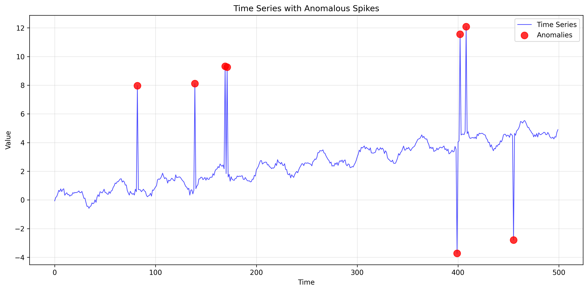
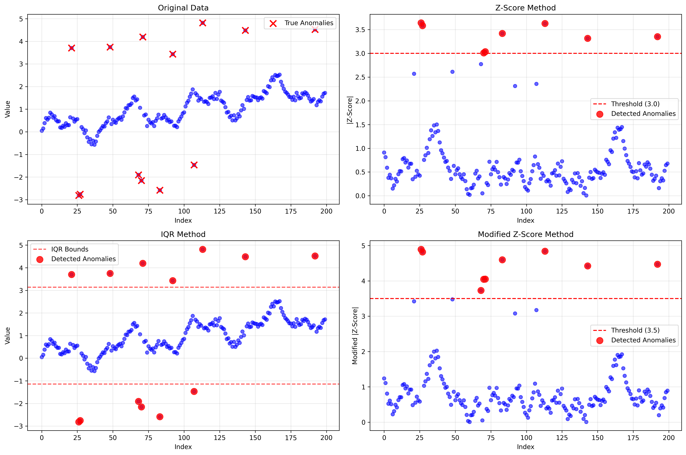
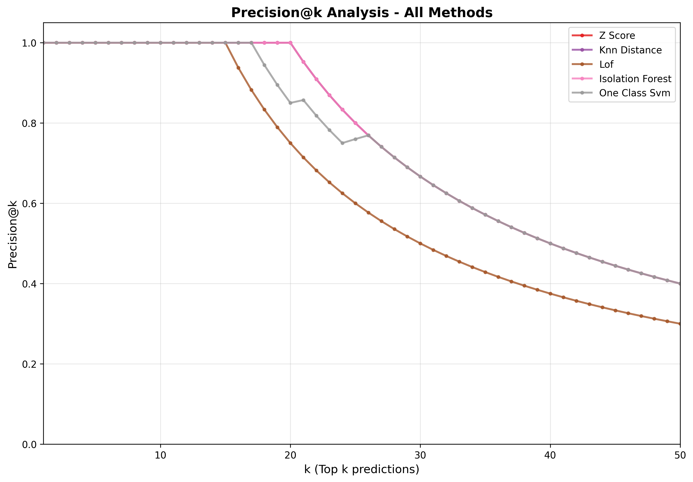

# Anomaly Detection

## 📌 Overview
Comprehensive implementation of anomaly detection techniques covering statistical, distance-based, and model-based methods. This module provides a complete learning experience for understanding different approaches to identify unusual patterns and outliers in data.

## 🧠 Key Concepts Mastered
- **Anomaly Types**: Point, contextual, and collective anomalies
- **Statistical Methods**: Z-score, IQR, Modified Z-score (robust to outliers)
- **Distance-based Methods**: k-NN distance, DBSCAN clustering, Local Outlier Factor (LOF)
- **Model-based Methods**: Isolation Forest, One-Class SVM, Autoencoder reconstruction error
- **Evaluation Techniques**: Precision@k, ROC AUC, comprehensive performance metrics

## 🛠️ Implementation Files

### `synthetic_anomaly_data.py`
- **SyntheticAnomalyData** class for generating test datasets
- 2D Gaussian clusters with injected outliers
- Time series with anomalous spikes
- Mixed distributions and moon-shaped data
- Comprehensive visualization functions

### `stat_methods.py`
- **StatisticalAnomalyDetector** with methods implemented from scratch:
  - Z-score detection with customizable thresholds
  - IQR (Interquartile Range) method with outlier bounds
  - Modified Z-score using median absolute deviation
- Threshold sensitivity analysis
- 1D and 2D anomaly visualization

### `distance_methods.py`
- **DistanceAnomalyDetector** featuring:
  - k-NN distance detection (single and average distance)
  - DBSCAN clustering-based outlier detection
  - Local Outlier Factor (LOF) implemented from scratch
- Decision region visualization for 2D data
- Parameter sensitivity analysis

### `model_based_methods.py`
- **ModelBasedAnomalyDetector** with advanced methods:
  - Isolation Forest using scikit-learn
  - One-Class SVM with kernel-based anomaly separation
  - PyTorch Autoencoder with reconstruction error scoring
  - Ensemble methods combining multiple approaches
- Autoencoder latent space visualization

### `visualize_anomalies.py`
- **AnomalyVisualizationSuite** for unified analysis:
  - Comprehensive 2D visualization comparing all methods
  - Performance comparison with detailed metrics
  - ROC curve comparisons across all methods
  - Precision@k analysis
  - Time series anomaly visualization

## 📊 Visualizations Generated

### Synthetic Dataset Overview

**Figure 1: Synthetic 2D Datasets** - Three different synthetic datasets used for testing anomaly detection methods:
- **Gaussian Clusters**: Normal data forms distinct clusters with outliers scattered around the perimeter
- **Mixed Distributions**: Two overlapping Gaussian distributions with random outliers
- **Moons**: Crescent-shaped normal data with outliers in empty regions


**Figure 2: Time Series with Anomalous Spikes** - Synthetic time series combining sinusoidal patterns with trend and injected anomalous spikes (red circles) that deviate significantly from the normal pattern.

### Statistical Methods Analysis

**Figure 3: Statistical Methods on Time Series** - Four panels showing:
- **Top-left**: Original time series with true anomalies marked
- **Top-right**: Z-score values with threshold line (red dashed) and detected anomalies
- **Bottom-left**: IQR method showing data points with bounds and detected outliers
- **Bottom-right**: Modified Z-score using median absolute deviation (more robust to outliers)


**Figure 4: Statistical Methods on 2D Data** - Comparison of three statistical approaches:
- **Z-Score**: Detects points with high standardized distance from mean
- **IQR Method**: Identifies outliers beyond 1.5×IQR from quartiles
- **Modified Z-Score**: Uses median-based statistics for robustness
Orange crosses show true anomalies for comparison.


**Figure 5: Parameter Sensitivity Analysis** - Shows how detection performance varies with:
- **Top**: Z-score threshold (1.0 to 4.0) - higher thresholds = fewer detected anomalies
- **Bottom**: IQR multiplier (0.5 to 3.0) - lower multipliers = more sensitive detection
Trade-off between precision and recall is clearly visible.

### Distance-Based Methods

**Figure 6: Distance-Based Methods Comparison** - Four different distance-based approaches:
- **k-NN Distance**: Points far from their k nearest neighbors
- **k-NN Average Distance**: Uses average distance to k neighbors (smoother)
- **DBSCAN**: Clustering-based, marks noise points as anomalies
- **LOF**: Local density-based detection, finds points with low local density


**Figure 7: Decision Regions for k-NN Distance** - Visualizes the decision space:
- **Left**: Binary decision regions (blue=normal, red=anomaly)
- **Right**: Continuous anomaly scores with color intensity showing risk level
Helps understand how the algorithm makes decisions across the feature space.


**Figure 8: Distance Method Parameter Analysis** - Four sensitivity analyses:
- **Top-left**: k-NN performance vs. number of neighbors (k)
- **Top-right**: Threshold percentile impact on detection
- **Bottom-left**: DBSCAN eps parameter (neighborhood radius)
- **Bottom-right**: DBSCAN min_samples parameter effect

### Model-Based Methods

**Figure 9: Model-Based Anomaly Detection** - Advanced ML methods:
- **Isolation Forest**: Tree-based isolation, shorter paths = anomalies
- **One-Class SVM**: Kernel-based boundary learning with RBF kernel
- **Autoencoder**: Neural network reconstruction error-based detection
- **Ensemble**: Combines multiple methods for robust detection
Color intensity represents anomaly scores.


**Figure 10: ROC Curve Comparison** - Performance comparison across all model-based methods:
- **Curves closer to top-left** indicate better performance
- **AUC values** quantify overall detection quality
- **Isolation Forest** often performs well on this type of data
- **Random baseline** (diagonal line) for reference


**Figure 11: Precision@k Analysis** - Practical detection metric:
- **X-axis**: Number of top-ranked predictions considered
- **Y-axis**: Precision among those top-k predictions
- **Important for real applications** where you can only investigate limited alerts
- Shows which methods are most reliable for high-priority alerts


**Figure 12: Autoencoder Deep Dive** - Three-panel analysis:
- **Left**: Original 2D data with true anomaly labels
- **Middle**: 2D latent space representation learned by encoder
- **Right**: Reconstruction error heatmap (higher error = more anomalous)
Shows how autoencoders learn normal patterns and struggle with anomalies.

### Comprehensive Comparison

**Figure 13: All Methods on Same Dataset** - Side-by-side comparison of all implemented methods:
- **Blue dots**: Normal points detected correctly
- **Red circles**: Detected anomalies
- **Orange crosses**: True anomalies for reference
- Allows direct visual comparison of method behaviors and biases


**Figure 14: Quantitative Performance Metrics** - Bar charts showing:
- **Precision**: How many detected anomalies are actually anomalous
- **Recall**: How many true anomalies were successfully detected
- **F1-Score**: Harmonic mean balancing precision and recall
- **ROC-AUC**: Area under ROC curve (higher = better ranking)
Numerical values displayed on bars for exact comparison.

### Time Series Anomaly Detection

**Figure 15: Time Series Anomaly Detection** - Two-panel temporal analysis:
- **Top**: Original time series with true anomaly spikes highlighted
- **Bottom**: Comparison of statistical methods (Z-score triangles, IQR squares)
- Shows how different methods perform on temporal data patterns
- **Gray dashed lines**: IQR bounds for visual reference

## 🚀 Usage

Run individual demonstrations:
```bash
# Generate and visualize synthetic datasets
python synthetic_anomaly_data.py

# Statistical method demonstrations with threshold analysis
python stat_methods.py

# Distance-based methods with decision regions
python distance_methods.py

# Model-based methods including autoencoder training
python model_based_methods.py

# Comprehensive analysis of all methods
python visualize_anomalies.py
```

## 🎯 Learning Outcomes
- Understand when to use different anomaly detection approaches
- Implement statistical methods from scratch
- Apply distance-based techniques for local outlier detection
- Use modern ML models (Isolation Forest, One-Class SVM, Autoencoders)
- Evaluate anomaly detection performance with appropriate metrics
- Visualize anomalies in 2D space and time series data
- Analyze parameter sensitivity and method comparison

## 📈 Key Results
- **Statistical Methods**: Fast and interpretable, good for simple outliers
- **Distance Methods**: Effective for local anomalies and cluster-based outliers
- **Model Methods**: Powerful for complex patterns and high-dimensional data
- **Ensemble Approaches**: Often provide best overall performance
- **Evaluation**: Precision@k often more meaningful than traditional metrics

## 📚 References
- [Anomaly Detection Survey](https://dl.acm.org/doi/10.1145/3439950)
- [Isolation Forest Paper](https://cs.nju.edu.cn/zhouzh/zhouzh.files/publication/icdm08b.pdf)
- [LOF Paper](https://dl.acm.org/doi/10.1145/335191.335388)
- [One-Class SVM](https://proceedings.neurips.cc/paper/1999/file/8725fb777f25776ffa9076e44fcfd776-Paper.pdf)
- [Scikit-learn Anomaly Detection](https://scikit-learn.org/stable/modules/outlier_detection.html) 