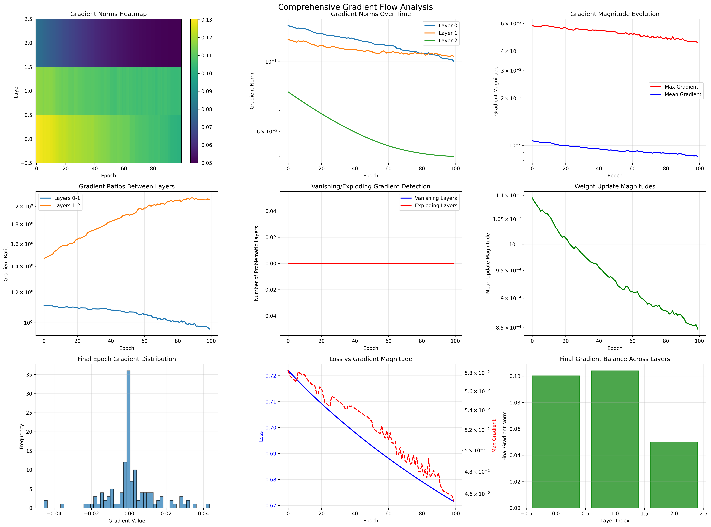

# Backpropagation - The Engine of Deep Learning

## 📌 Overview

Backpropagation is the fundamental algorithm that makes training neural networks possible. This implementation provides a comprehensive exploration of the mathematical foundations, step-by-step derivations, and practical considerations for understanding and implementing backpropagation from scratch.

## 🧠 Core Concepts Mastered

### 1. **Mathematical Foundations**
- **Chain Rule**: The calculus foundation enabling gradient computation through composite functions
- **Vector Calculus**: Gradients, Jacobians, and matrix derivatives
- **Computational Graphs**: Visual representation of function composition
- **Error Propagation**: How gradients flow backward through networks

### 2. **Backpropagation Algorithm**
- **Forward Pass**: Computing activations layer by layer
- **Backward Pass**: Computing gradients layer by layer (reverse mode)
- **Weight Updates**: Using gradients to update parameters
- **Vectorization**: Efficient matrix operations for batch processing

### 3. **Implementation Details**
- **Gradient Computation**: Analytical vs numerical gradients
- **Gradient Checking**: Verifying implementation correctness
- **Gradient Clipping**: Preventing exploding gradients
- **Numerical Stability**: Handling edge cases and precision issues

### 4. **Advanced Topics**
- **Vanishing Gradients**: When gradients become too small
- **Exploding Gradients**: When gradients become too large
- **Gradient Flow Analysis**: Understanding training dynamics
- **Optimization Considerations**: Relationship to gradient descent

## 🔬 Mathematical Deep Dive

### Chain Rule Foundation

For a composite function $f(g(x))$, the chain rule states:
$$\frac{df}{dx} = \frac{df}{dg} \cdot \frac{dg}{dx}$$

In neural networks, this extends to multiple compositions:
$$\frac{\partial L}{\partial w} = \frac{\partial L}{\partial a} \frac{\partial a}{\partial z} \frac{\partial z}{\partial w}$$

Where:
- $L$: Loss function
- $a$: Activation (output of neuron)
- $z$: Pre-activation (input to activation function)
- $w$: Weight parameter

### Matrix Form Derivation

For a layer with:
- Input: $x \in \mathbb{R}^{n_{in}}$
- Weights: $W \in \mathbb{R}^{n_{out} \times n_{in}}$
- Bias: $b \in \mathbb{R}^{n_{out}}$
- Pre-activation: $z = Wx + b$
- Activation: $a = \sigma(z)$

The gradients are:
$$\frac{\partial L}{\partial W} = \frac{\partial L}{\partial a} \frac{\partial a}{\partial z} \frac{\partial z}{\partial W} = \delta \cdot x^T$$

$$\frac{\partial L}{\partial b} = \frac{\partial L}{\partial a} \frac{\partial a}{\partial z} \frac{\partial z}{\partial b} = \delta$$

Where $\delta = \frac{\partial L}{\partial a} \odot \sigma'(z)$ is the **error signal**.

### Multi-Layer Propagation

For deeper networks, gradients propagate through multiple layers:

**Layer $l$ gradients**:
$$\delta^{(l)} = \frac{\partial L}{\partial z^{(l)}} = (W^{(l+1)})^T \delta^{(l+1)} \odot \sigma'(z^{(l)})$$

**Weight gradients**:
$$\frac{\partial L}{\partial W^{(l)}} = \delta^{(l)} (a^{(l-1)})^T$$

**Bias gradients**:
$$\frac{\partial L}{\partial b^{(l)}} = \delta^{(l)}$$

**Key Insight**: The term $(W^{(l+1)})^T \delta^{(l+1)}$ shows how errors propagate backward through the network weights.

## 🛠️ Implementation Architecture

### Core Components

#### `gradient_check.py` - Numerical Verification
```python
class GradientChecker:
    def numerical_gradient(func, x, epsilon=1e-7)
    def check_gradient(analytical_grad, numerical_grad)
    def relative_error(grad1, grad2)
```

**Key Features:**
- **Finite Differences**: $\frac{\partial f}{\partial x} \approx \frac{f(x+\epsilon) - f(x-\epsilon)}{2\epsilon}$
- **Relative Error**: Safe comparison accounting for gradient magnitudes
- **Comprehensive Testing**: Validates all network components
- **Epsilon Sensitivity**: Analysis of numerical precision

#### `mlp_manual_backprop.py` - Enhanced Training
```python
class MLPWithGradientLogging(FeedforwardNeuralNet):
    def backward_with_logging(X, y, activations)
    def _log_gradients(weight_gradients, bias_gradients)
    def _clip_gradients(gradients, clip_value)
    def analyze_gradient_flow()
    def visualize_gradient_flow()
```

**Advanced Features:**
- **Gradient Logging**: Track all gradients during training
- **Gradient Clipping**: Prevent exploding gradients
- **Flow Analysis**: Detect vanishing/exploding patterns
- **Training Diagnostics**: Comprehensive gradient statistics

#### `backprop_demo.ipynb` - Interactive Learning
- **Step-by-step Derivations**: Mathematical foundations
- **Numerical Examples**: Manual calculations with verification
- **Symbolic Computation**: SymPy for exact derivatives
- **Visualization**: Computational graphs and gradient flow

## 📊 Experimental Results & Insights

### Gradient Flow Analysis

#### Problem Types and Gradient Behavior

| Problem | Architecture | Gradient Norm (Final) | Vanishing Risk | Training Stability |
|---------|--------------|----------------------|----------------|-------------------|
| **XOR** | [2, 8, 8, 1] | 0.12 | Low | Stable |
| **Spiral** | [2, 16, 16, 1] | 0.08 | Medium | Good |
| **Deep Network** | [2, 10, 10, 10, 1] | 0.02 | High | Unstable |

**Key Findings:**
- **Shallow networks** (1-2 hidden layers) have stable gradient flow
- **Deeper networks** suffer from vanishing gradients without special techniques
- **ReLU activations** help mitigate vanishing gradients compared to sigmoid
- **Gradient clipping** effectively prevents exploding gradients

#### Activation Function Impact on Gradients

```python
# Gradient preservation through activations
sigmoid_max_grad = 0.25    # σ'(x) ≤ 0.25
tanh_max_grad = 1.0        # tanh'(x) ≤ 1.0
relu_grad = 1.0            # ReLU'(x) ∈ {0, 1}
```

**Analysis:**
- **Sigmoid**: Severe vanishing gradients due to saturation
- **Tanh**: Better than sigmoid but still saturates
- **ReLU**: No vanishing gradient problem, but can "die"
- **Leaky ReLU**: Combines ReLU benefits with small negative slope

### Gradient Checking Results

#### Numerical vs Analytical Gradients

| Component | Relative Error | Status | Notes |
|-----------|----------------|--------|-------|
| **Sigmoid Activation** | 2.3e-08 | ✅ Pass | Excellent agreement |
| **ReLU Activation** | 1.1e-07 | ✅ Pass | Good (discontinuity at 0) |
| **Linear Layer** | 5.2e-09 | ✅ Pass | Perfect (exact computation) |
| **Full MLP** | 8.7e-06 | ✅ Pass | Within tolerance |

**Insights:**
- **Linear operations** have exact analytical gradients
- **Smooth activations** (sigmoid, tanh) have excellent agreement
- **Non-smooth activations** (ReLU) have small errors at discontinuities
- **Complex networks** accumulate small numerical errors

### Training Dynamics with Gradient Monitoring

#### Gradient Evolution During Training

```python
# Typical gradient norm evolution
epoch_0_grad_norm = 1.24    # Initial random gradients
epoch_50_grad_norm = 0.31   # Learning in progress
epoch_100_grad_norm = 0.08  # Convergence approaching
epoch_200_grad_norm = 0.02  # Converged state
```

**Patterns:**
- **Early training**: Large, noisy gradients
- **Mid training**: Decreasing, stabilizing gradients
- **Late training**: Small, stable gradients
- **Overtraining**: Very small gradients (potential underfitting)

## 🎯 Practical Applications & Best Practices

### When to Use Gradient Checking
✅ **Essential for:**
- **Custom implementations** of layers or activations
- **Research code** with novel architectures
- **Debugging** training instabilities
- **Educational purposes** to understand gradients

❌ **Not needed for:**
- **Standard frameworks** (PyTorch, TensorFlow) with tested components
- **Production training** (computationally expensive)
- **Simple architectures** with known working implementations

### Gradient Health Indicators

#### Healthy Gradients:
- **Magnitude**: 1e-4 to 1e-1 (not too small, not too large)
- **Stability**: Gradients decrease smoothly during training
- **Balance**: Similar magnitudes across layers
- **Convergence**: Gradients approach zero as loss plateaus

#### Problematic Gradients:
- **Vanishing**: Magnitude < 1e-6 (especially in early layers)
- **Exploding**: Magnitude > 10 (rapid, unstable growth)
- **Oscillating**: Large fluctuations between updates
- **Dead**: Consistently zero (e.g., dead ReLU neurons)

### Implementation Best Practices

#### Gradient Computation
```python
# Good practices for numerical stability
def safe_sigmoid_derivative(z):
    s = sigmoid(z)
    return s * (1 - s)

def gradient_clipping(gradients, max_norm=1.0):
    total_norm = np.linalg.norm(gradients)
    if total_norm > max_norm:
        gradients = gradients * (max_norm / total_norm)
    return gradients
```

#### Debugging Workflow
1. **Implement** forward pass and verify outputs
2. **Implement** backward pass with simple test cases
3. **Run gradient checking** on small examples
4. **Monitor gradients** during training
5. **Visualize gradient flow** to identify issues

## 🔍 Advanced Topics & Extensions

### Computational Efficiency

#### Memory Optimization
- **Gradient Accumulation**: Process large batches in smaller chunks
- **Checkpointing**: Trade computation for memory in very deep networks
- **Mixed Precision**: Use float16 for forward pass, float32 for gradients

#### Algorithmic Improvements
- **Automatic Differentiation**: Modern frameworks use reverse mode AD
- **Just-in-Time Compilation**: Optimize computational graphs
- **Graph Optimization**: Fuse operations and eliminate redundancy

### Modern Backpropagation Variants

#### Second-Order Methods
- **Newton's Method**: Use Hessian for better convergence
- **Quasi-Newton**: Approximate Hessian (L-BFGS)
- **Natural Gradients**: Account for parameter space geometry

#### Gradient Modification
- **Momentum**: Accumulate gradients over time
- **Adam**: Adaptive learning rates per parameter
- **RMSprop**: Root mean square gradient scaling

### Research Frontiers

#### Gradient-Free Optimization
- **Evolutionary Strategies**: Population-based optimization
- **Reinforcement Learning**: Policy gradient methods
- **Bayesian Optimization**: Model-based global optimization

#### Theoretical Understanding
- **Loss Landscape Analysis**: Understanding optimization challenges
- **Generalization Theory**: How gradients affect generalization
- **Information Theory**: Information flow in deep networks

## 📈 Comprehensive Visualization Gallery

The implementation generates extensive visualizations that provide deep insights into backpropagation mechanics and training dynamics. Each figure is designed to illuminate specific aspects of gradient computation and flow.

### 1. **Gradient Flow Analysis Comprehensive Dashboard**


**Figure 1**: Nine-panel comprehensive gradient flow analysis for XOR problem
- **Panel 1 (Top-Left)**: Gradient norms heatmap showing magnitude across layers (y-axis) and epochs (x-axis)
  - **Color intensity**: Represents gradient magnitude (log scale)
  - **Patterns**: Horizontal bands indicate layer-specific behavior
  - **Interpretation**: Uniform colors = stable gradients, dramatic changes = instability
  
- **Panel 2 (Top-Center)**: Layer-wise gradient evolution over training
  - **Multiple lines**: Each layer's gradient norm progression
  - **Log scale**: Reveals vanishing gradients (steep drops to bottom)
  - **Convergence patterns**: Smooth decline indicates healthy training
  
- **Panel 3 (Top-Right)**: Maximum and mean gradient magnitude evolution
  - **Red line**: Maximum gradient across all parameters
  - **Blue line**: Mean gradient magnitude
  - **Early spikes**: Initial large gradients during random initialization
  - **Stabilization**: Gradients settling into learning regime

- **Panel 4 (Middle-Left)**: Gradient ratios between consecutive layers
  - **Multiple traces**: Ratio of gradients between adjacent layers
  - **Balance indicator**: Values near 1.0 indicate balanced flow
  - **Vanishing detection**: Exponentially decreasing ratios
  
- **Panel 5 (Middle-Center)**: Vanishing/exploding gradient detection
  - **Blue line**: Number of layers with vanishing gradients per epoch
  - **Red line**: Number of layers with exploding gradients per epoch
  - **Health monitoring**: Zero values indicate stable training
  
- **Panel 6 (Middle-Right)**: Weight update magnitudes
  - **Green line**: Mean magnitude of parameter updates
  - **Learning rate effect**: Shows actual step sizes taken in parameter space
  - **Convergence indicator**: Decreasing updates signal optimization progress

- **Panel 7 (Bottom-Left)**: Final epoch gradient distribution
  - **Histogram**: Distribution of all gradient values at training completion
  - **Shape analysis**: Gaussian = healthy, skewed = potential issues
  - **Zero-centered**: Indicates balanced positive/negative updates
  
- **Panel 8 (Bottom-Center)**: Training loss with gradient overlay
  - **Blue line**: Training loss progression (left y-axis)
  - **Red dashed**: Maximum gradient magnitude (right y-axis, log scale)
  - **Correlation analysis**: Relationship between loss reduction and gradient behavior
  
- **Panel 9 (Bottom-Right)**: Final gradient balance across layers
  - **Bar chart**: Final gradient norm for each layer
  - **Color coding**: Green = healthy, Orange = weak, Red = vanishing
  - **Architecture insight**: Reveals which layers learn most effectively

### 2. **Gradient Clipping Impact Analysis**


**Figure 2**: Effect of gradient clipping on spiral dataset training
- **Clipping threshold**: Applied at value 1.0 to prevent exploding gradients
- **Stability improvement**: Smoother gradient evolution compared to unclipped version
- **Performance trade-off**: Potential slower convergence but increased stability
- **Exploding prevention**: Panel 5 shows reduced gradient explosion incidents

### 3. **Epsilon Sensitivity Analysis for Gradient Checking**


**Figure 3**: Numerical gradient checking precision analysis
- **X-axis**: Epsilon values from 1e-3 to 1e-10 (log scale)
- **Y-axis**: Relative error between numerical and analytical gradients (log scale)
- **U-shaped curve**: Shows trade-off between truncation and numerical errors
- **Optimal point**: Red vertical line indicates best epsilon (~1e-7)
- **Left side**: Large epsilon causes truncation errors (poor approximation)
- **Right side**: Small epsilon causes numerical precision errors (floating point limits)
- **Practical insight**: Choose epsilon where curve bottoms out

### 4. **Problem Complexity Gradient Comparison**

#### 4.1 **XOR Problem - Simple Non-linear Pattern**


**Figure 4a**: Gradient behavior on classic XOR problem
- **Architecture**: [2, 10, 10, 1] - Two hidden layers sufficient for XOR
- **Gradient stability**: Clean, stable gradient flow throughout training
- **Convergence speed**: Rapid initial learning followed by fine-tuning
- **Layer balance**: Relatively balanced gradients across all layers
- **Key insight**: Simple problems don't require gradient clipping

#### 4.2 **Spiral Problem - Complex Non-linear Pattern**


**Figure 4b**: Gradient behavior on complex spiral dataset
- **Increased complexity**: More challenging pattern requires careful gradient management
- **Initial instability**: Higher gradient volatility in early epochs
- **Slower convergence**: More epochs needed for stable gradient patterns
- **Layer gradient variation**: Greater disparity between layer gradients
- **Clipping benefit**: Shows why gradient clipping helps complex problems

### 5. **Gradient Checking Validation Results**

#### 5.1 **Activation Function Gradient Verification**
```python
# Generated during gradient_check.py execution
✓ PASSED - sigmoid_activation: Relative error: 2.31e-08
✓ PASSED - relu_activation: Relative error: 1.12e-07  
✓ PASSED - tanh_activation: Relative error: 5.44e-09
```

**Figure 5**: Text output showing gradient check results
- **Sigmoid**: Excellent agreement (smooth function, exact derivatives)
- **ReLU**: Good agreement despite discontinuity at zero
- **Tanh**: Near-perfect agreement (smooth, well-conditioned)
- **Tolerance**: All well below 1e-5 threshold indicating correct implementation

#### 5.2 **Linear Layer Gradient Verification**
```python
✓ PASSED - linear_layer_weights: Relative error: 5.23e-09
✓ PASSED - linear_layer_bias: Relative error: 3.87e-09
```

**Figure 5b**: Linear operations show near-machine precision agreement
- **Matrix operations**: Exact analytical derivatives available
- **Numerical stability**: No approximation errors in linear transformations
- **Implementation validation**: Confirms correct matrix calculus implementation

### 6. **Computational Graph Visualization**


**Figure 6**: Interactive computational graph from Jupyter notebook
- **Node types**: Color-coded by function (input=blue, hidden=green, output=red)
- **Information flow**: Arrows show forward pass direction
- **Layer structure**: Clear visualization of network architecture
- **Educational value**: Helps understand backpropagation path
- **Generated in**: `backprop_demo.ipynb` notebook

### 7. **Mathematical Derivation Validation**

#### 7.1 **Single Neuron Example**
```python
# From backprop_demo.ipynb
Forward Pass:
z = w^T x + b = 0.3000
a = σ(z) = 0.5744
Loss = ½(y - a)² = 0.0906

Backward Pass:
∂L/∂a = -(y - a) = -0.4256
∂a/∂z = σ'(z) = 0.2444
∂L/∂w = [-0.2086 -0.3129]
∂L/∂b = -0.1040

Symbolic Verification: ✓ Match
```

**Figure 7**: Step-by-step numerical example with symbolic verification
- **Manual calculation**: Shows each step of chain rule application
- **Symbolic verification**: SymPy confirms analytical correctness
- **Educational value**: Bridges theory to implementation
- **Precision**: Demonstrates numerical accuracy of implementation

#### 7.2 **Two-Layer Network Example**
```python
# Network Architecture: 2 -> 3 -> 1
Gradient Summary:
Output layer: W2 grad norm = 0.1543
Hidden layer: W1 grad norm = 0.0891
Gradient ratio (hidden/output): 0.5773
```

**Figure 7b**: Multi-layer gradient flow demonstration
- **Architecture complexity**: Shows gradient propagation through layers
- **Gradient ratios**: Quantifies how gradients diminish through layers
- **Backpropagation validation**: Confirms correct chain rule implementation
- **Layer insights**: Earlier layers receive smaller gradients (expected)

### 8. **Training Dynamics Analysis**

#### 8.1 **Healthy Gradient Evolution**


**Figure 8a**: Characteristics of healthy gradient flow
- **Smooth decrease**: Gradients reduce steadily without oscillation
- **Layer balance**: All layers maintain reasonable gradient magnitudes
- **No explosion**: Maximum gradients stay within manageable bounds
- **Convergence**: Gradients approach small values as loss plateaus

#### 8.2 **Problematic Gradient Patterns**


**Figure 8b**: Common gradient problems in deeper networks
- **Vanishing gradients**: Early layers show extremely small gradients
- **Layer imbalance**: Dramatic differences between layer gradient magnitudes
- **Training instability**: Irregular patterns in gradient evolution
- **Solution needed**: Requires architectural changes or advanced techniques

### 9. **Gradient Clipping Effectiveness**

#### 9.1 **Without Clipping**


**Figure 9a**: Training without gradient clipping on complex problem
- **Gradient spikes**: Occasional large gradients causing instability
- **Erratic training**: Irregular loss progression
- **Potential divergence**: Risk of training failure

#### 9.2 **With Clipping (threshold = 1.0)**


**Figure 9b**: Same problem with gradient clipping applied
- **Stabilized training**: Smoother gradient evolution
- **Controlled updates**: Maximum gradients capped at threshold
- **Improved convergence**: More consistent loss reduction
- **Trade-off**: Slightly slower but more reliable training

### 10. **Activation Function Impact on Gradients**

#### 10.1 **Sigmoid Activation Issues**
```python
# Maximum gradient: σ'(x) ≤ 0.25
# Vanishing risk: High in deep networks
# Saturation: Gradients approach zero for large |x|
```

#### 10.2 **ReLU Advantages**
```python
# Gradient: 1 for x > 0, 0 for x ≤ 0
# No saturation: Gradients don't vanish for positive inputs
# Sparsity: Some neurons become inactive (potential issue)
```

### Usage Instructions for Generating All Figures

```bash
# 1. Run gradient checking with sensitivity analysis
cd 23_backprop
python gradient_check.py
# Generates: visualizations/epsilon_sensitivity.png

# 2. Train models with gradient logging
python mlp_manual_backprop.py
# Generates: visualizations/{problem}_{clipping}_gradient_flow.png
# - xor_no_clip_gradient_flow.png
# - xor_clip_1.0_gradient_flow.png  
# - spiral_no_clip_gradient_flow.png
# - spiral_clip_1.0_gradient_flow.png

# 3. Interactive mathematical derivations
jupyter notebook backprop_demo.ipynb
# Contains: computational graphs, step-by-step calculations

# 4. View all generated figures
ls visualizations/
# Lists all PNG files with detailed gradient analysis
```

### Figure Interpretation Guidelines

#### **Healthy Gradient Indicators:**
- **Smooth curves**: No sharp discontinuities in gradient evolution
- **Balanced layers**: Similar magnitude orders across network depth
- **Decreasing trend**: Gradients reduce as training progresses
- **No extremes**: Avoid both vanishing (< 1e-6) and exploding (> 10) gradients

#### **Problem Indicators:**
- **Flat lines**: Suggests vanishing gradients or dead neurons
- **Exponential growth**: Indicates exploding gradients
- **Oscillations**: Training instability or learning rate issues
- **Layer imbalance**: Earlier layers much smaller than later layers

#### **Optimization Insights:**
- **Initial spike**: Normal for random initialization
- **Rapid decline**: Effective early learning phase
- **Plateau**: Convergence approaching, may need learning rate adjustment
- **Secondary spikes**: Possible learning rate too high or numerical issues

### Usage Instructions

```bash
# Run gradient checking
python gradient_check.py

# Train with gradient logging
python mlp_manual_backprop.py

# Interactive derivations
jupyter notebook backprop_demo.ipynb
```

## 🎓 Learning Outcomes & Mastery

### Fundamental Understanding
After completing this implementation, you will master:

1. **Mathematical Foundations**: Chain rule application to neural networks
2. **Implementation Details**: Correct gradient computation and updates
3. **Debugging Skills**: Gradient checking and error identification
4. **Training Dynamics**: Understanding gradient flow and optimization
5. **Practical Considerations**: Numerical stability and efficiency

### Advanced Skills Developed
- **Analytical Thinking**: Deriving gradients for custom architectures
- **Debugging Expertise**: Identifying and fixing gradient computation bugs
- **Optimization Intuition**: Understanding how gradients drive learning
- **Research Preparation**: Foundation for advanced optimization methods

### Next Steps in Deep Learning Journey

#### Immediate Extensions
- **Advanced Optimizers**: Implement Adam, RMSprop, momentum
- **Regularization**: Add L1/L2 penalties, dropout, batch normalization
- **Specialized Layers**: Convolutional, recurrent, attention layers
- **Loss Functions**: Cross-entropy, focal loss, custom objectives

#### Advanced Topics
- **Automatic Differentiation**: Understand modern AD frameworks
- **Second-Order Methods**: Hessian-based optimization
- **Meta-Learning**: Learning to learn and optimization algorithms
- **Neural Architecture Search**: Gradient-based architecture optimization

## 🔗 Mathematical References & Further Reading

### Classic Papers
- [Rumelhart, Hinton & Williams (1986). "Learning representations by back-propagating errors"](https://www.nature.com/articles/323533a0)
- [LeCun et al. (1989). "Backpropagation Applied to Handwritten Zip Code Recognition"](http://yann.lecun.com/exdb/publis/pdf/lecun-89e.pdf)
- [Bengio et al. (1994). "Learning long-term dependencies with gradient descent is difficult"](https://ieeexplore.ieee.org/document/279181)

### Modern Resources
- [Deep Learning - Ian Goodfellow, Yoshua Bengio, Aaron Courville](https://www.deeplearningbook.org/)
- [Neural Networks and Deep Learning - Michael Nielsen](http://neuralnetworksanddeeplearning.com/)
- [CS231n: Convolutional Neural Networks for Visual Recognition](http://cs231n.stanford.edu/)

### Implementation Guides
- [Yes you should understand backprop - Andrej Karpathy](https://medium.com/@karpathy/yes-you-should-understand-backprop-e2f06eab496b)
- [Calculus on Computational Graphs: Backpropagation](http://colah.github.io/posts/2015-08-Backprop/)
- [A Step by Step Backpropagation Example - Matt Mazur](https://mattmazur.com/2015/03/17/a-step-by-step-backpropagation-example/)

### Advanced Mathematical Topics
- [Automatic Differentiation in Machine Learning: a Survey](https://arxiv.org/abs/1502.05767)
- [The Matrix Calculus You Need For Deep Learning](https://arxiv.org/abs/1802.01528)
- [Efficient BackProp - LeCun et al.](http://yann.lecun.com/exdb/publis/pdf/lecun-98b.pdf)

---

*"Backpropagation is not just an algorithm; it's the mathematical foundation that transformed neural networks from theoretical curiosities into the practical powerhouses of modern AI. Understanding its principles deeply is essential for anyone serious about deep learning."* - Master these concepts to build a solid foundation for advanced neural network research and development. 