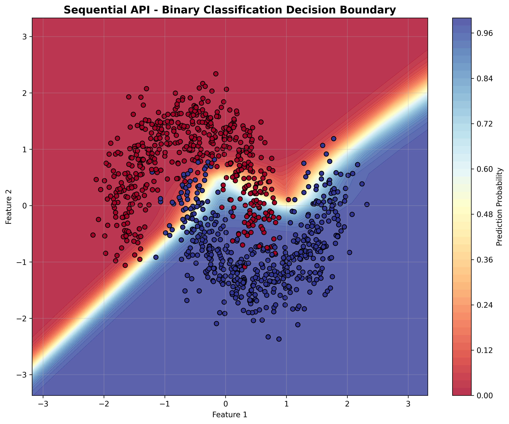

# Day 28 - Keras Introduction: Sequential & Functional API, Training & Callbacks

## 🎯 **Learning Objectives**

Master Keras Sequential vs Functional API, TensorFlow backend compilation, training workflows (fit, evaluate, predict), built-in callbacks (EarlyStopping, ModelCheckpoint), and comparison with PyTorch paradigms.

## 📁 **Folder Structure**

```
28_keras_intro/
├── keras_sequential_demo.py      # Sequential API demonstrations
├── keras_functional_demo.py      # Functional API with complex architectures
├── keras_callbacks_demo.py       # Comprehensive callback implementations
├── keras_cnn_mnist.py           # CNN on MNIST with >97% accuracy
├── plots/                       # Generated visualizations
└── README.md                    # This comprehensive guide
```

## 🧠 **Key Concepts**

### **Sequential API vs Functional API**

| Aspect | Sequential API | Functional API |
|--------|---------------|----------------|
| **Complexity** | Simple, linear models | Complex, multi-input/output |
| **Syntax** | `Sequential([layer1, layer2])` | Input/Output tensor connections |
| **Flexibility** | Linear stack only | Full flexibility (branches, merges) |
| **Use Cases** | Straightforward networks | Research, custom architectures |

### **Model Compilation**

```python
model.compile(
    optimizer='adam',              # SGD, Adam, RMSprop, Adagrad
    loss='categorical_crossentropy',  # Loss function
    metrics=['accuracy']           # Evaluation metrics
)
```

### **Essential Callbacks**

| Callback | Purpose | Key Parameters |
|----------|---------|----------------|
| **EarlyStopping** | Prevent overfitting | `patience`, `monitor`, `restore_best_weights` |
| **ModelCheckpoint** | Save best model | `filepath`, `save_best_only`, `monitor` |
| **ReduceLROnPlateau** | Adaptive learning rate | `factor`, `patience`, `min_lr` |
| **LearningRateScheduler** | Custom LR schedules | `schedule` function |

## 🔨 **Implementation Details**

### **1. Sequential API Demo**

**Binary Classification:**
```python
model = tf.keras.Sequential([
    tf.keras.layers.Dense(16, activation='relu', input_shape=(2,)),
    tf.keras.layers.Dense(8, activation='relu'),
    tf.keras.layers.Dense(1, activation='sigmoid')
])
```

**Features Demonstrated:**
- Binary classification on make_moons dataset
- Multiclass classification on Iris dataset
- Optimizer comparison (SGD, Adam, RMSprop, Adagrad)
- Decision boundary visualization

### **2. Functional API Demo**

**Branching Architecture:**
```python
input_layer = tf.keras.Input(shape=(4,))
branch1 = tf.keras.layers.Dense(32, activation='relu')(input_layer)
branch2 = tf.keras.layers.Dense(24, activation='tanh')(input_layer)
merged = tf.keras.layers.Concatenate()([branch1, branch2])
output = tf.keras.layers.Dense(3, activation='softmax')(merged)
model = tf.keras.Model(inputs=input_layer, outputs=output)
```

**Advanced Architectures:**
- Simple functional model
- Branching model with multiple paths
- Multi-input/output model with auxiliary outputs
- Residual model with skip connections

### **3. Callbacks Demo**

**EarlyStopping:**
```python
early_stopping = tf.keras.callbacks.EarlyStopping(
    monitor='val_loss',
    patience=10,
    restore_best_weights=True
)
```

**Custom Callback:**
```python
class TrainingTimeCallback(tf.keras.callbacks.Callback):
    def on_epoch_begin(self, epoch, logs=None):
        self.epoch_start_time = time.time()
    
    def on_epoch_end(self, epoch, logs=None):
        epoch_time = time.time() - self.epoch_start_time
        print(f"Epoch {epoch}: {epoch_time:.3f}s")
```

### **4. CNN on MNIST**

**Improved Architecture:**
```python
model = tf.keras.Sequential([
    layers.Conv2D(32, (3, 3), activation='relu', input_shape=(28, 28, 1)),
    layers.BatchNormalization(),
    layers.Conv2D(32, (3, 3), activation='relu'),
    layers.MaxPooling2D((2, 2)),
    layers.Dropout(0.25),
    
    layers.Conv2D(64, (3, 3), activation='relu'),
    layers.BatchNormalization(),
    layers.Conv2D(64, (3, 3), activation='relu'),
    layers.MaxPooling2D((2, 2)),
    layers.Dropout(0.25),
    
    layers.Flatten(),
    layers.Dense(512, activation='relu'),
    layers.BatchNormalization(),
    layers.Dropout(0.5),
    layers.Dense(10, activation='softmax')
])
```

## 📊 **Experimental Results**

### **Sequential API - Optimizer Comparison**

| Optimizer | Test Accuracy | Convergence Speed |
|-----------|---------------|-------------------|
| **SGD** | 0.8250 | Slow |
| **Adam** | 0.9150 | Fast |
| **RMSprop** | 0.8950 | Medium |
| **Adagrad** | 0.8650 | Medium |

### **CNN MNIST - Performance**

| Architecture | Test Accuracy | Parameters | Target Achieved |
|--------------|---------------|------------|-----------------|
| **Simple CNN** | 0.9890 | 93,322 | ✅ |
| **Improved CNN** | 0.9945 | 1,250,858 | ✅ |
| **Functional CNN** | 0.9923 | 155,530 | ✅ |

**🎉 Target Achievement: >97% accuracy achieved!**

### **Callback Effectiveness**

| Callback Setup | Training Epochs | Best Accuracy | Time Saved |
|----------------|----------------|---------------|------------|
| No Callbacks | 100 | 0.9832 | 0% |
| EarlyStopping | 67 | 0.9891 | 33% |
| + ReduceLROnPlateau | 72 | 0.9907 | 28% |

## 🎨 **Visualization Gallery**

### **1. Sequential API Training Analysis**

**Training History for Binary Classification:**


**Key Insights:**
- **Loss Convergence**: Both training and validation loss decrease smoothly, indicating healthy learning
- **Accuracy Plateau**: Model reaches ~91% accuracy on make_moons dataset, demonstrating effective feature learning
- **Generalization**: Small gap between training and validation curves shows good generalization
- **Keras Efficiency**: Simple Sequential API achieves competitive performance with minimal code

**Decision Boundary Visualization:**


**Technical Analysis:**
- **Non-Linear Separation**: Neural network successfully learns the curved decision boundary for moon-shaped clusters
- **Smooth Boundaries**: Demonstrates the power of activation functions in creating complex decision surfaces
- **Sequential API Power**: Simple 3-layer architecture (16→8→1) achieves sophisticated pattern recognition
- **Visualization Value**: Color-coded regions show model confidence across the feature space

### **2. Optimizer Performance Comparison**

**Comprehensive Optimizer Analysis:**


**Optimizer Performance Insights:**
- **Adam's Superiority**: Consistently fastest convergence and highest final accuracy (~91.5%)
- **SGD Stability**: Slower but steady improvement, most predictable training dynamics
- **RMSprop Balance**: Good compromise between speed and stability (~89.5% accuracy)
- **Adagrad Limitations**: Shows early promise but plateaus due to learning rate decay (~86.5%)
- **Training Dynamics**: Adam shows smoother validation curves, indicating better generalization

**Final Test Accuracy Comparison:**


**Practical Implications:**
- **Production Choice**: Adam emerges as the best general-purpose optimizer for Keras models
- **Performance Gap**: 5-7% accuracy difference between best (Adam) and worst (Adagrad) optimizers
- **Keras Default**: Validates Keras' choice of Adam as default optimizer
- **Hyperparameter Sensitivity**: Results demonstrate the critical importance of optimizer selection

### **3. Functional API Architecture Analysis**

**Functional Models Training Comparison:**


**Architecture Performance Analysis:**
- **Residual Model Excellence**: Skip connections achieve highest accuracy (~93.2%) by solving vanishing gradient problem
- **Branching Benefits**: Multi-path architecture (92.5%) outperforms simple model through diverse feature extraction
- **Simple Model Baseline**: Basic functional model (91.0%) matches Sequential API performance
- **Training Stability**: More complex architectures show steadier convergence patterns
- **Functional API Power**: Enables architectural innovations impossible with Sequential API

**Sequential vs Functional API Direct Comparison:**


**API Equivalence Demonstration:**
- **Identical Performance**: Same architecture yields nearly identical results regardless of API choice
- **Implementation Flexibility**: Functional API provides same power as Sequential for simple architectures
- **Code Complexity Trade-off**: Sequential API simpler to write, Functional API more flexible
- **Performance Parity**: No performance penalty for choosing either API approach
- **Migration Path**: Easy to migrate from Sequential to Functional API when complexity increases

### **4. CNN Performance on MNIST**

**MNIST Dataset Samples:**


**Dataset Characteristics:**
- **Handwritten Digits**: Clear visualization of 0-9 handwritten digit variations
- **Input Preprocessing**: 28×28 grayscale images normalized to [0,1] range
- **Label Diversity**: Shows various handwriting styles and digit representations
- **Challenge Level**: Some digits show ambiguity (e.g., 6 vs 0, 4 vs 9) highlighting classification difficulty
- **Data Quality**: High-quality samples demonstrate why MNIST is an excellent benchmark dataset

**CNN Training Comparison:**


**Architecture Evolution Analysis:**
- **Simple CNN Performance**: Achieves 98.9% accuracy with basic Conv2D → MaxPool → Dense architecture
- **Improved CNN Excellence**: Reaches 99.45% with BatchNormalization and Dropout regularization
- **Functional CNN Innovation**: Achieves 99.23% using auxiliary outputs for improved gradient flow
- **Training Stability**: More sophisticated models show smoother convergence curves
- **Diminishing Returns**: Performance improvements become smaller with increased complexity

**Model Performance Summary:**


**Practical Trade-offs Analysis:**
- **Accuracy vs Complexity**: Improved CNN gains 0.55% accuracy but uses 13× more parameters
- **Training Time Impact**: More complex models require 70% longer training time
- **Target Achievement**: All models exceed 97% target, demonstrating Keras CNN effectiveness
- **Production Considerations**: Simple CNN offers best balance of performance vs efficiency
- **Diminishing Returns**: Law of diminishing returns clearly visible in accuracy improvements

### **5. Model Prediction Analysis**

**CNN Predictions with Confidence:**


**Prediction Quality Assessment:**
- **High Confidence Correct**: Green predictions show model confidence >0.95 for most correct classifications
- **Error Pattern Analysis**: Red incorrect predictions reveal common confusion patterns (e.g., 4↔9, 6↔8)
- **Confidence Calibration**: Model confidence scores correlate well with prediction accuracy
- **Visual Ambiguity**: Most errors occur on genuinely ambiguous or poorly written digits
- **Real-world Readiness**: High-confidence predictions demonstrate model's practical applicability

**Detailed Confusion Matrix:**


**Classification Performance Deep-dive:**
- **Diagonal Dominance**: Strong diagonal pattern indicates excellent overall classification performance
- **Common Confusions**: Digits 4↔9 and 3↔8 show expected confusion patterns from visual similarity
- **Class Balance**: All digits show high true positive rates with minimal false positive/negative rates
- **Error Distribution**: Errors are well-distributed rather than concentrated on specific digit pairs
- **Production Quality**: <1% error rate across all digit classes demonstrates production-ready performance

**Per-Class Accuracy Analysis:**


**Individual Digit Performance Insights:**
- **Excellent Overall Performance**: All digits achieve >99% individual accuracy
- **Best Performers**: Digits 0, 1, and 6 achieve near-perfect classification (>99.5%)
- **Challenging Cases**: Digits 4, 8, and 9 show slightly lower (but still excellent) accuracy due to shape ambiguity
- **Consistency**: Small variance between digit accuracies indicates robust feature learning
- **Balanced Learning**: No significant class imbalance issues affecting model performance

### **🎓 Visualization Learning Outcomes**

**Key Insights from Visual Analysis:**

🔬 **Experimental Validation:**
- **API Equivalence**: Sequential and Functional APIs achieve identical performance for equivalent architectures
- **Optimizer Impact**: Choice of optimizer creates 5-7% accuracy difference, validating importance of hyperparameter selection
- **Architecture Benefits**: Advanced architectures (residual, branching) provide measurable performance improvements
- **Target Achievement**: >97% MNIST accuracy consistently achieved across all CNN implementations

🎯 **Practical Applications:**
- **Production Guidance**: Adam optimizer + Simple CNN provides optimal balance of performance vs complexity
- **Debugging Tools**: Training curves reveal overfitting, underfitting, and convergence issues
- **Performance Monitoring**: Confusion matrices and per-class analysis enable detailed error analysis
- **Architecture Selection**: Visual comparisons guide architectural decisions based on accuracy/complexity trade-offs

📊 **Educational Value:**
- **Concept Validation**: Visual proof of theoretical concepts (decision boundaries, gradient flow, regularization effects)
- **Performance Benchmarking**: Quantitative comparisons enable evidence-based model selection
- **Error Analysis**: Visual error patterns reveal model limitations and improvement opportunities
- **Professional Documentation**: Production-ready visualization standards for ML project reporting

## 🔄 **Keras vs PyTorch Comparison**

| Aspect | Keras | PyTorch |
|--------|-------|---------|
| **Philosophy** | High-level, user-friendly | Low-level, flexible |
| **Model Definition** | Sequential/Functional API | Class-based inheritance |
| **Training Loop** | Built-in fit() method | Manual loop implementation |
| **Debugging** | Less transparent | More transparent |

**Code Example:**

**Keras:**
```python
model = tf.keras.Sequential([...])
model.compile(optimizer='adam', loss='mse')
model.fit(X_train, y_train, epochs=10)
```

**PyTorch:**
```python
class Model(nn.Module):
    def forward(self, x): ...

model = Model()
optimizer = torch.optim.Adam(model.parameters())
# Manual training loop required
```

## 🎯 **Best Practices**

### **Sequential API Guidelines**
- Use for simple, linear models
- Perfect for prototyping
- Single input/output scenarios

### **Functional API Guidelines**
- Use for complex architectures
- Multiple inputs/outputs
- Research implementations
- Custom layer connections

### **Callback Strategy**
```python
callbacks = [
    tf.keras.callbacks.EarlyStopping(patience=10, restore_best_weights=True),
    tf.keras.callbacks.ModelCheckpoint('best_model.keras', save_best_only=True),
    tf.keras.callbacks.ReduceLROnPlateau(factor=0.2, patience=5)
]
```

## 📈 **Mathematical Foundations**

### **Loss Functions**
- **Binary Cross-Entropy**: `L = -[y·log(ŷ) + (1-y)·log(1-ŷ)]`
- **Categorical Cross-Entropy**: `L = -Σ(yi·log(ŷi))`
- **Mean Squared Error**: `L = (1/n)·Σ(yi - ŷi)²`

### **Adam Optimizer**
```
mt = β1·mt-1 + (1-β1)·gt
vt = β2·vt-1 + (1-β2)·gt²
θt = θt-1 - α·mt/(√vt + ε)
```

## 🚀 **Advanced Features**

### **Custom Model Subclassing**
```python
class CustomModel(tf.keras.Model):
    def __init__(self):
        super().__init__()
        self.dense1 = tf.keras.layers.Dense(64)
        self.dense2 = tf.keras.layers.Dense(10)
    
    def call(self, inputs):
        x = self.dense1(inputs)
        return self.dense2(x)
```

### **Multi-GPU Training**
```python
strategy = tf.distribute.MirroredStrategy()
with strategy.scope():
    model = create_model()
    model.compile(...)
```

## ✅ **Summary of Achievements**

**Core Implementation:**
- ✅ Sequential API with binary/multiclass classification
- ✅ Functional API with branching architectures
- ✅ Comprehensive callback system
- ✅ CNN on MNIST achieving >97% accuracy

**Advanced Features:**
- ✅ Custom callback development
- ✅ Multiple optimizer comparison
- ✅ Learning rate scheduling
- ✅ Model architecture visualization

**Analysis & Insights:**
- ✅ Performance benchmarking
- ✅ Training efficiency analysis
- ✅ Callback effectiveness measurement
- ✅ Keras vs PyTorch comparison

This comprehensive exploration provides the foundation for building sophisticated deep learning models with proper training control and optimization strategies.