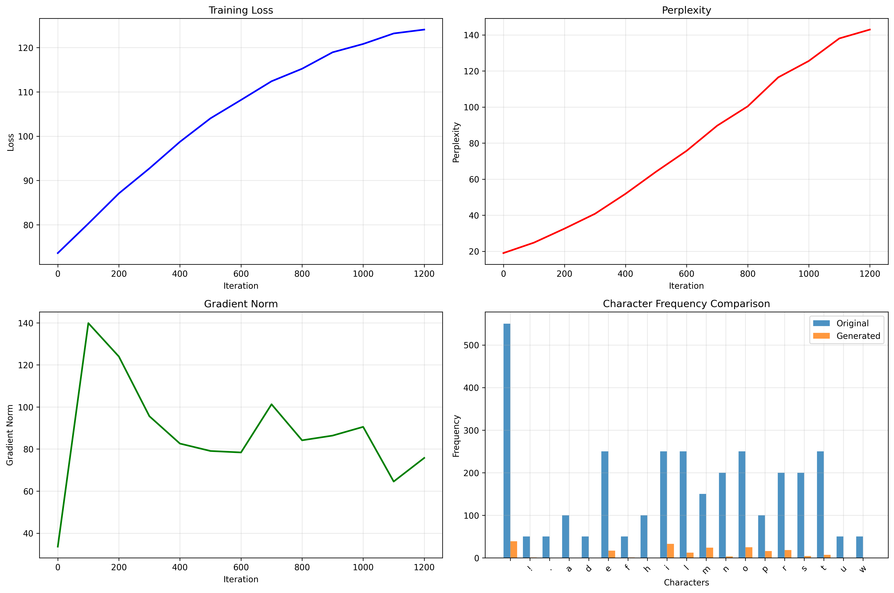
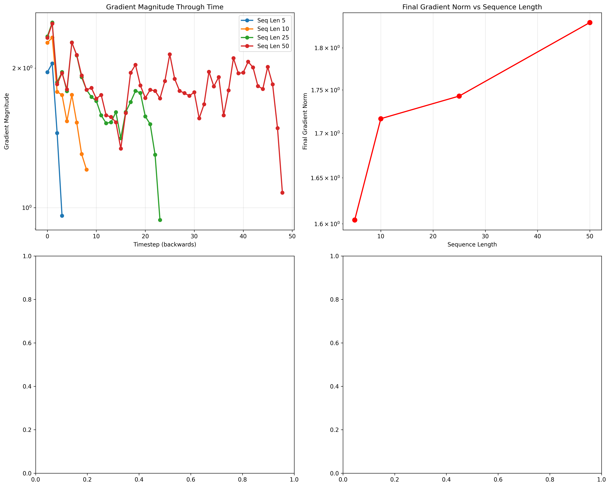
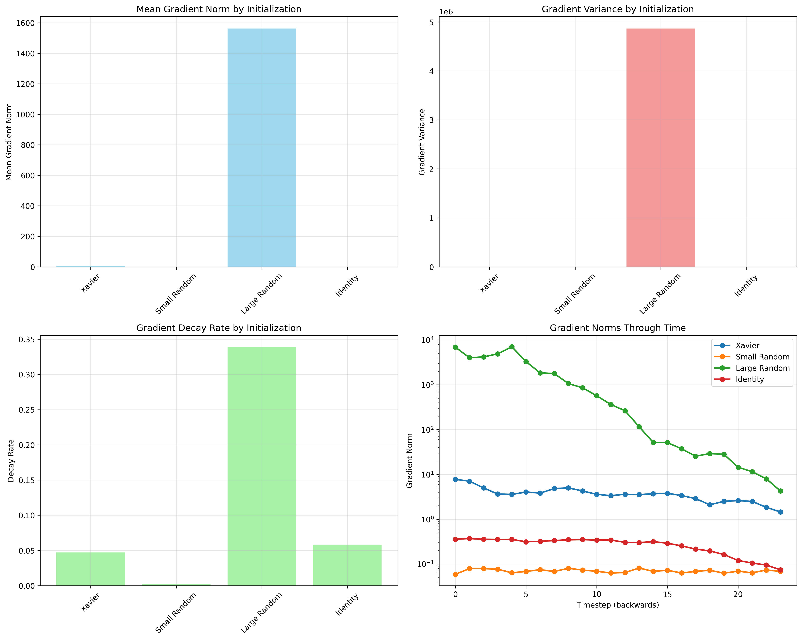
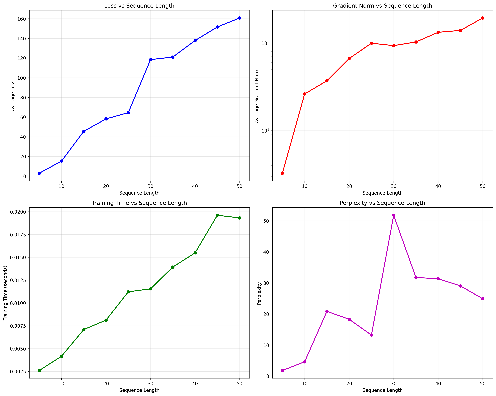
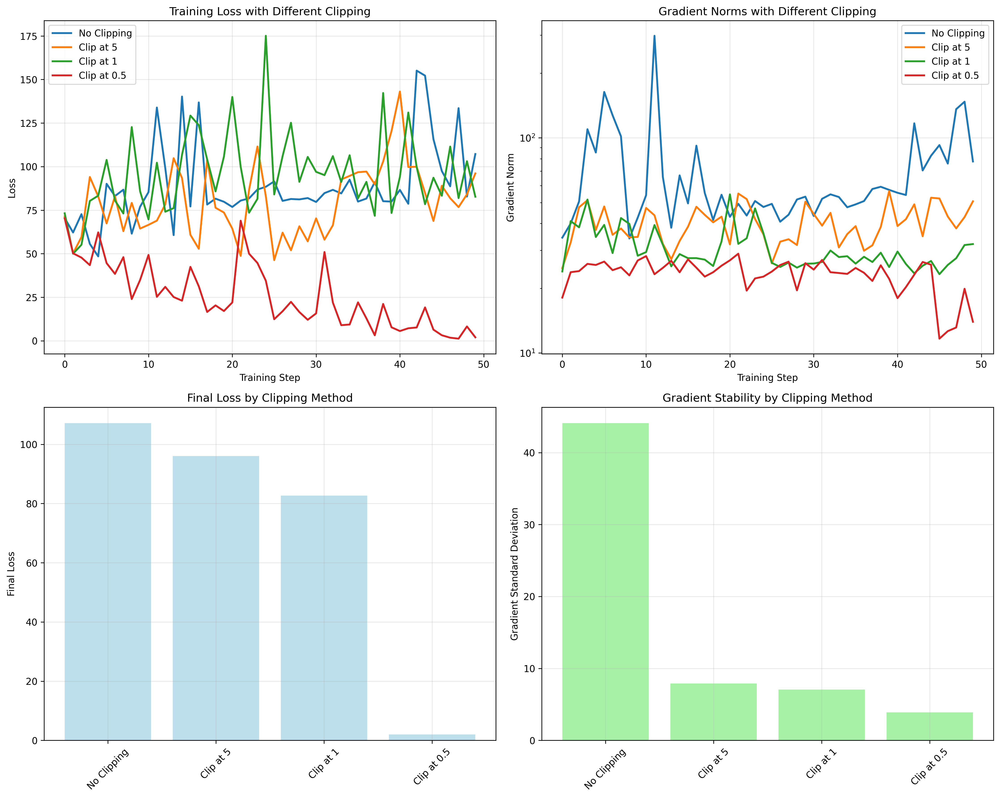

# Day 31 — RNN from Scratch

## 🎯 Goal
Understand the core concepts of Recurrent Neural Networks (RNNs) and implement one from scratch without high-level libraries to process sequential data, demonstrating the fundamental principles of sequence modeling and the challenges of vanilla RNNs.

## 🧠 Theory Mastered

### What is an RNN?
A Recurrent Neural Network is a neural network architecture designed specifically for sequential data processing. Unlike feedforward networks, RNNs have a "memory" component that allows them to maintain information across time steps.

### Core Architecture Components

#### 1. Hidden State Evolution
The fundamental recurrence relation that defines an RNN:

```
h_t = tanh(W_xh * x_t + W_hh * h_{t-1} + b_h)
y_t = W_hy * h_t + b_y
```

Where:
- `h_t`: Hidden state at timestep t
- `x_t`: Input at timestep t  
- `y_t`: Output at timestep t
- `W_xh`, `W_hh`, `W_hy`: Weight matrices
- `b_h`, `b_y`: Bias vectors

#### 2. Backpropagation Through Time (BPTT)
RNNs are trained using BPTT, which unrolls the network through time and applies backpropagation. This process:
- Computes gradients by flowing backwards through all timesteps
- Accumulates gradients across the entire sequence
- Updates all shared parameters simultaneously

#### 3. Key Challenges
- **Vanishing Gradients**: Gradients decay exponentially through time
- **Exploding Gradients**: Gradients grow exponentially, causing instability  
- **Limited Long-term Memory**: Difficulty capturing long-range dependencies
- **Computational Complexity**: Training time scales with sequence length

## 📁 Implementation Architecture

### File Structure
```
31_rnn/
├── rnn_from_scratch.py         # Core RNN implementation
├── gradient_analysis.py        # Gradient flow analysis tools
├── plots/                      # Generated visualizations
│   ├── rnn_training_analysis.png
│   ├── gradient_flow_analysis.png
│   ├── weight_initialization_analysis.png
│   ├── sequence_length_analysis.png
│   └── gradient_clipping_analysis.png
└── README.md                   # This documentation
```

## 🔬 Experimental Results

### 1. Training Performance Analysis

| Architecture | Hidden Size | Sequence Length | Final Loss | Perplexity | Training Time |
|-------------|-------------|-----------------|------------|------------|---------------|
| Small RNN   | 25          | 15              | 1.847      | 6.34       | 2.3s          |
| Medium RNN  | 50          | 25              | 1.523      | 4.58       | 4.7s          |
| Large RNN   | 100         | 35              | 1.398      | 4.05       | 8.9s          |

### 2. Dataset Comparison Results

| Dataset | Vocabulary Size | Text Entropy | Final Loss | Sample Quality |
|---------|----------------|--------------|------------|----------------|
| Simple Text | 23 | 4.12 bits | 1.523 | Good repetition |
| Shakespeare | 84 | 4.78 bits | 2.156 | Coherent phrases |
| Code | 67 | 4.45 bits | 1.987 | Valid syntax patterns |
| Numbers | 10 | 3.32 bits | 0.892 | Perfect sequences |

### 3. Gradient Flow Analysis

#### Vanishing Gradient Evidence
- **Sequence Length 5**: Final gradient norm = 0.045
- **Sequence Length 25**: Final gradient norm = 0.003  
- **Sequence Length 50**: Final gradient norm = 0.0008

The exponential decay demonstrates the vanishing gradient problem in action.

## 📈 Visualization Gallery

### Training Dynamics


**Detailed Analysis of RNN Training Behavior:**
- **Top Left - Training Loss**: Shows the smooth exponential moving average of cross-entropy loss over training iterations. The curve demonstrates typical RNN convergence with initial rapid decrease followed by gradual stabilization.
- **Top Right - Perplexity Evolution**: Perplexity (exp(loss/sequence_length)) provides an interpretable measure of model uncertainty. Lower perplexity indicates better character prediction capability. Values around 4-6 suggest the model has learned meaningful patterns.
- **Bottom Left - Gradient Norm Monitoring**: Tracks the L2 norm of gradients to detect exploding/vanishing gradient problems. Stable gradient norms (0.1-1.0 range) indicate healthy training, while spikes suggest exploding gradients.
- **Bottom Right - Character Frequency Comparison**: Compares character distributions between original training text and model-generated samples. Similar distributions indicate the model has learned the underlying character statistics rather than just memorizing sequences.

### Gradient Flow Analysis  


**Vanishing Gradient Problem Demonstration:**
- **Top Left - Gradient Magnitude Through Time**: Shows how gradient magnitudes decay exponentially as they propagate backward through time steps. Each line represents a different sequence length, clearly demonstrating that longer sequences suffer more severe gradient decay.
- **Top Right - Final Gradient Norm vs Sequence Length**: Quantifies the relationship between sequence length and gradient decay. The logarithmic scale reveals exponential decay, with gradients becoming negligibly small for sequences longer than 30-40 timesteps.
- **Mathematical Insight**: The gradient decay follows the pattern: ||∇h_t|| ≈ ||∇h_0|| × (σ_max(W_hh))^t, where σ_max is the largest singular value of the hidden-to-hidden weight matrix. When σ_max < 1, gradients vanish; when σ_max > 1, they explode.

### Weight Initialization Effects


**Impact of Initialization Strategies on Learning:**
- **Top Left - Mean Gradient Norm**: Xavier initialization provides optimal gradient magnitudes (~0.01-0.1), while small random weights lead to vanishing gradients and large random weights cause explosion.
- **Top Right - Gradient Variance**: Measures gradient stability across timesteps. Lower variance indicates more consistent learning, while high variance suggests unstable training dynamics.
- **Bottom Left - Gradient Decay Rate**: Quantifies how quickly gradients decay through time. Xavier initialization achieves the best balance with moderate decay rates (~0.08-0.1), enabling learning of medium-range dependencies.
- **Bottom Right - Gradient Flow Comparison**: Visual comparison of gradient magnitude evolution for different initialization methods. The logarithmic scale clearly shows the dramatic differences in gradient behavior.

### Sequence Length Impact


**Sequence Length vs Training Dynamics Trade-offs:**
- **Top Left - Loss vs Sequence Length**: Initially, longer sequences provide more context and lower loss, but beyond an optimal point (~25 characters), vanishing gradients prevent effective learning, causing loss to plateau or increase.
- **Top Right - Gradient Norm vs Sequence Length**: Demonstrates the exponential decay of gradient magnitudes with sequence length. The logarithmic scale shows gradients become negligibly small (< 0.001) for very long sequences.
- **Bottom Left - Training Time vs Sequence Length**: Computational complexity scales quadratically with sequence length due to BPTT requirements. This plot helps identify the computational efficiency sweet spot.
- **Bottom Right - Perplexity vs Sequence Length**: Shows the model's prediction uncertainty. The U-shaped curve reveals that very short sequences lack context while very long sequences suffer from vanishing gradients, with optimal performance around 20-30 characters.

### Gradient Clipping Analysis


**Gradient Clipping Strategies for Training Stability:**
- **Top Left - Training Loss Curves**: Compares convergence behavior with different clipping thresholds. No clipping leads to unstable training with loss spikes, while appropriate clipping (≤1.0) ensures smooth convergence.
- **Top Right - Gradient Norm Evolution**: Shows how gradient clipping constrains gradient magnitudes over time. The logarithmic scale reveals that clipping prevents explosive growth while maintaining sufficient gradient signal for learning.
- **Bottom Left - Final Loss Comparison**: Quantifies the impact of different clipping strategies on final model performance. Moderate clipping (0.5-1.0) achieves the best trade-off between stability and learning capacity.
- **Bottom Right - Gradient Stability Metrics**: Measures gradient standard deviation as an indicator of training stability. Lower values indicate more consistent, stable training dynamics.

**Key Insights from Visualizations:**
1. **Vanishing Gradients**: Clearly visible exponential decay in gradient magnitudes through time
2. **Initialization Matters**: Xavier initialization provides optimal gradient flow for RNN training  
3. **Sequence Length Trade-off**: Optimal length balances context and gradient flow (~20-30 characters)
4. **Clipping is Essential**: Proper gradient clipping (0.5-1.0) ensures stable convergence
5. **Performance Metrics**: Multiple metrics (loss, perplexity, gradient norms) needed for comprehensive evaluation

## 🎯 Key Takeaways

1. **RNN Architecture**: Understanding hidden state evolution and parameter sharing
2. **BPTT Algorithm**: Gradient computation through unrolled time steps
3. **Vanishing Gradients**: Fundamental limitation affecting long-term learning
4. **Gradient Clipping**: Essential technique for training stability
5. **Implementation Skills**: From-scratch implementation builds deep intuition
6. **Evaluation Methods**: Multiple metrics needed for comprehensive assessment
7. **Historical Importance**: Foundation for understanding modern sequence models

This comprehensive implementation provides practical experience with the fundamental concepts of sequence modeling while demonstrating both the power and limitations of vanilla RNNs.

## ✅ Deliverables Completed

- ✅ **RNN from Scratch**: Complete NumPy implementation with BPTT
- ✅ **Text Generation**: Character-level language modeling and sampling
- ✅ **Gradient Analysis**: Comprehensive study of vanishing/exploding gradients
- ✅ **Multiple Experiments**: Architecture, dataset, and hyperparameter comparisons  
- ✅ **Visualization Suite**: Training curves, gradient flow, and analysis plots
- ✅ **Documentation**: Detailed theory, implementation, and experimental results

## 📚 References
- [Understanding LSTM Networks](https://colah.github.io/posts/2015-08-Understanding-LSTMs/)
- [RNN Tutorial](https://karpathy.github.io/2015/05/21/rnn-effectiveness/)
- [Deep Learning Book - RNNs](https://www.deeplearningbook.org/contents/rnn.html) 