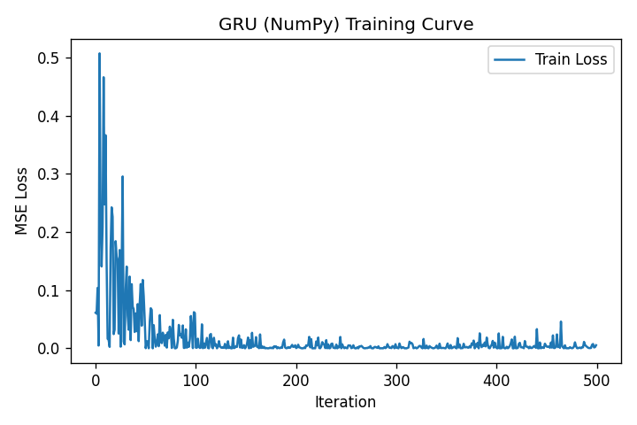
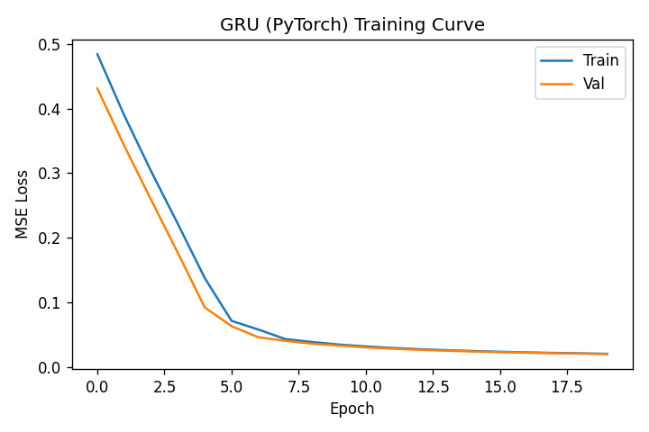

# Gated Recurrent Unit (GRU)

## 📌 Overview
Learn the GRU architecture, understand how it differs from LSTM, and implement a GRU for sequence prediction both from scratch (NumPy) and using PyTorch. Compare convergence and performance with LSTM on simple sequence tasks.

### Theory
GRU was introduced by Cho et al. (2014) as a simplified alternative to LSTM. It merges the cell and hidden state into a single hidden state and uses two gates:

- Update gate z_t: controls how much of the previous state to keep
- Reset gate r_t: controls how much past information to forget

Equations (with ⊙ as element-wise product):

$$
\begin{aligned}
z_t &= \sigma(W_z x_t + U_z h_{t-1} + b_z) \\
r_t &= \sigma(W_r x_t + U_r h_{t-1} + b_r) \\
\tilde{h}_t &= \tanh\left(W_h x_t + U_h (r_t \cdot h_{t-1}) + b_h\right) \\
h_t &= (1 - z_t) \cdot h_{t-1} + z_t \cdot \tilde{h}_t
\end{aligned}
$$

Output layer for regression/classification is typically a linear or affine head applied to h_t.

Key differences vs LSTM:
- No separate cell state; only hidden state h_t
- Fewer parameters and often faster training
- Comparable performance to LSTM on many tasks; sometimes slightly worse on very long dependencies

### What’s Included
- `gru_from_scratch.py`: Minimal but complete GRU implementation in NumPy with forward, BPTT, training loop, and a sine-wave next-step prediction demo
- `gru_pytorch.py`: PyTorch implementation using `nn.GRU` with a linear head, Dataset/DataLoader utilities, training/validation loops, and plots

### How to Run

NumPy implementation (quick demo):
```bash
python gru_from_scratch.py
```

PyTorch implementation (with plots saved under `plots/`):
```bash
python gru_pytorch.py
```

### Results to Expect
- Stable training on sine-wave next-step prediction
- Loss curves showing GRU convergence
- GRU typically trains faster than LSTM with similar final error on short-to-medium sequences

### Figures and explanations
- `plots/gru_numpy_training_curve.png`:

  
  - Shows the training MSE loss over iterations for the NumPy GRU trained with a simple online loop.
  - Early iterations often drop quickly as the model learns the sinusoidal structure; later iterations plateau as the model fits residual noise.
  - A smooth, monotonically decreasing trend indicates healthy gradient flow and a suitable learning rate. Oscillation suggests the learning rate is too high; a flat line suggests it is too low.
- `plots/gru_pytorch_training_curve.png`:

  
  - Shows train and validation MSE over epochs for the PyTorch GRU trained with mini-batches.
  - The validation curve should closely track the training curve on this synthetic task. A widening gap indicates overfitting; reduce model size, add noise, or use early stopping.
  - If validation is consistently above training and not improving, consider lowering the learning rate or increasing batch size.

What to look for:
- Faster initial convergence than a comparable LSTM of the same hidden size (fewer parameters, simpler gating).
- Similar final performance for short-to-medium sequence horizons; LSTM may edge out GRU for very long dependencies.

### Tips
- Clip gradients to stabilize training
- Try both GRU and LSTM for your task; their relative performance is task-dependent
- For sequence inputs, keep tensor shapes consistent: `(batch, seq, features)` for PyTorch when using `batch_first=True`

### Implementation details and shapes
- NumPy (from scratch):
  - Inputs are a list of length T; each element has shape `(input_size, 1)`.
  - Many-to-one regression: the network predicts the next value using the final hidden state.
  - Uses Adam with gradient clipping for stability.
- PyTorch:
  - Inputs are shaped `(batch, seq_len, features)` with `batch_first=True`.
  - The GRU outputs `(batch, seq_len, hidden)` → linear head produces `(batch, seq_len, output)` for next-step prediction at each time step.

### Practical guidance
- Learning rate: start with 1e-3 (PyTorch) or 1e-2 (NumPy) and adjust by factors of 2–10.
- Hidden size: 32–128 is typically sufficient for simple periodic signals like sine waves.
- Overfitting indicators: training loss decreases while validation loss stalls or rises; mitigate with smaller hidden size or mild noise augmentation.

### GRU vs LSTM: when to choose which
- Prefer GRU for smaller datasets or when speed/parameter-efficiency matters.
- Prefer LSTM for very long-range dependencies or when you observe vanishing gradients with GRU.

## 📚 References
- [GRU Original Paper](https://arxiv.org/abs/1406.1078)
- [GRU vs LSTM Comparison](https://towardsdatascience.com/illustrated-guide-to-lstms-and-gru-s-a-step-by-step-explanation-44e9eb85bf21)
- [Empirical Evaluation of RNN Architectures](https://arxiv.org/abs/1412.3555) 