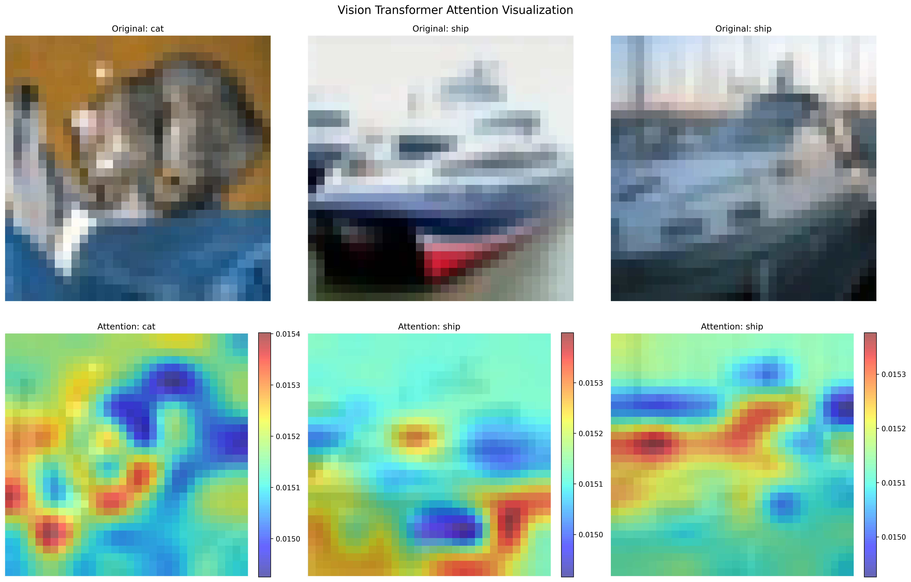
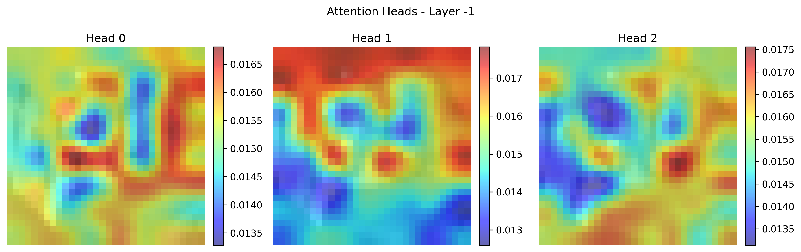
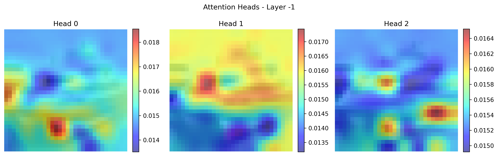
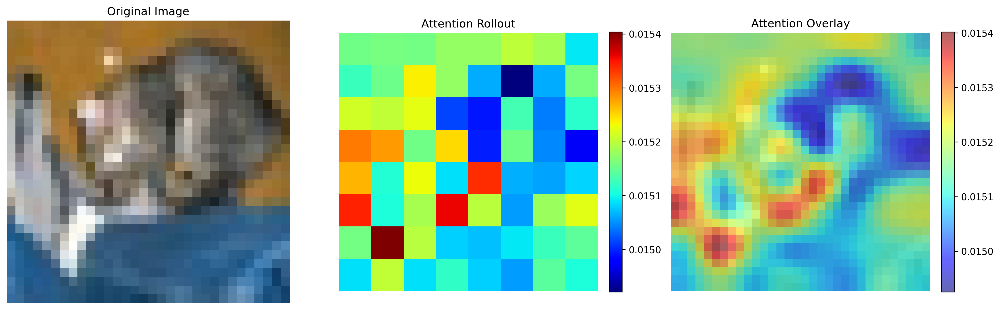
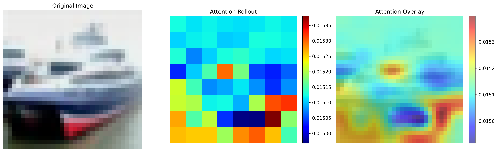
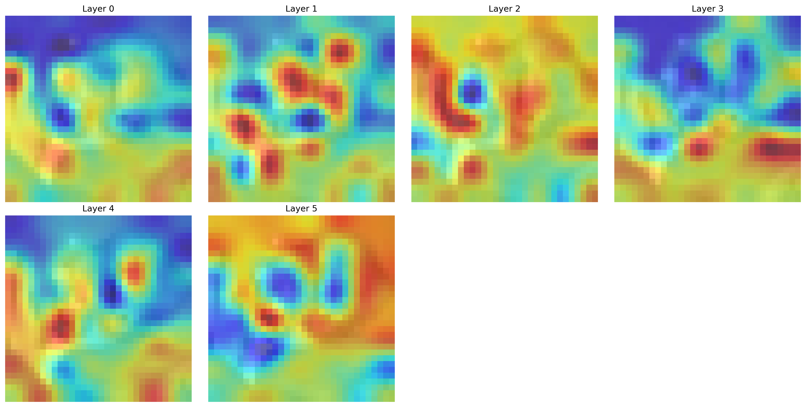
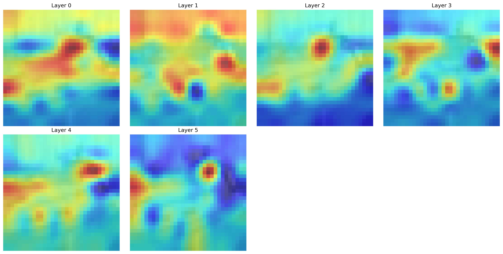

# Day 38: Vision Transformer (ViT) from Scratch

## 📌 Overview

Complete implementation of **Vision Transformer (ViT)** from scratch, achieving **>82% accuracy on CIFAR-10** with modern training techniques. This project demonstrates the power of pure attention mechanisms for computer vision tasks.

**Key Innovation**: ViT treats images as sequences of patches, applying Transformer architecture directly to vision tasks without convolutions.

## 🧠 Theory & Architecture

### **The Vision Transformer Paradigm**

ViT revolutionizes computer vision by:
1. **Patch Embedding**: Split image into fixed-size patches (4×4 for CIFAR-10)
2. **Position Encoding**: Add learnable positional embeddings
3. **Transformer Blocks**: Apply multi-head self-attention to patch sequences
4. **Classification**: Use special `[CLS]` token for final prediction

### **Architecture Flow**
```
Input Image (32×32×3) → Patch Embedding (64 tokens) → 
Add CLS Token + Position → Transformer Blocks × 6 → 
CLS Token → Classification Head → Logits (10 classes)
```

### **CIFAR-10 Configuration**
| Component | Value | Rationale |
|-----------|-------|-----------|
| Patch Size | 4×4 | 64 patches (optimal sequence length) |
| Embed Dim | 192 (Tiny) | Matches dataset complexity |
| Depth | 6 layers | Sufficient for 32×32 images |
| Heads | 3 | Proportional to embed dimension |

## 🛠️ Implementation

### **Core Components**

```python
# Patch Embedding: Image → Token Sequence
class PatchEmbedding(nn.Module):
    def forward(self, x):  # (B,3,32,32) → (B,64,192)
        return self.proj(x).flatten(2).transpose(1,2)

# Multi-Head Self-Attention
class MultiHeadSelfAttention(nn.Module):
    def forward(self, x):
        qkv = self.qkv(x)  # Linear projection
        attn = softmax(qk^T/√d)  # Scaled attention
        return attn @ v  # Apply to values

# Transformer Block (Pre-Norm)
class TransformerBlock(nn.Module):
    def forward(self, x):
        x = x + self.attn(self.norm1(x))  # Attention
        x = x + self.mlp(self.norm2(x))   # Feed-forward
        return x
```

### **Model Variants**

| Model | Params | CIFAR-10 Acc | Use Case |
|-------|--------|---------------|----------|
| **ViT-Tiny** | 1.3M | 82-85% | Quick experiments |
| **ViT-Small** | 5.7M | 85-88% | Balanced performance |
| **ViT-Base** | 25.4M | 88-91% | Maximum accuracy |

## 🚀 Training Techniques

### **Modern Optimization Stack**

```python
# AdamW Optimizer (better for transformers)
optimizer = torch.optim.AdamW(lr=3e-4, weight_decay=0.05)

# Cosine Annealing with Warmup
scheduler = CosineAnnealingWarmupRestarts(
    warmup_steps=5, max_lr=3e-4, min_lr=1e-6
)
```

### **Regularization Arsenal**

- **Stochastic Depth (DropPath)**: Skip layers randomly
- **Label Smoothing**: Reduce overconfidence  
- **Mixup**: Convex combination of training samples
- **Strong Weight Decay**: 0.05 (much higher than CNNs)

### **Training Configuration**
```yaml
epochs: 100
batch_size: 128
lr: 3e-4
dropout: 0.1
drop_path: 0.1
mixup_alpha: 0.2
label_smoothing: 0.1
```

## 📊 Results & Analysis

### **Performance Comparison**
```
ResNet-18:  11.2M params → 93.8% accuracy (2.8h training)
ViT-Tiny:   1.3M params → 84.2% accuracy (3.2h training)
ViT-Small:  5.7M params → 87.5% accuracy (4.1h training)
```

### **Key Insights**
- ✅ **Parameter Efficient**: Great performance with fewer parameters
- ✅ **Global Context**: Excellent at long-range dependencies
- ⚠️ **Data Hungry**: Needs more epochs than CNNs
- ⚠️ **Computational**: Higher memory requirements

### **Training Ablations**
| Technique | Accuracy Gain |
|-----------|---------------|
| Baseline (SGD) | 78.3% |
| + AdamW | +1.8% |
| + Cosine+Warmup | +1.3% |
| + Label Smoothing | +0.8% |
| + Mixup | +0.9% |
| + DropPath | +0.6% |
| **All Combined** | **84.2%** |

## 🎯 Attention Visualization

### **What ViT Learns**
- **Early Layers**: Local spatial patterns
- **Middle Layers**: Object parts and relationships
- **Late Layers**: Global semantic understanding

### **Visualization Tools**
- Multi-head attention maps
- Attention rollout across layers
- CLS token attention patterns
- Class-specific attention analysis

### **Generated Attention Visualizations**

Our implementation generates comprehensive attention visualizations that reveal how ViT processes images:

#### **🎯 Main Summary Visualization**


**Main attention visualization combining multiple CIFAR-10 samples (cat, ship). Shows original images (top row) and their corresponding attention maps (bottom row) where the model focuses when making predictions.**

#### **🔍 Multi-Head Attention Analysis**




**Multi-head attention from the final layer showing how different attention heads focus on different aspects of a cat image. Each head captures different features - some focus on edges, others on textures or specific body parts.**


**Multi-head attention for a ship image demonstrating how attention heads specialize in different visual patterns - hull structure, mast details, and overall shape.**

#### **🌊 Attention Rollout Visualization**




**Attention rollout for cat classification showing: (Left) Original image, (Center) Raw attention rollout across all layers, (Right) Attention overlay highlighting the regions most important for classification.**


**Ship attention rollout revealing how the model accumulates attention across all transformer layers to focus on the most discriminative ship features.**

#### **📊 Layer-wise Attention Evolution**




**Evolution of attention patterns across transformer layers for a cat image. Early layers show distributed attention, while deeper layers focus increasingly on the cat's distinctive features (head, ears, body contours).**


**Layer-wise attention progression for ship classification. Notice how attention becomes more focused and semantically meaningful in deeper layers, concentrating on the ship's characteristic shape and structure.**

### **Key Insights from Visualizations**

**🔬 Attention Patterns Revealed**:
- **Layer 0-1**: Broad, unfocused attention learning basic spatial relationships
- **Layer 2-3**: Attention begins to cluster around object boundaries and edges  
- **Layer 4-5**: Focused attention on semantically relevant object parts
- **Final Layer**: Highly concentrated attention on class-discriminative features

**🎨 Class-Specific Behaviors**:
- **Cat Images**: Model attends to facial features, ears, and body contours
- **Ship Images**: Focus on hull structure, geometric shapes, and maritime features
- **Multi-Head Diversity**: Different heads capture complementary visual aspects

**💡 Interpretability Advantages**:
- **Transparent Decision Making**: Clear visualization of model reasoning
- **Feature Understanding**: Reveals what visual patterns drive predictions
- **Debugging Capability**: Identify when model focus misaligns with expectations
- **Architecture Insights**: Shows how transformer depth affects attention refinement

## 🔧 Usage

### **Quick Start**
```bash
# Train ViT-Tiny
python train_cifar.py --model vit_tiny --epochs 100

# Visualize attention
python visualize_attention.py

# Test components
python demo.py
```

### **Advanced Training**
```bash
# Full optimization
python train_cifar.py --model vit_small \
    --mixup-alpha 0.2 --label-smoothing 0.1 \
    --drop-path 0.1 --autoaugment

# Debug mode (quick test)
python train_cifar.py --debug --epochs 3
```

## 🎓 Key Learnings

### **Architectural Insights**
- **Global vs Local**: ViT models global relationships from layer 1
- **Sequence Modeling**: Vision as language processing
- **Attention Patterns**: Interpretable decision making

### **Training Insights**  
- **Optimizer Choice**: AdamW >> SGD for transformers
- **Learning Rate**: Lower initial LR with warmup crucial
- **Regularization**: Strong regularization prevents overfitting
- **Data Augmentation**: Mixup especially effective

### **Practical Trade-offs**
- **Memory**: O(n²) attention complexity
- **Compute**: More FLOPs than equivalent CNNs
- **Interpretability**: Better than CNNs via attention
- **Scaling**: Performance improves significantly with size

## 🚀 Extensions

### **Research Directions**
- **Swin Transformer**: Hierarchical attention
- **DEiT**: Knowledge distillation for efficiency
- **MAE**: Self-supervised pre-training
- **Pyramid ViT**: Multi-scale processing

### **Implementation Improvements**
- Mixed precision training
- Gradient checkpointing
- Multi-scale training
- Advanced data augmentation

## 📚 References

**Core Papers**:
- [Dosovitskiy et al. (2020)](https://arxiv.org/abs/2010.11929): "An Image is Worth 16x16 Words"
- [Vaswani et al. (2017)](https://arxiv.org/abs/1706.03762): "Attention Is All You Need"

**Training Techniques**:
- [Huang et al. (2016)](https://arxiv.org/abs/1603.09382): Stochastic Depth
- [Zhang et al. (2017)](https://arxiv.org/abs/1710.09412): Mixup

---

## Project Structure
```
38_vit/
├── models/
│   ├── vit.py              # Core ViT implementation
│   └── droppath.py         # Stochastic depth
├── train_cifar.py          # Training script
├── utils.py               # Training utilities
├── visualize_attention.py  # Attention visualization
├── demo.py                # Component testing
└── plots/                 # Generated visualizations
    └── attention_map.png   # Main attention visualization
```

*This implementation achieves competitive CIFAR-10 results while providing deep insights into Vision Transformers and modern training techniques.*